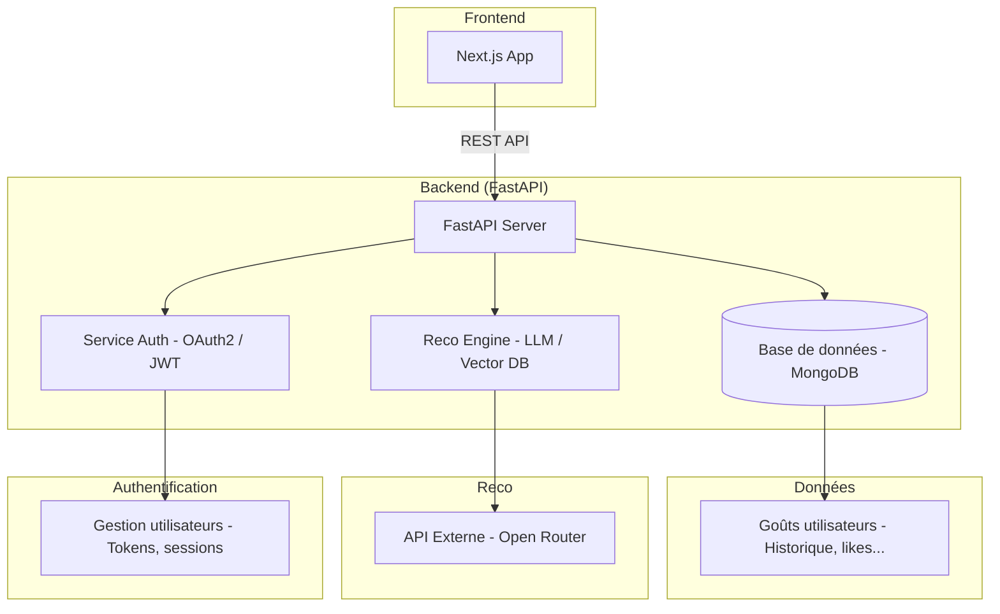

Create virtual env
https://fastapi.tiangolo.com/virtual-environments/#create-a-virtual-environment


Windows
```sh
.venv\Scripts\Activate.ps1
```
Linux/Mac
```sh
python3 -m venv .venv
source .venv/bin/activate
which python
python -m pip install --upgrade pip
pip install -r requirements.txt
docker compose --env-file .env up -d
uvicorn app.main:app --reload
```


Si votre IDE ne trouve pas les packages

```sh
which python
```
Copier le chemin et inscrivez le à l'aide de : Cmd+Shift+P → "Python: Select Interpreter" → sélectionnez le chemin ci-dessus


## Schema Global


