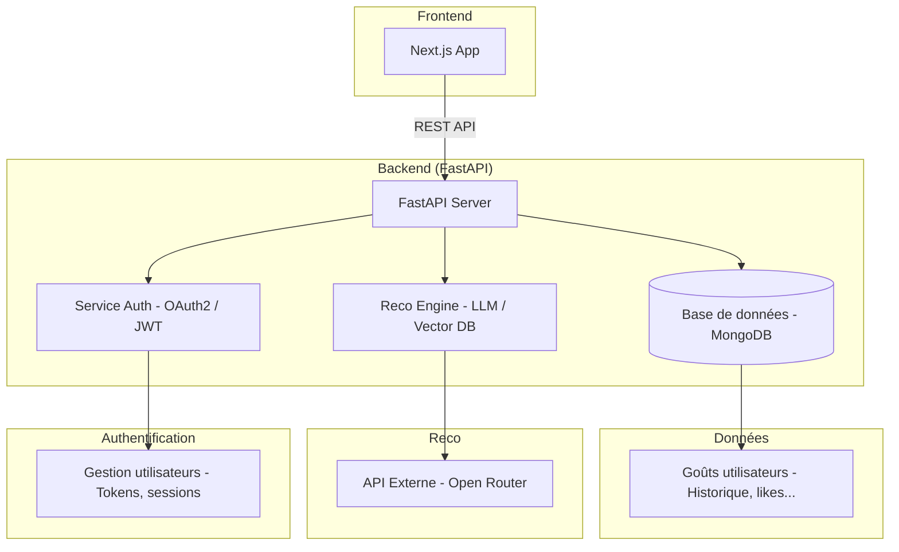

Create virtual env
https://fastapi.tiangolo.com/virtual-environments/#create-a-virtual-environment


Windows
```sh
.venv\Scripts\Activate.ps1
```
Linux/Mac
```sh
python3 -m venv .venv
source .venv/bin/activate
which python
python -m pip install --upgrade pip
pip install -r requirements.txt
docker compose --env-file .env up -d
```


Si votre IDE ne trouve pas les packages

```sh
which python
```
Copier le chemin et inscrivez le à l'aide de : Cmd+Shift+P → "Python: Select Interpreter" → sélectionnez le chemin ci-dessus


## Schema Global




{"t":{"$date":"2025-06-01T22:11:19.513+00:00"},"s":"I",  "c":"CONTROL",  "id":23285,   "ctx":"main","msg":"Automatically disabling TLS 1.0, to force-enable TLS 1.0 specify --sslDisabledProtocols 'none'"}
{"t":{"$date":"2025-06-01T22:11:19.515+00:00"},"s":"I",  "c":"CONTROL",  "id":5945603, "ctx":"main","msg":"Multi threading initialized"}
{"t":{"$date":"2025-06-01T22:11:19.516+00:00"},"s":"I",  "c":"NETWORK",  "id":4648601, "ctx":"main","msg":"Implicit TCP FastOpen unavailable. If TCP FastOpen is required, set at least one of the related parameters","attr":{"relatedParameters":["tcpFastOpenServer","tcpFastOpenClient","tcpFastOpenQueueSize"]}}
{"t":{"$date":"2025-06-01T22:11:19.516+00:00"},"s":"I",  "c":"NETWORK",  "id":4915701, "ctx":"main","msg":"Initialized wire specification","attr":{"spec":{"incomingExternalClient":{"minWireVersion":0,"maxWireVersion":25},"incomingInternalClient":{"minWireVersion":0,"maxWireVersion":25},"outgoing":{"minWireVersion":6,"maxWireVersion":25},"isInternalClient":true}}}
{"t":{"$date":"2025-06-01T22:11:19.518+00:00"},"s":"I",  "c":"TENANT_M", "id":7091600, "ctx":"main","msg":"Starting TenantMigrationAccessBlockerRegistry"}
{"t":{"$date":"2025-06-01T22:11:19.518+00:00"},"s":"I",  "c":"CONTROL",  "id":4615611, "ctx":"initandlisten","msg":"MongoDB starting","attr":{"pid":1,"port":27017,"dbPath":"/data/db","architecture":"64-bit","host":"017d509fbdfe"}}
{"t":{"$date":"2025-06-01T22:11:19.518+00:00"},"s":"I",  "c":"CONTROL",  "id":23403,   "ctx":"initandlisten","msg":"Build Info","attr":{"buildInfo":{"version":"8.0.9","gitVersion":"f882ef816d531ecfbb593843e4c554fda90ca416","openSSLVersion":"OpenSSL 3.0.13 30 Jan 2024","modules":[],"allocator":"tcmalloc-google","environment":{"distmod":"ubuntu2404","distarch":"aarch64","target_arch":"aarch64"}}}}
{"t":{"$date":"2025-06-01T22:11:19.518+00:00"},"s":"I",  "c":"CONTROL",  "id":51765,   "ctx":"initandlisten","msg":"Operating System","attr":{"os":{"name":"Ubuntu","version":"24.04"}}}
{"t":{"$date":"2025-06-01T22:11:19.518+00:00"},"s":"I",  "c":"CONTROL",  "id":21951,   "ctx":"initandlisten","msg":"Options set by command line","attr":{"options":{"net":{"bindIp":"*"},"security":{"authorization":"enabled"}}}}
{"t":{"$date":"2025-06-01T22:11:19.521+00:00"},"s":"I",  "c":"STORAGE",  "id":22270,   "ctx":"initandlisten","msg":"Storage engine to use detected by data files","attr":{"dbpath":"/data/db","storageEngine":"wiredTiger"}}
{"t":{"$date":"2025-06-01T22:11:19.521+00:00"},"s":"I",  "c":"STORAGE",  "id":22315,   "ctx":"initandlisten","msg":"Opening WiredTiger","attr":{"config":"create,cache_size=1477M,session_max=33000,eviction=(threads_min=4,threads_max=4),config_base=false,statistics=(fast),log=(enabled=true,remove=true,path=journal,compressor=snappy),builtin_extension_config=(zstd=(compression_level=6)),file_manager=(close_idle_time=600,close_scan_interval=10,close_handle_minimum=2000),statistics_log=(wait=0),json_output=(error,message),verbose=[recovery_progress:1,checkpoint_progress:1,compact_progress:1,backup:0,checkpoint:0,compact:0,evict:0,history_store:0,recovery:0,rts:0,salvage:0,tiered:0,timestamp:0,transaction:0,verify:0,log:0],prefetch=(available=true,default=false),"}}
{"t":{"$date":"2025-06-01T22:11:20.267+00:00"},"s":"I",  "c":"WTRECOV",  "id":22430,   "ctx":"initandlisten","msg":"WiredTiger message","attr":{"message":{"ts_sec":1748815880,"ts_usec":267156,"thread":"1:0xffffac087040","session_name":"txn-recover","category":"WT_VERB_RECOVERY_PROGRESS","category_id":34,"verbose_level":"DEBUG_1","verbose_level_id":1,"msg":"Recovering log 13 through 14"}}}
{"t":{"$date":"2025-06-01T22:11:20.342+00:00"},"s":"I",  "c":"WTRECOV",  "id":22430,   "ctx":"initandlisten","msg":"WiredTiger message","attr":{"message":{"ts_sec":1748815880,"ts_usec":342482,"thread":"1:0xffffac087040","session_name":"txn-recover","category":"WT_VERB_RECOVERY_PROGRESS","category_id":34,"verbose_level":"DEBUG_1","verbose_level_id":1,"msg":"Recovering log 14 through 14"}}}
{"t":{"$date":"2025-06-01T22:11:20.424+00:00"},"s":"I",  "c":"WTRECOV",  "id":22430,   "ctx":"initandlisten","msg":"WiredTiger message","attr":{"message":{"ts_sec":1748815880,"ts_usec":424708,"thread":"1:0xffffac087040","session_name":"txn-recover","category":"WT_VERB_RECOVERY_PROGRESS","category_id":34,"verbose_level":"DEBUG_1","verbose_level_id":1,"msg":"Main recovery loop: starting at 13/2304 to 14/256"}}}
{"t":{"$date":"2025-06-01T22:11:20.482+00:00"},"s":"I",  "c":"WTRECOV",  "id":22430,   "ctx":"initandlisten","msg":"WiredTiger message","attr":{"message":{"ts_sec":1748815880,"ts_usec":482851,"thread":"1:0xffffac087040","session_name":"txn-recover","category":"WT_VERB_RECOVERY_PROGRESS","category_id":34,"verbose_level":"DEBUG_1","verbose_level_id":1,"msg":"Recovering log 13 through 14"}}}
{"t":{"$date":"2025-06-01T22:11:20.514+00:00"},"s":"I",  "c":"WTRECOV",  "id":22430,   "ctx":"initandlisten","msg":"WiredTiger message","attr":{"message":{"ts_sec":1748815880,"ts_usec":514261,"thread":"1:0xffffac087040","session_name":"txn-recover","category":"WT_VERB_RECOVERY_PROGRESS","category_id":34,"verbose_level":"DEBUG_1","verbose_level_id":1,"msg":"Recovering log 14 through 14"}}}
{"t":{"$date":"2025-06-01T22:11:20.529+00:00"},"s":"I",  "c":"WTRECOV",  "id":22430,   "ctx":"initandlisten","msg":"WiredTiger message","attr":{"message":{"ts_sec":1748815880,"ts_usec":529379,"thread":"1:0xffffac087040","session_name":"txn-recover","category":"WT_VERB_RECOVERY_PROGRESS","category_id":34,"verbose_level":"DEBUG_1","verbose_level_id":1,"msg":"recovery log replay has successfully finished and ran for 262 milliseconds"}}}
{"t":{"$date":"2025-06-01T22:11:20.529+00:00"},"s":"I",  "c":"WTRECOV",  "id":22430,   "ctx":"initandlisten","msg":"WiredTiger message","attr":{"message":{"ts_sec":1748815880,"ts_usec":529524,"thread":"1:0xffffac087040","session_name":"txn-recover","category":"WT_VERB_RECOVERY_PROGRESS","category_id":34,"verbose_level":"DEBUG_1","verbose_level_id":1,"msg":"Set global recovery timestamp: (0, 0)"}}}
{"t":{"$date":"2025-06-01T22:11:20.529+00:00"},"s":"I",  "c":"WTRECOV",  "id":22430,   "ctx":"initandlisten","msg":"WiredTiger message","attr":{"message":{"ts_sec":1748815880,"ts_usec":529581,"thread":"1:0xffffac087040","session_name":"txn-recover","category":"WT_VERB_RECOVERY_PROGRESS","category_id":34,"verbose_level":"DEBUG_1","verbose_level_id":1,"msg":"Set global oldest timestamp: (0, 0)"}}}
{"t":{"$date":"2025-06-01T22:11:20.530+00:00"},"s":"I",  "c":"WTRECOV",  "id":22430,   "ctx":"initandlisten","msg":"WiredTiger message","attr":{"message":{"ts_sec":1748815880,"ts_usec":530763,"thread":"1:0xffffac087040","session_name":"txn-recover","category":"WT_VERB_RECOVERY_PROGRESS","category_id":34,"verbose_level":"DEBUG_1","verbose_level_id":1,"msg":"recovery rollback to stable has successfully finished and ran for 1 milliseconds"}}}
{"t":{"$date":"2025-06-01T22:11:20.535+00:00"},"s":"I",  "c":"WTCHKPT",  "id":22430,   "ctx":"initandlisten","msg":"WiredTiger message","attr":{"message":{"ts_sec":1748815880,"ts_usec":535924,"thread":"1:0xffffac087040","session_name":"WT_SESSION.checkpoint","category":"WT_VERB_CHECKPOINT_PROGRESS","category_id":7,"verbose_level":"DEBUG_1","verbose_level_id":1,"msg":"saving checkpoint snapshot min: 1, snapshot max: 1 snapshot count: 0, oldest timestamp: (0, 0) , meta checkpoint timestamp: (0, 0) base write gen: 118"}}}
{"t":{"$date":"2025-06-01T22:11:20.550+00:00"},"s":"I",  "c":"WTRECOV",  "id":22430,   "ctx":"initandlisten","msg":"WiredTiger message","attr":{"message":{"ts_sec":1748815880,"ts_usec":550261,"thread":"1:0xffffac087040","session_name":"txn-recover","category":"WT_VERB_RECOVERY_PROGRESS","category_id":34,"verbose_level":"DEBUG_1","verbose_level_id":1,"msg":"recovery checkpoint has successfully finished and ran for 18 milliseconds"}}}
{"t":{"$date":"2025-06-01T22:11:20.550+00:00"},"s":"I",  "c":"WTRECOV",  "id":22430,   "ctx":"initandlisten","msg":"WiredTiger message","attr":{"message":{"ts_sec":1748815880,"ts_usec":550518,"thread":"1:0xffffac087040","session_name":"txn-recover","category":"WT_VERB_RECOVERY_PROGRESS","category_id":34,"verbose_level":"DEBUG_1","verbose_level_id":1,"msg":"recovery was completed successfully and took 283ms, including 262ms for the log replay, 1ms for the rollback to stable, and 18ms for the checkpoint."}}}
{"t":{"$date":"2025-06-01T22:11:20.555+00:00"},"s":"I",  "c":"STORAGE",  "id":4795906, "ctx":"initandlisten","msg":"WiredTiger opened","attr":{"durationMillis":1034}}
{"t":{"$date":"2025-06-01T22:11:20.555+00:00"},"s":"I",  "c":"RECOVERY", "id":23987,   "ctx":"initandlisten","msg":"WiredTiger recoveryTimestamp","attr":{"recoveryTimestamp":{"$timestamp":{"t":0,"i":0}}}}
{"t":{"$date":"2025-06-01T22:11:20.558+00:00"},"s":"I",  "c":"STORAGE",  "id":9529901, "ctx":"initandlisten","msg":"Initializing durable catalog","attr":{"numRecords":4}}
{"t":{"$date":"2025-06-01T22:11:20.561+00:00"},"s":"I",  "c":"STORAGE",  "id":9529902, "ctx":"initandlisten","msg":"Retrieving all idents from storage engine"}
{"t":{"$date":"2025-06-01T22:11:20.562+00:00"},"s":"I",  "c":"STORAGE",  "id":9529903, "ctx":"initandlisten","msg":"Initializing all collections in durable catalog","attr":{"numEntries":4}}
{"t":{"$date":"2025-06-01T22:11:20.569+00:00"},"s":"W",  "c":"CONTROL",  "id":22184,   "ctx":"initandlisten","msg":"Soft rlimits for open file descriptors too low","attr":{"currentValue":20480,"recommendedMinimum":64000},"tags":["startupWarnings"]}
{"t":{"$date":"2025-06-01T22:11:20.569+00:00"},"s":"W",  "c":"CONTROL",  "id":9068900, "ctx":"initandlisten","msg":"For customers running the current memory allocator, we suggest changing the contents of the following sysfsFile","attr":{"allocator":"tcmalloc-google","sysfsFile":"/sys/kernel/mm/transparent_hugepage/enabled","currentValue":"never","desiredValue":"always"},"tags":["startupWarnings"]}
{"t":{"$date":"2025-06-01T22:11:20.569+00:00"},"s":"W",  "c":"CONTROL",  "id":9068900, "ctx":"initandlisten","msg":"For customers running the current memory allocator, we suggest changing the contents of the following sysfsFile","attr":{"allocator":"tcmalloc-google","sysfsFile":"/sys/kernel/mm/transparent_hugepage/defrag","currentValue":"madvise","desiredValue":"defer+madvise"},"tags":["startupWarnings"]}
{"t":{"$date":"2025-06-01T22:11:20.569+00:00"},"s":"W",  "c":"CONTROL",  "id":8640302, "ctx":"initandlisten","msg":"We suggest setting the contents of sysfsFile to 0.","attr":{"sysfsFile":"/sys/kernel/mm/transparent_hugepage/khugepaged/max_ptes_none","currentValue":511},"tags":["startupWarnings"]}
{"t":{"$date":"2025-06-01T22:11:20.570+00:00"},"s":"W",  "c":"CONTROL",  "id":8386700, "ctx":"initandlisten","msg":"We suggest setting swappiness to 0 or 1, as swapping can cause performance problems.","attr":{"sysfsFile":"/proc/sys/vm/swappiness","currentValue":20},"tags":["startupWarnings"]}
{"t":{"$date":"2025-06-01T22:11:20.575+00:00"},"s":"F",  "c":"CONTROL",  "id":20573,   "ctx":"initandlisten","msg":"Wrong mongod version","attr":{"error":"UPGRADE PROBLEM: Found an invalid featureCompatibilityVersion document (ERROR: Location4926900: Invalid featureCompatibilityVersion document in admin.system.version: { _id: \"featureCompatibilityVersion\", version: \"6.0\" }. See https://docs.mongodb.com/master/release-notes/7.0-compatibility/#feature-compatibility. :: caused by :: Invalid feature compatibility version value '6.0'; expected '7.0' or '7.3' or '8.0'. See https://docs.mongodb.com/master/release-notes/7.0-compatibility/#feature-compatibility.). If the current featureCompatibilityVersion is below 7.0, see the documentation on upgrading at https://docs.mongodb.com/master/release-notes/7.0/#upgrade-procedures."}}
{"t":{"$date":"2025-06-01T22:11:20.575+00:00"},"s":"I",  "c":"REPL",     "id":4784900, "ctx":"initandlisten","msg":"Stepping down the ReplicationCoordinator for shutdown","attr":{"waitTimeMillis":15000}}
{"t":{"$date":"2025-06-01T22:11:20.575+00:00"},"s":"I",  "c":"REPL",     "id":4794602, "ctx":"initandlisten","msg":"Attempting to enter quiesce mode"}
{"t":{"$date":"2025-06-01T22:11:20.575+00:00"},"s":"I",  "c":"-",        "id":6371601, "ctx":"initandlisten","msg":"Shutting down the FLE Crud thread pool"}
{"t":{"$date":"2025-06-01T22:11:20.575+00:00"},"s":"I",  "c":"COMMAND",  "id":4784901, "ctx":"initandlisten","msg":"Shutting down the MirrorMaestro"}
{"t":{"$date":"2025-06-01T22:11:20.575+00:00"},"s":"I",  "c":"SHARDING", "id":4784902, "ctx":"initandlisten","msg":"Shutting down the WaitForMajorityService"}
{"t":{"$date":"2025-06-01T22:11:20.575+00:00"},"s":"I",  "c":"NETWORK",  "id":8314100, "ctx":"initandlisten","msg":"Shutdown: Closing listener sockets"}
{"t":{"$date":"2025-06-01T22:11:20.575+00:00"},"s":"I",  "c":"NETWORK",  "id":4784905, "ctx":"initandlisten","msg":"Shutting down the global connection pool"}
{"t":{"$date":"2025-06-01T22:11:20.575+00:00"},"s":"I",  "c":"CONTROL",  "id":4784906, "ctx":"initandlisten","msg":"Shutting down the FlowControlTicketholder"}
{"t":{"$date":"2025-06-01T22:11:20.575+00:00"},"s":"I",  "c":"-",        "id":20520,   "ctx":"initandlisten","msg":"Stopping further Flow Control ticket acquisitions."}
{"t":{"$date":"2025-06-01T22:11:20.575+00:00"},"s":"I",  "c":"CONTROL",  "id":4784908, "ctx":"initandlisten","msg":"Shutting down the PeriodicThreadToAbortExpiredTransactions"}
{"t":{"$date":"2025-06-01T22:11:20.575+00:00"},"s":"I",  "c":"REPL",     "id":4784909, "ctx":"initandlisten","msg":"Shutting down the ReplicationCoordinator"}
{"t":{"$date":"2025-06-01T22:11:20.575+00:00"},"s":"I",  "c":"SHARDING", "id":4784910, "ctx":"initandlisten","msg":"Shutting down the ShardingInitializationMongoD"}
{"t":{"$date":"2025-06-01T22:11:20.575+00:00"},"s":"I",  "c":"REPL",     "id":4784911, "ctx":"initandlisten","msg":"Enqueuing the ReplicationStateTransitionLock for shutdown"}
{"t":{"$date":"2025-06-01T22:11:20.575+00:00"},"s":"I",  "c":"-",        "id":4784912, "ctx":"initandlisten","msg":"Killing all operations for shutdown"}
{"t":{"$date":"2025-06-01T22:11:20.576+00:00"},"s":"I",  "c":"-",        "id":4695300, "ctx":"initandlisten","msg":"Interrupted all currently running operations","attr":{"opsKilled":4}}
{"t":{"$date":"2025-06-01T22:11:20.576+00:00"},"s":"I",  "c":"TENANT_M", "id":5093807, "ctx":"initandlisten","msg":"Shutting down all TenantMigrationAccessBlockers on global shutdown"}
{"t":{"$date":"2025-06-01T22:11:20.576+00:00"},"s":"I",  "c":"ASIO",     "id":22582,   "ctx":"TenantMigrationBlockerNet","msg":"Killing all outstanding egress activity."}
{"t":{"$date":"2025-06-01T22:11:20.577+00:00"},"s":"I",  "c":"ASIO",     "id":6529201, "ctx":"initandlisten","msg":"Network interface redundant shutdown","attr":{"state":"Stopped"}}
{"t":{"$date":"2025-06-01T22:11:20.577+00:00"},"s":"I",  "c":"ASIO",     "id":22582,   "ctx":"initandlisten","msg":"Killing all outstanding egress activity."}
{"t":{"$date":"2025-06-01T22:11:20.577+00:00"},"s":"I",  "c":"COMMAND",  "id":4784913, "ctx":"initandlisten","msg":"Shutting down all open transactions"}
{"t":{"$date":"2025-06-01T22:11:20.577+00:00"},"s":"I",  "c":"REPL",     "id":4784914, "ctx":"initandlisten","msg":"Acquiring the ReplicationStateTransitionLock for shutdown"}
{"t":{"$date":"2025-06-01T22:11:20.577+00:00"},"s":"I",  "c":"INDEX",    "id":4784915, "ctx":"initandlisten","msg":"Shutting down the IndexBuildsCoordinator"}
{"t":{"$date":"2025-06-01T22:11:20.578+00:00"},"s":"I",  "c":"NETWORK",  "id":4784918, "ctx":"initandlisten","msg":"Shutting down the ReplicaSetMonitor"}
{"t":{"$date":"2025-06-01T22:11:20.578+00:00"},"s":"I",  "c":"SHARDING", "id":4784921, "ctx":"initandlisten","msg":"Shutting down the MigrationUtilExecutor"}
{"t":{"$date":"2025-06-01T22:11:20.579+00:00"},"s":"I",  "c":"ASIO",     "id":22582,   "ctx":"MigrationUtil-TaskExecutor","msg":"Killing all outstanding egress activity."}
{"t":{"$date":"2025-06-01T22:11:20.579+00:00"},"s":"I",  "c":"NETWORK",  "id":20562,   "ctx":"initandlisten","msg":"Shutdown: Closing open transport sessions"}
{"t":{"$date":"2025-06-01T22:11:20.579+00:00"},"s":"I",  "c":"NETWORK",  "id":4784923, "ctx":"initandlisten","msg":"Shutting down the ASIO transport SessionManager"}
{"t":{"$date":"2025-06-01T22:11:20.579+00:00"},"s":"I",  "c":"CONTROL",  "id":4784928, "ctx":"initandlisten","msg":"Shutting down the TTL monitor"}
{"t":{"$date":"2025-06-01T22:11:20.579+00:00"},"s":"I",  "c":"CONTROL",  "id":6278511, "ctx":"initandlisten","msg":"Shutting down the Change Stream Expired Pre-images Remover"}
{"t":{"$date":"2025-06-01T22:11:20.579+00:00"},"s":"I",  "c":"CONTROL",  "id":4784929, "ctx":"initandlisten","msg":"Acquiring the global lock for shutdown"}
{"t":{"$date":"2025-06-01T22:11:20.579+00:00"},"s":"I",  "c":"CONTROL",  "id":4784930, "ctx":"initandlisten","msg":"Shutting down the storage engine"}
{"t":{"$date":"2025-06-01T22:11:20.579+00:00"},"s":"I",  "c":"STORAGE",  "id":22320,   "ctx":"initandlisten","msg":"Shutting down journal flusher thread"}
{"t":{"$date":"2025-06-01T22:11:20.580+00:00"},"s":"I",  "c":"STORAGE",  "id":22321,   "ctx":"initandlisten","msg":"Finished shutting down journal flusher thread"}
{"t":{"$date":"2025-06-01T22:11:20.580+00:00"},"s":"I",  "c":"STORAGE",  "id":22322,   "ctx":"initandlisten","msg":"Shutting down checkpoint thread"}
{"t":{"$date":"2025-06-01T22:11:20.580+00:00"},"s":"I",  "c":"STORAGE",  "id":22323,   "ctx":"initandlisten","msg":"Finished shutting down checkpoint thread"}
{"t":{"$date":"2025-06-01T22:11:20.581+00:00"},"s":"I",  "c":"STORAGE",  "id":20282,   "ctx":"initandlisten","msg":"Deregistering all the collections"}
{"t":{"$date":"2025-06-01T22:11:20.581+00:00"},"s":"I",  "c":"STORAGE",  "id":22317,   "ctx":"initandlisten","msg":"WiredTigerKVEngine shutting down"}
{"t":{"$date":"2025-06-01T22:11:20.581+00:00"},"s":"I",  "c":"STORAGE",  "id":22318,   "ctx":"initandlisten","msg":"Shutting down session sweeper thread"}
{"t":{"$date":"2025-06-01T22:11:20.581+00:00"},"s":"I",  "c":"STORAGE",  "id":22319,   "ctx":"initandlisten","msg":"Finished shutting down session sweeper thread"}
{"t":{"$date":"2025-06-01T22:11:20.581+00:00"},"s":"I",  "c":"STORAGE",  "id":4795902, "ctx":"initandlisten","msg":"Closing WiredTiger","attr":{"closeConfig":"leak_memory=true,use_timestamp=false,"}}
{"t":{"$date":"2025-06-01T22:11:20.583+00:00"},"s":"I",  "c":"WTCHKPT",  "id":22430,   "ctx":"initandlisten","msg":"WiredTiger message","attr":{"message":{"ts_sec":1748815880,"ts_usec":583840,"thread":"1:0xffffac087040","session_name":"close_ckpt","category":"WT_VERB_CHECKPOINT_PROGRESS","category_id":7,"verbose_level":"DEBUG_1","verbose_level_id":1,"msg":"saving checkpoint snapshot min: 2, snapshot max: 2 snapshot count: 0, oldest timestamp: (0, 0) , meta checkpoint timestamp: (0, 0) base write gen: 118"}}}
{"t":{"$date":"2025-06-01T22:11:20.599+00:00"},"s":"I",  "c":"WTRECOV",  "id":22430,   "ctx":"initandlisten","msg":"WiredTiger message","attr":{"message":{"ts_sec":1748815880,"ts_usec":599634,"thread":"1:0xffffac087040","session_name":"WT_CONNECTION.close","category":"WT_VERB_RECOVERY_PROGRESS","category_id":34,"verbose_level":"DEBUG_1","verbose_level_id":1,"msg":"shutdown checkpoint has successfully finished and ran for 16 milliseconds"}}}
{"t":{"$date":"2025-06-01T22:11:20.599+00:00"},"s":"I",  "c":"WTRECOV",  "id":22430,   "ctx":"initandlisten","msg":"WiredTiger message","attr":{"message":{"ts_sec":1748815880,"ts_usec":599798,"thread":"1:0xffffac087040","session_name":"WT_CONNECTION.close","category":"WT_VERB_RECOVERY_PROGRESS","category_id":34,"verbose_level":"DEBUG_1","verbose_level_id":1,"msg":"shutdown was completed successfully and took 17ms, including 0ms for the rollback to stable, and 16ms for the checkpoint."}}}
{"t":{"$date":"2025-06-01T22:11:20.607+00:00"},"s":"I",  "c":"STORAGE",  "id":4795901, "ctx":"initandlisten","msg":"WiredTiger closed","attr":{"durationMillis":26}}
{"t":{"$date":"2025-06-01T22:11:20.607+00:00"},"s":"I",  "c":"STORAGE",  "id":22279,   "ctx":"initandlisten","msg":"shutdown: removing fs lock..."}
{"t":{"$date":"2025-06-01T22:11:20.607+00:00"},"s":"I",  "c":"-",        "id":4784931, "ctx":"initandlisten","msg":"Dropping the scope cache for shutdown"}
{"t":{"$date":"2025-06-01T22:11:20.607+00:00"},"s":"I",  "c":"CONTROL",  "id":20565,   "ctx":"initandlisten","msg":"Now exiting"}
{"t":{"$date":"2025-06-01T22:11:20.607+00:00"},"s":"I",  "c":"CONTROL",  "id":8423404, "ctx":"initandlisten","msg":"mongod shutdown complete","attr":{"Summary of time elapsed":{"Statistics":{"Enter terminal shutdown":"0 ms","Step down the replication coordinator for shutdown":"0 ms","Time spent in quiesce mode":"0 ms","Shut down FLE Crud subsystem":"0 ms","Shut down MirrorMaestro":"0 ms","Shut down WaitForMajorityService":"0 ms","Shut down the global connection pool":"0 ms","Shut down the flow control ticket holder":"0 ms","Shut down the thread that aborts expired transactions":"0 ms","Kill all operations for shutdown":"1 ms","Shut down all tenant migration access blockers on global shutdown":"1 ms","Shut down all open transactions":"0 ms","Acquire the RSTL for shutdown":"0 ms","Shut down the IndexBuildsCoordinator and wait for index builds to finish":"0 ms","Shut down the replica set monitor":"1 ms","Shut down the migration util executor":"1 ms","Shut down the transport layer":"0 ms","Shut down the TTL monitor":"0 ms","Shut down expired pre-images and documents removers":"0 ms","Shut down the storage engine":"28 ms","Wait for the oplog cap maintainer thread to stop":"0 ms","Shut down full-time data capture":"0 ms","Shut down online certificate status protocol manager":"0 ms","shutdownTask total elapsed time":"32 ms"}}}}
{"t":{"$date":"2025-06-01T22:11:20.607+00:00"},"s":"I",  "c":"CONTROL",  "id":23138,   "ctx":"initandlisten","msg":"Shutting down","attr":{"exitCode":62}}
{"t":{"$date":"2025-06-01T22:11:20.958+00:00"},"s":"I",  "c":"CONTROL",  "id":23285,   "ctx":"main","msg":"Automatically disabling TLS 1.0, to force-enable TLS 1.0 specify --sslDisabledProtocols 'none'"}
{"t":{"$date":"2025-06-01T22:11:20.961+00:00"},"s":"I",  "c":"CONTROL",  "id":5945603, "ctx":"main","msg":"Multi threading initialized"}
{"t":{"$date":"2025-06-01T22:11:20.961+00:00"},"s":"I",  "c":"NETWORK",  "id":4648601, "ctx":"main","msg":"Implicit TCP FastOpen unavailable. If TCP FastOpen is required, set at least one of the related parameters","attr":{"relatedParameters":["tcpFastOpenServer","tcpFastOpenClient","tcpFastOpenQueueSize"]}}
{"t":{"$date":"2025-06-01T22:11:20.962+00:00"},"s":"I",  "c":"NETWORK",  "id":4915701, "ctx":"main","msg":"Initialized wire specification","attr":{"spec":{"incomingExternalClient":{"minWireVersion":0,"maxWireVersion":25},"incomingInternalClient":{"minWireVersion":0,"maxWireVersion":25},"outgoing":{"minWireVersion":6,"maxWireVersion":25},"isInternalClient":true}}}
{"t":{"$date":"2025-06-01T22:11:20.963+00:00"},"s":"I",  "c":"TENANT_M", "id":7091600, "ctx":"main","msg":"Starting TenantMigrationAccessBlockerRegistry"}
{"t":{"$date":"2025-06-01T22:11:20.963+00:00"},"s":"I",  "c":"CONTROL",  "id":4615611, "ctx":"initandlisten","msg":"MongoDB starting","attr":{"pid":1,"port":27017,"dbPath":"/data/db","architecture":"64-bit","host":"017d509fbdfe"}}
{"t":{"$date":"2025-06-01T22:11:20.963+00:00"},"s":"I",  "c":"CONTROL",  "id":23403,   "ctx":"initandlisten","msg":"Build Info","attr":{"buildInfo":{"version":"8.0.9","gitVersion":"f882ef816d531ecfbb593843e4c554fda90ca416","openSSLVersion":"OpenSSL 3.0.13 30 Jan 2024","modules":[],"allocator":"tcmalloc-google","environment":{"distmod":"ubuntu2404","distarch":"aarch64","target_arch":"aarch64"}}}}
{"t":{"$date":"2025-06-01T22:11:20.963+00:00"},"s":"I",  "c":"CONTROL",  "id":51765,   "ctx":"initandlisten","msg":"Operating System","attr":{"os":{"name":"Ubuntu","version":"24.04"}}}
{"t":{"$date":"2025-06-01T22:11:20.963+00:00"},"s":"I",  "c":"CONTROL",  "id":21951,   "ctx":"initandlisten","msg":"Options set by command line","attr":{"options":{"net":{"bindIp":"*"},"security":{"authorization":"enabled"}}}}
{"t":{"$date":"2025-06-01T22:11:20.964+00:00"},"s":"I",  "c":"STORAGE",  "id":22270,   "ctx":"initandlisten","msg":"Storage engine to use detected by data files","attr":{"dbpath":"/data/db","storageEngine":"wiredTiger"}}
{"t":{"$date":"2025-06-01T22:11:20.964+00:00"},"s":"I",  "c":"STORAGE",  "id":22315,   "ctx":"initandlisten","msg":"Opening WiredTiger","attr":{"config":"create,cache_size=1477M,session_max=33000,eviction=(threads_min=4,threads_max=4),config_base=false,statistics=(fast),log=(enabled=true,remove=true,path=journal,compressor=snappy),builtin_extension_config=(zstd=(compression_level=6)),file_manager=(close_idle_time=600,close_scan_interval=10,close_handle_minimum=2000),statistics_log=(wait=0),json_output=(error,message),verbose=[recovery_progress:1,checkpoint_progress:1,compact_progress:1,backup:0,checkpoint:0,compact:0,evict:0,history_store:0,recovery:0,rts:0,salvage:0,tiered:0,timestamp:0,transaction:0,verify:0,log:0],prefetch=(available=true,default=false),"}}
{"t":{"$date":"2025-06-01T22:11:21.842+00:00"},"s":"I",  "c":"WTRECOV",  "id":22430,   "ctx":"initandlisten","msg":"WiredTiger message","attr":{"message":{"ts_sec":1748815881,"ts_usec":841983,"thread":"1:0xffff8444c040","session_name":"txn-recover","category":"WT_VERB_RECOVERY_PROGRESS","category_id":34,"verbose_level":"DEBUG_1","verbose_level_id":1,"msg":"Recovering log 14 through 15"}}}
{"t":{"$date":"2025-06-01T22:11:21.893+00:00"},"s":"I",  "c":"WTRECOV",  "id":22430,   "ctx":"initandlisten","msg":"WiredTiger message","attr":{"message":{"ts_sec":1748815881,"ts_usec":893265,"thread":"1:0xffff8444c040","session_name":"txn-recover","category":"WT_VERB_RECOVERY_PROGRESS","category_id":34,"verbose_level":"DEBUG_1","verbose_level_id":1,"msg":"Recovering log 15 through 15"}}}
{"t":{"$date":"2025-06-01T22:11:21.969+00:00"},"s":"I",  "c":"WTRECOV",  "id":22430,   "ctx":"initandlisten","msg":"WiredTiger message","attr":{"message":{"ts_sec":1748815881,"ts_usec":968937,"thread":"1:0xffff8444c040","session_name":"txn-recover","category":"WT_VERB_RECOVERY_PROGRESS","category_id":34,"verbose_level":"DEBUG_1","verbose_level_id":1,"msg":"Main recovery loop: starting at 14/2304 to 15/256"}}}
{"t":{"$date":"2025-06-01T22:11:22.003+00:00"},"s":"I",  "c":"WTRECOV",  "id":22430,   "ctx":"initandlisten","msg":"WiredTiger message","attr":{"message":{"ts_sec":1748815882,"ts_usec":3387,"thread":"1:0xffff8444c040","session_name":"txn-recover","category":"WT_VERB_RECOVERY_PROGRESS","category_id":34,"verbose_level":"DEBUG_1","verbose_level_id":1,"msg":"Recovering log 14 through 15"}}}
{"t":{"$date":"2025-06-01T22:11:22.024+00:00"},"s":"I",  "c":"WTRECOV",  "id":22430,   "ctx":"initandlisten","msg":"WiredTiger message","attr":{"message":{"ts_sec":1748815882,"ts_usec":24068,"thread":"1:0xffff8444c040","session_name":"txn-recover","category":"WT_VERB_RECOVERY_PROGRESS","category_id":34,"verbose_level":"DEBUG_1","verbose_level_id":1,"msg":"Recovering log 15 through 15"}}}
{"t":{"$date":"2025-06-01T22:11:22.040+00:00"},"s":"I",  "c":"WTRECOV",  "id":22430,   "ctx":"initandlisten","msg":"WiredTiger message","attr":{"message":{"ts_sec":1748815882,"ts_usec":40793,"thread":"1:0xffff8444c040","session_name":"txn-recover","category":"WT_VERB_RECOVERY_PROGRESS","category_id":34,"verbose_level":"DEBUG_1","verbose_level_id":1,"msg":"recovery log replay has successfully finished and ran for 199 milliseconds"}}}
{"t":{"$date":"2025-06-01T22:11:22.040+00:00"},"s":"I",  "c":"WTRECOV",  "id":22430,   "ctx":"initandlisten","msg":"WiredTiger message","attr":{"message":{"ts_sec":1748815882,"ts_usec":40980,"thread":"1:0xffff8444c040","session_name":"txn-recover","category":"WT_VERB_RECOVERY_PROGRESS","category_id":34,"verbose_level":"DEBUG_1","verbose_level_id":1,"msg":"Set global recovery timestamp: (0, 0)"}}}
{"t":{"$date":"2025-06-01T22:11:22.041+00:00"},"s":"I",  "c":"WTRECOV",  "id":22430,   "ctx":"initandlisten","msg":"WiredTiger message","attr":{"message":{"ts_sec":1748815882,"ts_usec":41002,"thread":"1:0xffff8444c040","session_name":"txn-recover","category":"WT_VERB_RECOVERY_PROGRESS","category_id":34,"verbose_level":"DEBUG_1","verbose_level_id":1,"msg":"Set global oldest timestamp: (0, 0)"}}}
{"t":{"$date":"2025-06-01T22:11:22.041+00:00"},"s":"I",  "c":"WTRECOV",  "id":22430,   "ctx":"initandlisten","msg":"WiredTiger message","attr":{"message":{"ts_sec":1748815882,"ts_usec":41677,"thread":"1:0xffff8444c040","session_name":"txn-recover","category":"WT_VERB_RECOVERY_PROGRESS","category_id":34,"verbose_level":"DEBUG_1","verbose_level_id":1,"msg":"recovery rollback to stable has successfully finished and ran for 0 milliseconds"}}}
{"t":{"$date":"2025-06-01T22:11:22.044+00:00"},"s":"I",  "c":"WTCHKPT",  "id":22430,   "ctx":"initandlisten","msg":"WiredTiger message","attr":{"message":{"ts_sec":1748815882,"ts_usec":44426,"thread":"1:0xffff8444c040","session_name":"WT_SESSION.checkpoint","category":"WT_VERB_CHECKPOINT_PROGRESS","category_id":7,"verbose_level":"DEBUG_1","verbose_level_id":1,"msg":"saving checkpoint snapshot min: 1, snapshot max: 1 snapshot count: 0, oldest timestamp: (0, 0) , meta checkpoint timestamp: (0, 0) base write gen: 126"}}}
{"t":{"$date":"2025-06-01T22:11:22.055+00:00"},"s":"I",  "c":"WTRECOV",  "id":22430,   "ctx":"initandlisten","msg":"WiredTiger message","attr":{"message":{"ts_sec":1748815882,"ts_usec":55724,"thread":"1:0xffff8444c040","session_name":"txn-recover","category":"WT_VERB_RECOVERY_PROGRESS","category_id":34,"verbose_level":"DEBUG_1","verbose_level_id":1,"msg":"recovery checkpoint has successfully finished and ran for 13 milliseconds"}}}
{"t":{"$date":"2025-06-01T22:11:22.055+00:00"},"s":"I",  "c":"WTRECOV",  "id":22430,   "ctx":"initandlisten","msg":"WiredTiger message","attr":{"message":{"ts_sec":1748815882,"ts_usec":55906,"thread":"1:0xffff8444c040","session_name":"txn-recover","category":"WT_VERB_RECOVERY_PROGRESS","category_id":34,"verbose_level":"DEBUG_1","verbose_level_id":1,"msg":"recovery was completed successfully and took 214ms, including 199ms for the log replay, 0ms for the rollback to stable, and 13ms for the checkpoint."}}}
{"t":{"$date":"2025-06-01T22:11:22.058+00:00"},"s":"I",  "c":"STORAGE",  "id":4795906, "ctx":"initandlisten","msg":"WiredTiger opened","attr":{"durationMillis":1094}}
{"t":{"$date":"2025-06-01T22:11:22.059+00:00"},"s":"I",  "c":"RECOVERY", "id":23987,   "ctx":"initandlisten","msg":"WiredTiger recoveryTimestamp","attr":{"recoveryTimestamp":{"$timestamp":{"t":0,"i":0}}}}
{"t":{"$date":"2025-06-01T22:11:22.060+00:00"},"s":"I",  "c":"STORAGE",  "id":9529901, "ctx":"initandlisten","msg":"Initializing durable catalog","attr":{"numRecords":4}}
{"t":{"$date":"2025-06-01T22:11:22.061+00:00"},"s":"I",  "c":"STORAGE",  "id":9529902, "ctx":"initandlisten","msg":"Retrieving all idents from storage engine"}
{"t":{"$date":"2025-06-01T22:11:22.061+00:00"},"s":"I",  "c":"STORAGE",  "id":9529903, "ctx":"initandlisten","msg":"Initializing all collections in durable catalog","attr":{"numEntries":4}}
{"t":{"$date":"2025-06-01T22:11:22.064+00:00"},"s":"W",  "c":"CONTROL",  "id":22184,   "ctx":"initandlisten","msg":"Soft rlimits for open file descriptors too low","attr":{"currentValue":20480,"recommendedMinimum":64000},"tags":["startupWarnings"]}
{"t":{"$date":"2025-06-01T22:11:22.064+00:00"},"s":"W",  "c":"CONTROL",  "id":9068900, "ctx":"initandlisten","msg":"For customers running the current memory allocator, we suggest changing the contents of the following sysfsFile","attr":{"allocator":"tcmalloc-google","sysfsFile":"/sys/kernel/mm/transparent_hugepage/enabled","currentValue":"never","desiredValue":"always"},"tags":["startupWarnings"]}
{"t":{"$date":"2025-06-01T22:11:22.064+00:00"},"s":"W",  "c":"CONTROL",  "id":9068900, "ctx":"initandlisten","msg":"For customers running the current memory allocator, we suggest changing the contents of the following sysfsFile","attr":{"allocator":"tcmalloc-google","sysfsFile":"/sys/kernel/mm/transparent_hugepage/defrag","currentValue":"madvise","desiredValue":"defer+madvise"},"tags":["startupWarnings"]}
{"t":{"$date":"2025-06-01T22:11:22.064+00:00"},"s":"W",  "c":"CONTROL",  "id":8640302, "ctx":"initandlisten","msg":"We suggest setting the contents of sysfsFile to 0.","attr":{"sysfsFile":"/sys/kernel/mm/transparent_hugepage/khugepaged/max_ptes_none","currentValue":511},"tags":["startupWarnings"]}
{"t":{"$date":"2025-06-01T22:11:22.065+00:00"},"s":"W",  "c":"CONTROL",  "id":8386700, "ctx":"initandlisten","msg":"We suggest setting swappiness to 0 or 1, as swapping can cause performance problems.","attr":{"sysfsFile":"/proc/sys/vm/swappiness","currentValue":20},"tags":["startupWarnings"]}
{"t":{"$date":"2025-06-01T22:11:22.067+00:00"},"s":"F",  "c":"CONTROL",  "id":20573,   "ctx":"initandlisten","msg":"Wrong mongod version","attr":{"error":"UPGRADE PROBLEM: Found an invalid featureCompatibilityVersion document (ERROR: Location4926900: Invalid featureCompatibilityVersion document in admin.system.version: { _id: \"featureCompatibilityVersion\", version: \"6.0\" }. See https://docs.mongodb.com/master/release-notes/7.0-compatibility/#feature-compatibility. :: caused by :: Invalid feature compatibility version value '6.0'; expected '7.0' or '7.3' or '8.0'. See https://docs.mongodb.com/master/release-notes/7.0-compatibility/#feature-compatibility.). If the current featureCompatibilityVersion is below 7.0, see the documentation on upgrading at https://docs.mongodb.com/master/release-notes/7.0/#upgrade-procedures."}}
{"t":{"$date":"2025-06-01T22:11:22.067+00:00"},"s":"I",  "c":"REPL",     "id":4784900, "ctx":"initandlisten","msg":"Stepping down the ReplicationCoordinator for shutdown","attr":{"waitTimeMillis":15000}}
{"t":{"$date":"2025-06-01T22:11:22.067+00:00"},"s":"I",  "c":"REPL",     "id":4794602, "ctx":"initandlisten","msg":"Attempting to enter quiesce mode"}
{"t":{"$date":"2025-06-01T22:11:22.067+00:00"},"s":"I",  "c":"-",        "id":6371601, "ctx":"initandlisten","msg":"Shutting down the FLE Crud thread pool"}
{"t":{"$date":"2025-06-01T22:11:22.067+00:00"},"s":"I",  "c":"COMMAND",  "id":4784901, "ctx":"initandlisten","msg":"Shutting down the MirrorMaestro"}
{"t":{"$date":"2025-06-01T22:11:22.067+00:00"},"s":"I",  "c":"SHARDING", "id":4784902, "ctx":"initandlisten","msg":"Shutting down the WaitForMajorityService"}
{"t":{"$date":"2025-06-01T22:11:22.067+00:00"},"s":"I",  "c":"NETWORK",  "id":8314100, "ctx":"initandlisten","msg":"Shutdown: Closing listener sockets"}
{"t":{"$date":"2025-06-01T22:11:22.067+00:00"},"s":"I",  "c":"NETWORK",  "id":4784905, "ctx":"initandlisten","msg":"Shutting down the global connection pool"}
{"t":{"$date":"2025-06-01T22:11:22.067+00:00"},"s":"I",  "c":"CONTROL",  "id":4784906, "ctx":"initandlisten","msg":"Shutting down the FlowControlTicketholder"}
{"t":{"$date":"2025-06-01T22:11:22.067+00:00"},"s":"I",  "c":"-",        "id":20520,   "ctx":"initandlisten","msg":"Stopping further Flow Control ticket acquisitions."}
{"t":{"$date":"2025-06-01T22:11:22.067+00:00"},"s":"I",  "c":"CONTROL",  "id":4784908, "ctx":"initandlisten","msg":"Shutting down the PeriodicThreadToAbortExpiredTransactions"}
{"t":{"$date":"2025-06-01T22:11:22.067+00:00"},"s":"I",  "c":"REPL",     "id":4784909, "ctx":"initandlisten","msg":"Shutting down the ReplicationCoordinator"}
{"t":{"$date":"2025-06-01T22:11:22.067+00:00"},"s":"I",  "c":"SHARDING", "id":4784910, "ctx":"initandlisten","msg":"Shutting down the ShardingInitializationMongoD"}
{"t":{"$date":"2025-06-01T22:11:22.067+00:00"},"s":"I",  "c":"REPL",     "id":4784911, "ctx":"initandlisten","msg":"Enqueuing the ReplicationStateTransitionLock for shutdown"}
{"t":{"$date":"2025-06-01T22:11:22.067+00:00"},"s":"I",  "c":"-",        "id":4784912, "ctx":"initandlisten","msg":"Killing all operations for shutdown"}
{"t":{"$date":"2025-06-01T22:11:22.067+00:00"},"s":"I",  "c":"-",        "id":4695300, "ctx":"initandlisten","msg":"Interrupted all currently running operations","attr":{"opsKilled":4}}
{"t":{"$date":"2025-06-01T22:11:22.067+00:00"},"s":"I",  "c":"TENANT_M", "id":5093807, "ctx":"initandlisten","msg":"Shutting down all TenantMigrationAccessBlockers on global shutdown"}
{"t":{"$date":"2025-06-01T22:11:22.068+00:00"},"s":"I",  "c":"ASIO",     "id":22582,   "ctx":"TenantMigrationBlockerNet","msg":"Killing all outstanding egress activity."}
{"t":{"$date":"2025-06-01T22:11:22.068+00:00"},"s":"I",  "c":"ASIO",     "id":6529201, "ctx":"initandlisten","msg":"Network interface redundant shutdown","attr":{"state":"Stopped"}}
{"t":{"$date":"2025-06-01T22:11:22.068+00:00"},"s":"I",  "c":"ASIO",     "id":22582,   "ctx":"initandlisten","msg":"Killing all outstanding egress activity."}
{"t":{"$date":"2025-06-01T22:11:22.068+00:00"},"s":"I",  "c":"COMMAND",  "id":4784913, "ctx":"initandlisten","msg":"Shutting down all open transactions"}
{"t":{"$date":"2025-06-01T22:11:22.068+00:00"},"s":"I",  "c":"REPL",     "id":4784914, "ctx":"initandlisten","msg":"Acquiring the ReplicationStateTransitionLock for shutdown"}
{"t":{"$date":"2025-06-01T22:11:22.068+00:00"},"s":"I",  "c":"INDEX",    "id":4784915, "ctx":"initandlisten","msg":"Shutting down the IndexBuildsCoordinator"}
{"t":{"$date":"2025-06-01T22:11:22.068+00:00"},"s":"I",  "c":"NETWORK",  "id":4784918, "ctx":"initandlisten","msg":"Shutting down the ReplicaSetMonitor"}
{"t":{"$date":"2025-06-01T22:11:22.068+00:00"},"s":"I",  "c":"SHARDING", "id":4784921, "ctx":"initandlisten","msg":"Shutting down the MigrationUtilExecutor"}
{"t":{"$date":"2025-06-01T22:11:22.068+00:00"},"s":"I",  "c":"ASIO",     "id":22582,   "ctx":"MigrationUtil-TaskExecutor","msg":"Killing all outstanding egress activity."}
{"t":{"$date":"2025-06-01T22:11:22.068+00:00"},"s":"I",  "c":"NETWORK",  "id":20562,   "ctx":"initandlisten","msg":"Shutdown: Closing open transport sessions"}
{"t":{"$date":"2025-06-01T22:11:22.068+00:00"},"s":"I",  "c":"NETWORK",  "id":4784923, "ctx":"initandlisten","msg":"Shutting down the ASIO transport SessionManager"}
{"t":{"$date":"2025-06-01T22:11:22.068+00:00"},"s":"I",  "c":"CONTROL",  "id":4784928, "ctx":"initandlisten","msg":"Shutting down the TTL monitor"}
{"t":{"$date":"2025-06-01T22:11:22.068+00:00"},"s":"I",  "c":"CONTROL",  "id":6278511, "ctx":"initandlisten","msg":"Shutting down the Change Stream Expired Pre-images Remover"}
{"t":{"$date":"2025-06-01T22:11:22.068+00:00"},"s":"I",  "c":"CONTROL",  "id":4784929, "ctx":"initandlisten","msg":"Acquiring the global lock for shutdown"}
{"t":{"$date":"2025-06-01T22:11:22.068+00:00"},"s":"I",  "c":"CONTROL",  "id":4784930, "ctx":"initandlisten","msg":"Shutting down the storage engine"}
{"t":{"$date":"2025-06-01T22:11:22.068+00:00"},"s":"I",  "c":"STORAGE",  "id":22320,   "ctx":"initandlisten","msg":"Shutting down journal flusher thread"}
{"t":{"$date":"2025-06-01T22:11:22.068+00:00"},"s":"I",  "c":"STORAGE",  "id":22321,   "ctx":"initandlisten","msg":"Finished shutting down journal flusher thread"}
{"t":{"$date":"2025-06-01T22:11:22.068+00:00"},"s":"I",  "c":"STORAGE",  "id":22322,   "ctx":"initandlisten","msg":"Shutting down checkpoint thread"}
{"t":{"$date":"2025-06-01T22:11:22.068+00:00"},"s":"I",  "c":"STORAGE",  "id":22323,   "ctx":"initandlisten","msg":"Finished shutting down checkpoint thread"}
{"t":{"$date":"2025-06-01T22:11:22.068+00:00"},"s":"I",  "c":"STORAGE",  "id":20282,   "ctx":"initandlisten","msg":"Deregistering all the collections"}
{"t":{"$date":"2025-06-01T22:11:22.068+00:00"},"s":"I",  "c":"STORAGE",  "id":22317,   "ctx":"initandlisten","msg":"WiredTigerKVEngine shutting down"}
{"t":{"$date":"2025-06-01T22:11:22.068+00:00"},"s":"I",  "c":"STORAGE",  "id":22318,   "ctx":"initandlisten","msg":"Shutting down session sweeper thread"}
{"t":{"$date":"2025-06-01T22:11:22.068+00:00"},"s":"I",  "c":"STORAGE",  "id":22319,   "ctx":"initandlisten","msg":"Finished shutting down session sweeper thread"}
{"t":{"$date":"2025-06-01T22:11:22.068+00:00"},"s":"I",  "c":"STORAGE",  "id":4795902, "ctx":"initandlisten","msg":"Closing WiredTiger","attr":{"closeConfig":"leak_memory=true,use_timestamp=false,"}}
{"t":{"$date":"2025-06-01T22:11:22.072+00:00"},"s":"I",  "c":"WTCHKPT",  "id":22430,   "ctx":"initandlisten","msg":"WiredTiger message","attr":{"message":{"ts_sec":1748815882,"ts_usec":72762,"thread":"1:0xffff8444c040","session_name":"close_ckpt","category":"WT_VERB_CHECKPOINT_PROGRESS","category_id":7,"verbose_level":"DEBUG_1","verbose_level_id":1,"msg":"saving checkpoint snapshot min: 2, snapshot max: 2 snapshot count: 0, oldest timestamp: (0, 0) , meta checkpoint timestamp: (0, 0) base write gen: 126"}}}
{"t":{"$date":"2025-06-01T22:11:22.080+00:00"},"s":"I",  "c":"WTRECOV",  "id":22430,   "ctx":"initandlisten","msg":"WiredTiger message","attr":{"message":{"ts_sec":1748815882,"ts_usec":80007,"thread":"1:0xffff8444c040","session_name":"WT_CONNECTION.close","category":"WT_VERB_RECOVERY_PROGRESS","category_id":34,"verbose_level":"DEBUG_1","verbose_level_id":1,"msg":"shutdown checkpoint has successfully finished and ran for 7 milliseconds"}}}
{"t":{"$date":"2025-06-01T22:11:22.080+00:00"},"s":"I",  "c":"WTRECOV",  "id":22430,   "ctx":"initandlisten","msg":"WiredTiger message","attr":{"message":{"ts_sec":1748815882,"ts_usec":80182,"thread":"1:0xffff8444c040","session_name":"WT_CONNECTION.close","category":"WT_VERB_RECOVERY_PROGRESS","category_id":34,"verbose_level":"DEBUG_1","verbose_level_id":1,"msg":"shutdown was completed successfully and took 11ms, including 0ms for the rollback to stable, and 7ms for the checkpoint."}}}
{"t":{"$date":"2025-06-01T22:11:22.086+00:00"},"s":"I",  "c":"STORAGE",  "id":4795901, "ctx":"initandlisten","msg":"WiredTiger closed","attr":{"durationMillis":18}}
{"t":{"$date":"2025-06-01T22:11:22.086+00:00"},"s":"I",  "c":"STORAGE",  "id":22279,   "ctx":"initandlisten","msg":"shutdown: removing fs lock..."}
{"t":{"$date":"2025-06-01T22:11:22.086+00:00"},"s":"I",  "c":"-",        "id":4784931, "ctx":"initandlisten","msg":"Dropping the scope cache for shutdown"}
{"t":{"$date":"2025-06-01T22:11:22.086+00:00"},"s":"I",  "c":"CONTROL",  "id":20565,   "ctx":"initandlisten","msg":"Now exiting"}
{"t":{"$date":"2025-06-01T22:11:22.087+00:00"},"s":"I",  "c":"CONTROL",  "id":8423404, "ctx":"initandlisten","msg":"mongod shutdown complete","attr":{"Summary of time elapsed":{"Statistics":{"Enter terminal shutdown":"0 ms","Step down the replication coordinator for shutdown":"0 ms","Time spent in quiesce mode":"0 ms","Shut down FLE Crud subsystem":"0 ms","Shut down MirrorMaestro":"0 ms","Shut down WaitForMajorityService":"0 ms","Shut down the global connection pool":"0 ms","Shut down the flow control ticket holder":"0 ms","Shut down the thread that aborts expired transactions":"0 ms","Kill all operations for shutdown":"0 ms","Shut down all tenant migration access blockers on global shutdown":"1 ms","Shut down all open transactions":"0 ms","Acquire the RSTL for shutdown":"0 ms","Shut down the IndexBuildsCoordinator and wait for index builds to finish":"0 ms","Shut down the replica set monitor":"0 ms","Shut down the migration util executor":"0 ms","Shut down the transport layer":"0 ms","Shut down the TTL monitor":"0 ms","Shut down expired pre-images and documents removers":"0 ms","Shut down the storage engine":"18 ms","Wait for the oplog cap maintainer thread to stop":"0 ms","Shut down full-time data capture":"0 ms","Shut down online certificate status protocol manager":"0 ms","shutdownTask total elapsed time":"20 ms"}}}}
{"t":{"$date":"2025-06-01T22:11:22.087+00:00"},"s":"I",  "c":"CONTROL",  "id":23138,   "ctx":"initandlisten","msg":"Shutting down","attr":{"exitCode":62}}
{"t":{"$date":"2025-06-01T22:11:22.506+00:00"},"s":"I",  "c":"CONTROL",  "id":23285,   "ctx":"main","msg":"Automatically disabling TLS 1.0, to force-enable TLS 1.0 specify --sslDisabledProtocols 'none'"}
{"t":{"$date":"2025-06-01T22:11:22.507+00:00"},"s":"I",  "c":"CONTROL",  "id":5945603, "ctx":"main","msg":"Multi threading initialized"}
{"t":{"$date":"2025-06-01T22:11:22.508+00:00"},"s":"I",  "c":"NETWORK",  "id":4648601, "ctx":"main","msg":"Implicit TCP FastOpen unavailable. If TCP FastOpen is required, set at least one of the related parameters","attr":{"relatedParameters":["tcpFastOpenServer","tcpFastOpenClient","tcpFastOpenQueueSize"]}}
{"t":{"$date":"2025-06-01T22:11:22.509+00:00"},"s":"I",  "c":"NETWORK",  "id":4915701, "ctx":"main","msg":"Initialized wire specification","attr":{"spec":{"incomingExternalClient":{"minWireVersion":0,"maxWireVersion":25},"incomingInternalClient":{"minWireVersion":0,"maxWireVersion":25},"outgoing":{"minWireVersion":6,"maxWireVersion":25},"isInternalClient":true}}}
{"t":{"$date":"2025-06-01T22:11:22.510+00:00"},"s":"I",  "c":"TENANT_M", "id":7091600, "ctx":"main","msg":"Starting TenantMigrationAccessBlockerRegistry"}
{"t":{"$date":"2025-06-01T22:11:22.510+00:00"},"s":"I",  "c":"CONTROL",  "id":4615611, "ctx":"initandlisten","msg":"MongoDB starting","attr":{"pid":1,"port":27017,"dbPath":"/data/db","architecture":"64-bit","host":"017d509fbdfe"}}
{"t":{"$date":"2025-06-01T22:11:22.510+00:00"},"s":"I",  "c":"CONTROL",  "id":23403,   "ctx":"initandlisten","msg":"Build Info","attr":{"buildInfo":{"version":"8.0.9","gitVersion":"f882ef816d531ecfbb593843e4c554fda90ca416","openSSLVersion":"OpenSSL 3.0.13 30 Jan 2024","modules":[],"allocator":"tcmalloc-google","environment":{"distmod":"ubuntu2404","distarch":"aarch64","target_arch":"aarch64"}}}}
{"t":{"$date":"2025-06-01T22:11:22.510+00:00"},"s":"I",  "c":"CONTROL",  "id":51765,   "ctx":"initandlisten","msg":"Operating System","attr":{"os":{"name":"Ubuntu","version":"24.04"}}}
{"t":{"$date":"2025-06-01T22:11:22.510+00:00"},"s":"I",  "c":"CONTROL",  "id":21951,   "ctx":"initandlisten","msg":"Options set by command line","attr":{"options":{"net":{"bindIp":"*"},"security":{"authorization":"enabled"}}}}
{"t":{"$date":"2025-06-01T22:11:22.511+00:00"},"s":"I",  "c":"STORAGE",  "id":22270,   "ctx":"initandlisten","msg":"Storage engine to use detected by data files","attr":{"dbpath":"/data/db","storageEngine":"wiredTiger"}}
{"t":{"$date":"2025-06-01T22:11:22.511+00:00"},"s":"I",  "c":"STORAGE",  "id":22315,   "ctx":"initandlisten","msg":"Opening WiredTiger","attr":{"config":"create,cache_size=1477M,session_max=33000,eviction=(threads_min=4,threads_max=4),config_base=false,statistics=(fast),log=(enabled=true,remove=true,path=journal,compressor=snappy),builtin_extension_config=(zstd=(compression_level=6)),file_manager=(close_idle_time=600,close_scan_interval=10,close_handle_minimum=2000),statistics_log=(wait=0),json_output=(error,message),verbose=[recovery_progress:1,checkpoint_progress:1,compact_progress:1,backup:0,checkpoint:0,compact:0,evict:0,history_store:0,recovery:0,rts:0,salvage:0,tiered:0,timestamp:0,transaction:0,verify:0,log:0],prefetch=(available=true,default=false),"}}
{"t":{"$date":"2025-06-01T22:11:23.236+00:00"},"s":"I",  "c":"WTRECOV",  "id":22430,   "ctx":"initandlisten","msg":"WiredTiger message","attr":{"message":{"ts_sec":1748815883,"ts_usec":236421,"thread":"1:0xffff823ec040","session_name":"txn-recover","category":"WT_VERB_RECOVERY_PROGRESS","category_id":34,"verbose_level":"DEBUG_1","verbose_level_id":1,"msg":"Recovering log 15 through 16"}}}
{"t":{"$date":"2025-06-01T22:11:23.253+00:00"},"s":"I",  "c":"WTRECOV",  "id":22430,   "ctx":"initandlisten","msg":"WiredTiger message","attr":{"message":{"ts_sec":1748815883,"ts_usec":253601,"thread":"1:0xffff823ec040","session_name":"txn-recover","category":"WT_VERB_RECOVERY_PROGRESS","category_id":34,"verbose_level":"DEBUG_1","verbose_level_id":1,"msg":"Recovering log 16 through 16"}}}
{"t":{"$date":"2025-06-01T22:11:23.288+00:00"},"s":"I",  "c":"WTRECOV",  "id":22430,   "ctx":"initandlisten","msg":"WiredTiger message","attr":{"message":{"ts_sec":1748815883,"ts_usec":288251,"thread":"1:0xffff823ec040","session_name":"txn-recover","category":"WT_VERB_RECOVERY_PROGRESS","category_id":34,"verbose_level":"DEBUG_1","verbose_level_id":1,"msg":"Main recovery loop: starting at 15/2304 to 16/256"}}}
{"t":{"$date":"2025-06-01T22:11:23.319+00:00"},"s":"I",  "c":"WTRECOV",  "id":22430,   "ctx":"initandlisten","msg":"WiredTiger message","attr":{"message":{"ts_sec":1748815883,"ts_usec":319205,"thread":"1:0xffff823ec040","session_name":"txn-recover","category":"WT_VERB_RECOVERY_PROGRESS","category_id":34,"verbose_level":"DEBUG_1","verbose_level_id":1,"msg":"Recovering log 15 through 16"}}}
{"t":{"$date":"2025-06-01T22:11:23.345+00:00"},"s":"I",  "c":"WTRECOV",  "id":22430,   "ctx":"initandlisten","msg":"WiredTiger message","attr":{"message":{"ts_sec":1748815883,"ts_usec":345770,"thread":"1:0xffff823ec040","session_name":"txn-recover","category":"WT_VERB_RECOVERY_PROGRESS","category_id":34,"verbose_level":"DEBUG_1","verbose_level_id":1,"msg":"Recovering log 16 through 16"}}}
{"t":{"$date":"2025-06-01T22:11:23.369+00:00"},"s":"I",  "c":"WTRECOV",  "id":22430,   "ctx":"initandlisten","msg":"WiredTiger message","attr":{"message":{"ts_sec":1748815883,"ts_usec":369191,"thread":"1:0xffff823ec040","session_name":"txn-recover","category":"WT_VERB_RECOVERY_PROGRESS","category_id":34,"verbose_level":"DEBUG_1","verbose_level_id":1,"msg":"recovery log replay has successfully finished and ran for 132 milliseconds"}}}
{"t":{"$date":"2025-06-01T22:11:23.369+00:00"},"s":"I",  "c":"WTRECOV",  "id":22430,   "ctx":"initandlisten","msg":"WiredTiger message","attr":{"message":{"ts_sec":1748815883,"ts_usec":369316,"thread":"1:0xffff823ec040","session_name":"txn-recover","category":"WT_VERB_RECOVERY_PROGRESS","category_id":34,"verbose_level":"DEBUG_1","verbose_level_id":1,"msg":"Set global recovery timestamp: (0, 0)"}}}
{"t":{"$date":"2025-06-01T22:11:23.369+00:00"},"s":"I",  "c":"WTRECOV",  "id":22430,   "ctx":"initandlisten","msg":"WiredTiger message","attr":{"message":{"ts_sec":1748815883,"ts_usec":369337,"thread":"1:0xffff823ec040","session_name":"txn-recover","category":"WT_VERB_RECOVERY_PROGRESS","category_id":34,"verbose_level":"DEBUG_1","verbose_level_id":1,"msg":"Set global oldest timestamp: (0, 0)"}}}
{"t":{"$date":"2025-06-01T22:11:23.369+00:00"},"s":"I",  "c":"WTRECOV",  "id":22430,   "ctx":"initandlisten","msg":"WiredTiger message","attr":{"message":{"ts_sec":1748815883,"ts_usec":369826,"thread":"1:0xffff823ec040","session_name":"txn-recover","category":"WT_VERB_RECOVERY_PROGRESS","category_id":34,"verbose_level":"DEBUG_1","verbose_level_id":1,"msg":"recovery rollback to stable has successfully finished and ran for 0 milliseconds"}}}
{"t":{"$date":"2025-06-01T22:11:23.372+00:00"},"s":"I",  "c":"WTCHKPT",  "id":22430,   "ctx":"initandlisten","msg":"WiredTiger message","attr":{"message":{"ts_sec":1748815883,"ts_usec":372806,"thread":"1:0xffff823ec040","session_name":"WT_SESSION.checkpoint","category":"WT_VERB_CHECKPOINT_PROGRESS","category_id":7,"verbose_level":"DEBUG_1","verbose_level_id":1,"msg":"saving checkpoint snapshot min: 1, snapshot max: 1 snapshot count: 0, oldest timestamp: (0, 0) , meta checkpoint timestamp: (0, 0) base write gen: 134"}}}
{"t":{"$date":"2025-06-01T22:11:23.381+00:00"},"s":"I",  "c":"WTRECOV",  "id":22430,   "ctx":"initandlisten","msg":"WiredTiger message","attr":{"message":{"ts_sec":1748815883,"ts_usec":380973,"thread":"1:0xffff823ec040","session_name":"txn-recover","category":"WT_VERB_RECOVERY_PROGRESS","category_id":34,"verbose_level":"DEBUG_1","verbose_level_id":1,"msg":"recovery checkpoint has successfully finished and ran for 10 milliseconds"}}}
{"t":{"$date":"2025-06-01T22:11:23.381+00:00"},"s":"I",  "c":"WTRECOV",  "id":22430,   "ctx":"initandlisten","msg":"WiredTiger message","attr":{"message":{"ts_sec":1748815883,"ts_usec":381095,"thread":"1:0xffff823ec040","session_name":"txn-recover","category":"WT_VERB_RECOVERY_PROGRESS","category_id":34,"verbose_level":"DEBUG_1","verbose_level_id":1,"msg":"recovery was completed successfully and took 144ms, including 132ms for the log replay, 0ms for the rollback to stable, and 10ms for the checkpoint."}}}
{"t":{"$date":"2025-06-01T22:11:23.383+00:00"},"s":"I",  "c":"STORAGE",  "id":4795906, "ctx":"initandlisten","msg":"WiredTiger opened","attr":{"durationMillis":872}}
{"t":{"$date":"2025-06-01T22:11:23.383+00:00"},"s":"I",  "c":"RECOVERY", "id":23987,   "ctx":"initandlisten","msg":"WiredTiger recoveryTimestamp","attr":{"recoveryTimestamp":{"$timestamp":{"t":0,"i":0}}}}
{"t":{"$date":"2025-06-01T22:11:23.384+00:00"},"s":"I",  "c":"STORAGE",  "id":9529901, "ctx":"initandlisten","msg":"Initializing durable catalog","attr":{"numRecords":4}}
{"t":{"$date":"2025-06-01T22:11:23.384+00:00"},"s":"I",  "c":"STORAGE",  "id":9529902, "ctx":"initandlisten","msg":"Retrieving all idents from storage engine"}
{"t":{"$date":"2025-06-01T22:11:23.384+00:00"},"s":"I",  "c":"STORAGE",  "id":9529903, "ctx":"initandlisten","msg":"Initializing all collections in durable catalog","attr":{"numEntries":4}}
{"t":{"$date":"2025-06-01T22:11:23.387+00:00"},"s":"W",  "c":"CONTROL",  "id":22184,   "ctx":"initandlisten","msg":"Soft rlimits for open file descriptors too low","attr":{"currentValue":20480,"recommendedMinimum":64000},"tags":["startupWarnings"]}
{"t":{"$date":"2025-06-01T22:11:23.387+00:00"},"s":"W",  "c":"CONTROL",  "id":9068900, "ctx":"initandlisten","msg":"For customers running the current memory allocator, we suggest changing the contents of the following sysfsFile","attr":{"allocator":"tcmalloc-google","sysfsFile":"/sys/kernel/mm/transparent_hugepage/enabled","currentValue":"never","desiredValue":"always"},"tags":["startupWarnings"]}
{"t":{"$date":"2025-06-01T22:11:23.387+00:00"},"s":"W",  "c":"CONTROL",  "id":9068900, "ctx":"initandlisten","msg":"For customers running the current memory allocator, we suggest changing the contents of the following sysfsFile","attr":{"allocator":"tcmalloc-google","sysfsFile":"/sys/kernel/mm/transparent_hugepage/defrag","currentValue":"madvise","desiredValue":"defer+madvise"},"tags":["startupWarnings"]}
{"t":{"$date":"2025-06-01T22:11:23.387+00:00"},"s":"W",  "c":"CONTROL",  "id":8640302, "ctx":"initandlisten","msg":"We suggest setting the contents of sysfsFile to 0.","attr":{"sysfsFile":"/sys/kernel/mm/transparent_hugepage/khugepaged/max_ptes_none","currentValue":511},"tags":["startupWarnings"]}
{"t":{"$date":"2025-06-01T22:11:23.387+00:00"},"s":"W",  "c":"CONTROL",  "id":8386700, "ctx":"initandlisten","msg":"We suggest setting swappiness to 0 or 1, as swapping can cause performance problems.","attr":{"sysfsFile":"/proc/sys/vm/swappiness","currentValue":20},"tags":["startupWarnings"]}
{"t":{"$date":"2025-06-01T22:11:23.389+00:00"},"s":"F",  "c":"CONTROL",  "id":20573,   "ctx":"initandlisten","msg":"Wrong mongod version","attr":{"error":"UPGRADE PROBLEM: Found an invalid featureCompatibilityVersion document (ERROR: Location4926900: Invalid featureCompatibilityVersion document in admin.system.version: { _id: \"featureCompatibilityVersion\", version: \"6.0\" }. See https://docs.mongodb.com/master/release-notes/7.0-compatibility/#feature-compatibility. :: caused by :: Invalid feature compatibility version value '6.0'; expected '7.0' or '7.3' or '8.0'. See https://docs.mongodb.com/master/release-notes/7.0-compatibility/#feature-compatibility.). If the current featureCompatibilityVersion is below 7.0, see the documentation on upgrading at https://docs.mongodb.com/master/release-notes/7.0/#upgrade-procedures."}}
{"t":{"$date":"2025-06-01T22:11:23.389+00:00"},"s":"I",  "c":"REPL",     "id":4784900, "ctx":"initandlisten","msg":"Stepping down the ReplicationCoordinator for shutdown","attr":{"waitTimeMillis":15000}}
{"t":{"$date":"2025-06-01T22:11:23.389+00:00"},"s":"I",  "c":"REPL",     "id":4794602, "ctx":"initandlisten","msg":"Attempting to enter quiesce mode"}
{"t":{"$date":"2025-06-01T22:11:23.389+00:00"},"s":"I",  "c":"-",        "id":6371601, "ctx":"initandlisten","msg":"Shutting down the FLE Crud thread pool"}
{"t":{"$date":"2025-06-01T22:11:23.389+00:00"},"s":"I",  "c":"COMMAND",  "id":4784901, "ctx":"initandlisten","msg":"Shutting down the MirrorMaestro"}
{"t":{"$date":"2025-06-01T22:11:23.389+00:00"},"s":"I",  "c":"SHARDING", "id":4784902, "ctx":"initandlisten","msg":"Shutting down the WaitForMajorityService"}
{"t":{"$date":"2025-06-01T22:11:23.389+00:00"},"s":"I",  "c":"NETWORK",  "id":8314100, "ctx":"initandlisten","msg":"Shutdown: Closing listener sockets"}
{"t":{"$date":"2025-06-01T22:11:23.389+00:00"},"s":"I",  "c":"NETWORK",  "id":4784905, "ctx":"initandlisten","msg":"Shutting down the global connection pool"}
{"t":{"$date":"2025-06-01T22:11:23.389+00:00"},"s":"I",  "c":"CONTROL",  "id":4784906, "ctx":"initandlisten","msg":"Shutting down the FlowControlTicketholder"}
{"t":{"$date":"2025-06-01T22:11:23.389+00:00"},"s":"I",  "c":"-",        "id":20520,   "ctx":"initandlisten","msg":"Stopping further Flow Control ticket acquisitions."}
{"t":{"$date":"2025-06-01T22:11:23.389+00:00"},"s":"I",  "c":"CONTROL",  "id":4784908, "ctx":"initandlisten","msg":"Shutting down the PeriodicThreadToAbortExpiredTransactions"}
{"t":{"$date":"2025-06-01T22:11:23.389+00:00"},"s":"I",  "c":"REPL",     "id":4784909, "ctx":"initandlisten","msg":"Shutting down the ReplicationCoordinator"}
{"t":{"$date":"2025-06-01T22:11:23.389+00:00"},"s":"I",  "c":"SHARDING", "id":4784910, "ctx":"initandlisten","msg":"Shutting down the ShardingInitializationMongoD"}
{"t":{"$date":"2025-06-01T22:11:23.389+00:00"},"s":"I",  "c":"REPL",     "id":4784911, "ctx":"initandlisten","msg":"Enqueuing the ReplicationStateTransitionLock for shutdown"}
{"t":{"$date":"2025-06-01T22:11:23.389+00:00"},"s":"I",  "c":"-",        "id":4784912, "ctx":"initandlisten","msg":"Killing all operations for shutdown"}
{"t":{"$date":"2025-06-01T22:11:23.389+00:00"},"s":"I",  "c":"-",        "id":4695300, "ctx":"initandlisten","msg":"Interrupted all currently running operations","attr":{"opsKilled":4}}
{"t":{"$date":"2025-06-01T22:11:23.389+00:00"},"s":"I",  "c":"TENANT_M", "id":5093807, "ctx":"initandlisten","msg":"Shutting down all TenantMigrationAccessBlockers on global shutdown"}
{"t":{"$date":"2025-06-01T22:11:23.389+00:00"},"s":"I",  "c":"ASIO",     "id":22582,   "ctx":"TenantMigrationBlockerNet","msg":"Killing all outstanding egress activity."}
{"t":{"$date":"2025-06-01T22:11:23.389+00:00"},"s":"I",  "c":"ASIO",     "id":6529201, "ctx":"initandlisten","msg":"Network interface redundant shutdown","attr":{"state":"Stopped"}}
{"t":{"$date":"2025-06-01T22:11:23.389+00:00"},"s":"I",  "c":"ASIO",     "id":22582,   "ctx":"initandlisten","msg":"Killing all outstanding egress activity."}
{"t":{"$date":"2025-06-01T22:11:23.389+00:00"},"s":"I",  "c":"COMMAND",  "id":4784913, "ctx":"initandlisten","msg":"Shutting down all open transactions"}
{"t":{"$date":"2025-06-01T22:11:23.389+00:00"},"s":"I",  "c":"REPL",     "id":4784914, "ctx":"initandlisten","msg":"Acquiring the ReplicationStateTransitionLock for shutdown"}
{"t":{"$date":"2025-06-01T22:11:23.389+00:00"},"s":"I",  "c":"INDEX",    "id":4784915, "ctx":"initandlisten","msg":"Shutting down the IndexBuildsCoordinator"}
{"t":{"$date":"2025-06-01T22:11:23.389+00:00"},"s":"I",  "c":"NETWORK",  "id":4784918, "ctx":"initandlisten","msg":"Shutting down the ReplicaSetMonitor"}
{"t":{"$date":"2025-06-01T22:11:23.389+00:00"},"s":"I",  "c":"SHARDING", "id":4784921, "ctx":"initandlisten","msg":"Shutting down the MigrationUtilExecutor"}
{"t":{"$date":"2025-06-01T22:11:23.389+00:00"},"s":"I",  "c":"ASIO",     "id":22582,   "ctx":"MigrationUtil-TaskExecutor","msg":"Killing all outstanding egress activity."}
{"t":{"$date":"2025-06-01T22:11:23.389+00:00"},"s":"I",  "c":"NETWORK",  "id":20562,   "ctx":"initandlisten","msg":"Shutdown: Closing open transport sessions"}
{"t":{"$date":"2025-06-01T22:11:23.389+00:00"},"s":"I",  "c":"NETWORK",  "id":4784923, "ctx":"initandlisten","msg":"Shutting down the ASIO transport SessionManager"}
{"t":{"$date":"2025-06-01T22:11:23.389+00:00"},"s":"I",  "c":"CONTROL",  "id":4784928, "ctx":"initandlisten","msg":"Shutting down the TTL monitor"}
{"t":{"$date":"2025-06-01T22:11:23.389+00:00"},"s":"I",  "c":"CONTROL",  "id":6278511, "ctx":"initandlisten","msg":"Shutting down the Change Stream Expired Pre-images Remover"}
{"t":{"$date":"2025-06-01T22:11:23.389+00:00"},"s":"I",  "c":"CONTROL",  "id":4784929, "ctx":"initandlisten","msg":"Acquiring the global lock for shutdown"}
{"t":{"$date":"2025-06-01T22:11:23.389+00:00"},"s":"I",  "c":"CONTROL",  "id":4784930, "ctx":"initandlisten","msg":"Shutting down the storage engine"}
{"t":{"$date":"2025-06-01T22:11:23.389+00:00"},"s":"I",  "c":"STORAGE",  "id":22320,   "ctx":"initandlisten","msg":"Shutting down journal flusher thread"}
{"t":{"$date":"2025-06-01T22:11:23.390+00:00"},"s":"I",  "c":"STORAGE",  "id":22321,   "ctx":"initandlisten","msg":"Finished shutting down journal flusher thread"}
{"t":{"$date":"2025-06-01T22:11:23.390+00:00"},"s":"I",  "c":"STORAGE",  "id":22322,   "ctx":"initandlisten","msg":"Shutting down checkpoint thread"}
{"t":{"$date":"2025-06-01T22:11:23.390+00:00"},"s":"I",  "c":"STORAGE",  "id":22323,   "ctx":"initandlisten","msg":"Finished shutting down checkpoint thread"}
{"t":{"$date":"2025-06-01T22:11:23.390+00:00"},"s":"I",  "c":"STORAGE",  "id":20282,   "ctx":"initandlisten","msg":"Deregistering all the collections"}
{"t":{"$date":"2025-06-01T22:11:23.390+00:00"},"s":"I",  "c":"STORAGE",  "id":22317,   "ctx":"initandlisten","msg":"WiredTigerKVEngine shutting down"}
{"t":{"$date":"2025-06-01T22:11:23.390+00:00"},"s":"I",  "c":"STORAGE",  "id":22318,   "ctx":"initandlisten","msg":"Shutting down session sweeper thread"}
{"t":{"$date":"2025-06-01T22:11:23.390+00:00"},"s":"I",  "c":"STORAGE",  "id":22319,   "ctx":"initandlisten","msg":"Finished shutting down session sweeper thread"}
{"t":{"$date":"2025-06-01T22:11:23.390+00:00"},"s":"I",  "c":"STORAGE",  "id":4795902, "ctx":"initandlisten","msg":"Closing WiredTiger","attr":{"closeConfig":"leak_memory=true,use_timestamp=false,"}}
{"t":{"$date":"2025-06-01T22:11:23.390+00:00"},"s":"I",  "c":"WTCHKPT",  "id":22430,   "ctx":"initandlisten","msg":"WiredTiger message","attr":{"message":{"ts_sec":1748815883,"ts_usec":390712,"thread":"1:0xffff823ec040","session_name":"close_ckpt","category":"WT_VERB_CHECKPOINT_PROGRESS","category_id":7,"verbose_level":"DEBUG_1","verbose_level_id":1,"msg":"saving checkpoint snapshot min: 2, snapshot max: 2 snapshot count: 0, oldest timestamp: (0, 0) , meta checkpoint timestamp: (0, 0) base write gen: 134"}}}
{"t":{"$date":"2025-06-01T22:11:23.396+00:00"},"s":"I",  "c":"WTRECOV",  "id":22430,   "ctx":"initandlisten","msg":"WiredTiger message","attr":{"message":{"ts_sec":1748815883,"ts_usec":396957,"thread":"1:0xffff823ec040","session_name":"WT_CONNECTION.close","category":"WT_VERB_RECOVERY_PROGRESS","category_id":34,"verbose_level":"DEBUG_1","verbose_level_id":1,"msg":"shutdown checkpoint has successfully finished and ran for 6 milliseconds"}}}
{"t":{"$date":"2025-06-01T22:11:23.397+00:00"},"s":"I",  "c":"WTRECOV",  "id":22430,   "ctx":"initandlisten","msg":"WiredTiger message","attr":{"message":{"ts_sec":1748815883,"ts_usec":397219,"thread":"1:0xffff823ec040","session_name":"WT_CONNECTION.close","category":"WT_VERB_RECOVERY_PROGRESS","category_id":34,"verbose_level":"DEBUG_1","verbose_level_id":1,"msg":"shutdown was completed successfully and took 7ms, including 0ms for the rollback to stable, and 6ms for the checkpoint."}}}
{"t":{"$date":"2025-06-01T22:11:23.402+00:00"},"s":"I",  "c":"STORAGE",  "id":4795901, "ctx":"initandlisten","msg":"WiredTiger closed","attr":{"durationMillis":12}}
{"t":{"$date":"2025-06-01T22:11:23.402+00:00"},"s":"I",  "c":"STORAGE",  "id":22279,   "ctx":"initandlisten","msg":"shutdown: removing fs lock..."}
{"t":{"$date":"2025-06-01T22:11:23.402+00:00"},"s":"I",  "c":"-",        "id":4784931, "ctx":"initandlisten","msg":"Dropping the scope cache for shutdown"}
{"t":{"$date":"2025-06-01T22:11:23.402+00:00"},"s":"I",  "c":"CONTROL",  "id":20565,   "ctx":"initandlisten","msg":"Now exiting"}
{"t":{"$date":"2025-06-01T22:11:23.402+00:00"},"s":"I",  "c":"CONTROL",  "id":8423404, "ctx":"initandlisten","msg":"mongod shutdown complete","attr":{"Summary of time elapsed":{"Statistics":{"Enter terminal shutdown":"0 ms","Step down the replication coordinator for shutdown":"0 ms","Time spent in quiesce mode":"0 ms","Shut down FLE Crud subsystem":"0 ms","Shut down MirrorMaestro":"0 ms","Shut down WaitForMajorityService":"0 ms","Shut down the global connection pool":"0 ms","Shut down the flow control ticket holder":"0 ms","Shut down the thread that aborts expired transactions":"0 ms","Kill all operations for shutdown":"0 ms","Shut down all tenant migration access blockers on global shutdown":"0 ms","Shut down all open transactions":"0 ms","Acquire the RSTL for shutdown":"0 ms","Shut down the IndexBuildsCoordinator and wait for index builds to finish":"0 ms","Shut down the replica set monitor":"0 ms","Shut down the migration util executor":"0 ms","Shut down the transport layer":"0 ms","Shut down the TTL monitor":"0 ms","Shut down expired pre-images and documents removers":"0 ms","Shut down the storage engine":"13 ms","Wait for the oplog cap maintainer thread to stop":"0 ms","Shut down full-time data capture":"0 ms","Shut down online certificate status protocol manager":"0 ms","shutdownTask total elapsed time":"13 ms"}}}}
{"t":{"$date":"2025-06-01T22:11:23.403+00:00"},"s":"I",  "c":"CONTROL",  "id":23138,   "ctx":"initandlisten","msg":"Shutting down","attr":{"exitCode":62}}
{"t":{"$date":"2025-06-01T22:11:23.959+00:00"},"s":"I",  "c":"CONTROL",  "id":23285,   "ctx":"main","msg":"Automatically disabling TLS 1.0, to force-enable TLS 1.0 specify --sslDisabledProtocols 'none'"}
{"t":{"$date":"2025-06-01T22:11:23.960+00:00"},"s":"I",  "c":"CONTROL",  "id":5945603, "ctx":"main","msg":"Multi threading initialized"}
{"t":{"$date":"2025-06-01T22:11:23.961+00:00"},"s":"I",  "c":"NETWORK",  "id":4648601, "ctx":"main","msg":"Implicit TCP FastOpen unavailable. If TCP FastOpen is required, set at least one of the related parameters","attr":{"relatedParameters":["tcpFastOpenServer","tcpFastOpenClient","tcpFastOpenQueueSize"]}}
{"t":{"$date":"2025-06-01T22:11:23.961+00:00"},"s":"I",  "c":"NETWORK",  "id":4915701, "ctx":"main","msg":"Initialized wire specification","attr":{"spec":{"incomingExternalClient":{"minWireVersion":0,"maxWireVersion":25},"incomingInternalClient":{"minWireVersion":0,"maxWireVersion":25},"outgoing":{"minWireVersion":6,"maxWireVersion":25},"isInternalClient":true}}}
{"t":{"$date":"2025-06-01T22:11:23.961+00:00"},"s":"I",  "c":"TENANT_M", "id":7091600, "ctx":"main","msg":"Starting TenantMigrationAccessBlockerRegistry"}
{"t":{"$date":"2025-06-01T22:11:23.962+00:00"},"s":"I",  "c":"CONTROL",  "id":4615611, "ctx":"initandlisten","msg":"MongoDB starting","attr":{"pid":1,"port":27017,"dbPath":"/data/db","architecture":"64-bit","host":"017d509fbdfe"}}
{"t":{"$date":"2025-06-01T22:11:23.962+00:00"},"s":"I",  "c":"CONTROL",  "id":23403,   "ctx":"initandlisten","msg":"Build Info","attr":{"buildInfo":{"version":"8.0.9","gitVersion":"f882ef816d531ecfbb593843e4c554fda90ca416","openSSLVersion":"OpenSSL 3.0.13 30 Jan 2024","modules":[],"allocator":"tcmalloc-google","environment":{"distmod":"ubuntu2404","distarch":"aarch64","target_arch":"aarch64"}}}}
{"t":{"$date":"2025-06-01T22:11:23.962+00:00"},"s":"I",  "c":"CONTROL",  "id":51765,   "ctx":"initandlisten","msg":"Operating System","attr":{"os":{"name":"Ubuntu","version":"24.04"}}}
{"t":{"$date":"2025-06-01T22:11:23.962+00:00"},"s":"I",  "c":"CONTROL",  "id":21951,   "ctx":"initandlisten","msg":"Options set by command line","attr":{"options":{"net":{"bindIp":"*"},"security":{"authorization":"enabled"}}}}
{"t":{"$date":"2025-06-01T22:11:23.963+00:00"},"s":"I",  "c":"STORAGE",  "id":22270,   "ctx":"initandlisten","msg":"Storage engine to use detected by data files","attr":{"dbpath":"/data/db","storageEngine":"wiredTiger"}}
{"t":{"$date":"2025-06-01T22:11:23.963+00:00"},"s":"I",  "c":"STORAGE",  "id":22315,   "ctx":"initandlisten","msg":"Opening WiredTiger","attr":{"config":"create,cache_size=1477M,session_max=33000,eviction=(threads_min=4,threads_max=4),config_base=false,statistics=(fast),log=(enabled=true,remove=true,path=journal,compressor=snappy),builtin_extension_config=(zstd=(compression_level=6)),file_manager=(close_idle_time=600,close_scan_interval=10,close_handle_minimum=2000),statistics_log=(wait=0),json_output=(error,message),verbose=[recovery_progress:1,checkpoint_progress:1,compact_progress:1,backup:0,checkpoint:0,compact:0,evict:0,history_store:0,recovery:0,rts:0,salvage:0,tiered:0,timestamp:0,transaction:0,verify:0,log:0],prefetch=(available=true,default=false),"}}
{"t":{"$date":"2025-06-01T22:11:24.655+00:00"},"s":"I",  "c":"WTRECOV",  "id":22430,   "ctx":"initandlisten","msg":"WiredTiger message","attr":{"message":{"ts_sec":1748815884,"ts_usec":655154,"thread":"1:0xffff93e1a040","session_name":"txn-recover","category":"WT_VERB_RECOVERY_PROGRESS","category_id":34,"verbose_level":"DEBUG_1","verbose_level_id":1,"msg":"Recovering log 16 through 17"}}}
{"t":{"$date":"2025-06-01T22:11:24.676+00:00"},"s":"I",  "c":"WTRECOV",  "id":22430,   "ctx":"initandlisten","msg":"WiredTiger message","attr":{"message":{"ts_sec":1748815884,"ts_usec":676426,"thread":"1:0xffff93e1a040","session_name":"txn-recover","category":"WT_VERB_RECOVERY_PROGRESS","category_id":34,"verbose_level":"DEBUG_1","verbose_level_id":1,"msg":"Recovering log 17 through 17"}}}
{"t":{"$date":"2025-06-01T22:11:24.713+00:00"},"s":"I",  "c":"WTRECOV",  "id":22430,   "ctx":"initandlisten","msg":"WiredTiger message","attr":{"message":{"ts_sec":1748815884,"ts_usec":713341,"thread":"1:0xffff93e1a040","session_name":"txn-recover","category":"WT_VERB_RECOVERY_PROGRESS","category_id":34,"verbose_level":"DEBUG_1","verbose_level_id":1,"msg":"Main recovery loop: starting at 16/2304 to 17/256"}}}
{"t":{"$date":"2025-06-01T22:11:24.743+00:00"},"s":"I",  "c":"WTRECOV",  "id":22430,   "ctx":"initandlisten","msg":"WiredTiger message","attr":{"message":{"ts_sec":1748815884,"ts_usec":743437,"thread":"1:0xffff93e1a040","session_name":"txn-recover","category":"WT_VERB_RECOVERY_PROGRESS","category_id":34,"verbose_level":"DEBUG_1","verbose_level_id":1,"msg":"Recovering log 16 through 17"}}}
{"t":{"$date":"2025-06-01T22:11:24.764+00:00"},"s":"I",  "c":"WTRECOV",  "id":22430,   "ctx":"initandlisten","msg":"WiredTiger message","attr":{"message":{"ts_sec":1748815884,"ts_usec":763968,"thread":"1:0xffff93e1a040","session_name":"txn-recover","category":"WT_VERB_RECOVERY_PROGRESS","category_id":34,"verbose_level":"DEBUG_1","verbose_level_id":1,"msg":"Recovering log 17 through 17"}}}
{"t":{"$date":"2025-06-01T22:11:24.779+00:00"},"s":"I",  "c":"WTRECOV",  "id":22430,   "ctx":"initandlisten","msg":"WiredTiger message","attr":{"message":{"ts_sec":1748815884,"ts_usec":779051,"thread":"1:0xffff93e1a040","session_name":"txn-recover","category":"WT_VERB_RECOVERY_PROGRESS","category_id":34,"verbose_level":"DEBUG_1","verbose_level_id":1,"msg":"recovery log replay has successfully finished and ran for 124 milliseconds"}}}
{"t":{"$date":"2025-06-01T22:11:24.779+00:00"},"s":"I",  "c":"WTRECOV",  "id":22430,   "ctx":"initandlisten","msg":"WiredTiger message","attr":{"message":{"ts_sec":1748815884,"ts_usec":779210,"thread":"1:0xffff93e1a040","session_name":"txn-recover","category":"WT_VERB_RECOVERY_PROGRESS","category_id":34,"verbose_level":"DEBUG_1","verbose_level_id":1,"msg":"Set global recovery timestamp: (0, 0)"}}}
{"t":{"$date":"2025-06-01T22:11:24.779+00:00"},"s":"I",  "c":"WTRECOV",  "id":22430,   "ctx":"initandlisten","msg":"WiredTiger message","attr":{"message":{"ts_sec":1748815884,"ts_usec":779232,"thread":"1:0xffff93e1a040","session_name":"txn-recover","category":"WT_VERB_RECOVERY_PROGRESS","category_id":34,"verbose_level":"DEBUG_1","verbose_level_id":1,"msg":"Set global oldest timestamp: (0, 0)"}}}
{"t":{"$date":"2025-06-01T22:11:24.779+00:00"},"s":"I",  "c":"WTRECOV",  "id":22430,   "ctx":"initandlisten","msg":"WiredTiger message","attr":{"message":{"ts_sec":1748815884,"ts_usec":779777,"thread":"1:0xffff93e1a040","session_name":"txn-recover","category":"WT_VERB_RECOVERY_PROGRESS","category_id":34,"verbose_level":"DEBUG_1","verbose_level_id":1,"msg":"recovery rollback to stable has successfully finished and ran for 0 milliseconds"}}}
{"t":{"$date":"2025-06-01T22:11:24.783+00:00"},"s":"I",  "c":"WTCHKPT",  "id":22430,   "ctx":"initandlisten","msg":"WiredTiger message","attr":{"message":{"ts_sec":1748815884,"ts_usec":783549,"thread":"1:0xffff93e1a040","session_name":"WT_SESSION.checkpoint","category":"WT_VERB_CHECKPOINT_PROGRESS","category_id":7,"verbose_level":"DEBUG_1","verbose_level_id":1,"msg":"saving checkpoint snapshot min: 1, snapshot max: 1 snapshot count: 0, oldest timestamp: (0, 0) , meta checkpoint timestamp: (0, 0) base write gen: 142"}}}
{"t":{"$date":"2025-06-01T22:11:24.793+00:00"},"s":"I",  "c":"WTRECOV",  "id":22430,   "ctx":"initandlisten","msg":"WiredTiger message","attr":{"message":{"ts_sec":1748815884,"ts_usec":793763,"thread":"1:0xffff93e1a040","session_name":"txn-recover","category":"WT_VERB_RECOVERY_PROGRESS","category_id":34,"verbose_level":"DEBUG_1","verbose_level_id":1,"msg":"recovery checkpoint has successfully finished and ran for 13 milliseconds"}}}
{"t":{"$date":"2025-06-01T22:11:24.793+00:00"},"s":"I",  "c":"WTRECOV",  "id":22430,   "ctx":"initandlisten","msg":"WiredTiger message","attr":{"message":{"ts_sec":1748815884,"ts_usec":793836,"thread":"1:0xffff93e1a040","session_name":"txn-recover","category":"WT_VERB_RECOVERY_PROGRESS","category_id":34,"verbose_level":"DEBUG_1","verbose_level_id":1,"msg":"recovery was completed successfully and took 138ms, including 124ms for the log replay, 0ms for the rollback to stable, and 13ms for the checkpoint."}}}
{"t":{"$date":"2025-06-01T22:11:24.795+00:00"},"s":"I",  "c":"STORAGE",  "id":4795906, "ctx":"initandlisten","msg":"WiredTiger opened","attr":{"durationMillis":832}}
{"t":{"$date":"2025-06-01T22:11:24.796+00:00"},"s":"I",  "c":"RECOVERY", "id":23987,   "ctx":"initandlisten","msg":"WiredTiger recoveryTimestamp","attr":{"recoveryTimestamp":{"$timestamp":{"t":0,"i":0}}}}
{"t":{"$date":"2025-06-01T22:11:24.796+00:00"},"s":"I",  "c":"STORAGE",  "id":9529901, "ctx":"initandlisten","msg":"Initializing durable catalog","attr":{"numRecords":4}}
{"t":{"$date":"2025-06-01T22:11:24.797+00:00"},"s":"I",  "c":"STORAGE",  "id":9529902, "ctx":"initandlisten","msg":"Retrieving all idents from storage engine"}
{"t":{"$date":"2025-06-01T22:11:24.797+00:00"},"s":"I",  "c":"STORAGE",  "id":9529903, "ctx":"initandlisten","msg":"Initializing all collections in durable catalog","attr":{"numEntries":4}}
{"t":{"$date":"2025-06-01T22:11:24.800+00:00"},"s":"W",  "c":"CONTROL",  "id":22184,   "ctx":"initandlisten","msg":"Soft rlimits for open file descriptors too low","attr":{"currentValue":20480,"recommendedMinimum":64000},"tags":["startupWarnings"]}
{"t":{"$date":"2025-06-01T22:11:24.800+00:00"},"s":"W",  "c":"CONTROL",  "id":9068900, "ctx":"initandlisten","msg":"For customers running the current memory allocator, we suggest changing the contents of the following sysfsFile","attr":{"allocator":"tcmalloc-google","sysfsFile":"/sys/kernel/mm/transparent_hugepage/enabled","currentValue":"never","desiredValue":"always"},"tags":["startupWarnings"]}
{"t":{"$date":"2025-06-01T22:11:24.800+00:00"},"s":"W",  "c":"CONTROL",  "id":9068900, "ctx":"initandlisten","msg":"For customers running the current memory allocator, we suggest changing the contents of the following sysfsFile","attr":{"allocator":"tcmalloc-google","sysfsFile":"/sys/kernel/mm/transparent_hugepage/defrag","currentValue":"madvise","desiredValue":"defer+madvise"},"tags":["startupWarnings"]}
{"t":{"$date":"2025-06-01T22:11:24.800+00:00"},"s":"W",  "c":"CONTROL",  "id":8640302, "ctx":"initandlisten","msg":"We suggest setting the contents of sysfsFile to 0.","attr":{"sysfsFile":"/sys/kernel/mm/transparent_hugepage/khugepaged/max_ptes_none","currentValue":511},"tags":["startupWarnings"]}
{"t":{"$date":"2025-06-01T22:11:24.800+00:00"},"s":"W",  "c":"CONTROL",  "id":8386700, "ctx":"initandlisten","msg":"We suggest setting swappiness to 0 or 1, as swapping can cause performance problems.","attr":{"sysfsFile":"/proc/sys/vm/swappiness","currentValue":20},"tags":["startupWarnings"]}
{"t":{"$date":"2025-06-01T22:11:24.802+00:00"},"s":"F",  "c":"CONTROL",  "id":20573,   "ctx":"initandlisten","msg":"Wrong mongod version","attr":{"error":"UPGRADE PROBLEM: Found an invalid featureCompatibilityVersion document (ERROR: Location4926900: Invalid featureCompatibilityVersion document in admin.system.version: { _id: \"featureCompatibilityVersion\", version: \"6.0\" }. See https://docs.mongodb.com/master/release-notes/7.0-compatibility/#feature-compatibility. :: caused by :: Invalid feature compatibility version value '6.0'; expected '7.0' or '7.3' or '8.0'. See https://docs.mongodb.com/master/release-notes/7.0-compatibility/#feature-compatibility.). If the current featureCompatibilityVersion is below 7.0, see the documentation on upgrading at https://docs.mongodb.com/master/release-notes/7.0/#upgrade-procedures."}}
{"t":{"$date":"2025-06-01T22:11:24.802+00:00"},"s":"I",  "c":"REPL",     "id":4784900, "ctx":"initandlisten","msg":"Stepping down the ReplicationCoordinator for shutdown","attr":{"waitTimeMillis":15000}}
{"t":{"$date":"2025-06-01T22:11:24.802+00:00"},"s":"I",  "c":"REPL",     "id":4794602, "ctx":"initandlisten","msg":"Attempting to enter quiesce mode"}
{"t":{"$date":"2025-06-01T22:11:24.802+00:00"},"s":"I",  "c":"-",        "id":6371601, "ctx":"initandlisten","msg":"Shutting down the FLE Crud thread pool"}
{"t":{"$date":"2025-06-01T22:11:24.802+00:00"},"s":"I",  "c":"COMMAND",  "id":4784901, "ctx":"initandlisten","msg":"Shutting down the MirrorMaestro"}
{"t":{"$date":"2025-06-01T22:11:24.802+00:00"},"s":"I",  "c":"SHARDING", "id":4784902, "ctx":"initandlisten","msg":"Shutting down the WaitForMajorityService"}
{"t":{"$date":"2025-06-01T22:11:24.802+00:00"},"s":"I",  "c":"NETWORK",  "id":8314100, "ctx":"initandlisten","msg":"Shutdown: Closing listener sockets"}
{"t":{"$date":"2025-06-01T22:11:24.802+00:00"},"s":"I",  "c":"NETWORK",  "id":4784905, "ctx":"initandlisten","msg":"Shutting down the global connection pool"}
{"t":{"$date":"2025-06-01T22:11:24.802+00:00"},"s":"I",  "c":"CONTROL",  "id":4784906, "ctx":"initandlisten","msg":"Shutting down the FlowControlTicketholder"}
{"t":{"$date":"2025-06-01T22:11:24.802+00:00"},"s":"I",  "c":"-",        "id":20520,   "ctx":"initandlisten","msg":"Stopping further Flow Control ticket acquisitions."}
{"t":{"$date":"2025-06-01T22:11:24.802+00:00"},"s":"I",  "c":"CONTROL",  "id":4784908, "ctx":"initandlisten","msg":"Shutting down the PeriodicThreadToAbortExpiredTransactions"}
{"t":{"$date":"2025-06-01T22:11:24.802+00:00"},"s":"I",  "c":"REPL",     "id":4784909, "ctx":"initandlisten","msg":"Shutting down the ReplicationCoordinator"}
{"t":{"$date":"2025-06-01T22:11:24.802+00:00"},"s":"I",  "c":"SHARDING", "id":4784910, "ctx":"initandlisten","msg":"Shutting down the ShardingInitializationMongoD"}
{"t":{"$date":"2025-06-01T22:11:24.803+00:00"},"s":"I",  "c":"REPL",     "id":4784911, "ctx":"initandlisten","msg":"Enqueuing the ReplicationStateTransitionLock for shutdown"}
{"t":{"$date":"2025-06-01T22:11:24.803+00:00"},"s":"I",  "c":"-",        "id":4784912, "ctx":"initandlisten","msg":"Killing all operations for shutdown"}
{"t":{"$date":"2025-06-01T22:11:24.803+00:00"},"s":"I",  "c":"-",        "id":4695300, "ctx":"initandlisten","msg":"Interrupted all currently running operations","attr":{"opsKilled":4}}
{"t":{"$date":"2025-06-01T22:11:24.803+00:00"},"s":"I",  "c":"TENANT_M", "id":5093807, "ctx":"initandlisten","msg":"Shutting down all TenantMigrationAccessBlockers on global shutdown"}
{"t":{"$date":"2025-06-01T22:11:24.803+00:00"},"s":"I",  "c":"ASIO",     "id":22582,   "ctx":"TenantMigrationBlockerNet","msg":"Killing all outstanding egress activity."}
{"t":{"$date":"2025-06-01T22:11:24.803+00:00"},"s":"I",  "c":"ASIO",     "id":6529201, "ctx":"initandlisten","msg":"Network interface redundant shutdown","attr":{"state":"Stopped"}}
{"t":{"$date":"2025-06-01T22:11:24.803+00:00"},"s":"I",  "c":"ASIO",     "id":22582,   "ctx":"initandlisten","msg":"Killing all outstanding egress activity."}
{"t":{"$date":"2025-06-01T22:11:24.803+00:00"},"s":"I",  "c":"COMMAND",  "id":4784913, "ctx":"initandlisten","msg":"Shutting down all open transactions"}
{"t":{"$date":"2025-06-01T22:11:24.803+00:00"},"s":"I",  "c":"REPL",     "id":4784914, "ctx":"initandlisten","msg":"Acquiring the ReplicationStateTransitionLock for shutdown"}
{"t":{"$date":"2025-06-01T22:11:24.803+00:00"},"s":"I",  "c":"INDEX",    "id":4784915, "ctx":"initandlisten","msg":"Shutting down the IndexBuildsCoordinator"}
{"t":{"$date":"2025-06-01T22:11:24.803+00:00"},"s":"I",  "c":"NETWORK",  "id":4784918, "ctx":"initandlisten","msg":"Shutting down the ReplicaSetMonitor"}
{"t":{"$date":"2025-06-01T22:11:24.803+00:00"},"s":"I",  "c":"SHARDING", "id":4784921, "ctx":"initandlisten","msg":"Shutting down the MigrationUtilExecutor"}
{"t":{"$date":"2025-06-01T22:11:24.803+00:00"},"s":"I",  "c":"ASIO",     "id":22582,   "ctx":"MigrationUtil-TaskExecutor","msg":"Killing all outstanding egress activity."}
{"t":{"$date":"2025-06-01T22:11:24.803+00:00"},"s":"I",  "c":"NETWORK",  "id":20562,   "ctx":"initandlisten","msg":"Shutdown: Closing open transport sessions"}
{"t":{"$date":"2025-06-01T22:11:24.803+00:00"},"s":"I",  "c":"NETWORK",  "id":4784923, "ctx":"initandlisten","msg":"Shutting down the ASIO transport SessionManager"}
{"t":{"$date":"2025-06-01T22:11:24.803+00:00"},"s":"I",  "c":"CONTROL",  "id":4784928, "ctx":"initandlisten","msg":"Shutting down the TTL monitor"}
{"t":{"$date":"2025-06-01T22:11:24.803+00:00"},"s":"I",  "c":"CONTROL",  "id":6278511, "ctx":"initandlisten","msg":"Shutting down the Change Stream Expired Pre-images Remover"}
{"t":{"$date":"2025-06-01T22:11:24.803+00:00"},"s":"I",  "c":"CONTROL",  "id":4784929, "ctx":"initandlisten","msg":"Acquiring the global lock for shutdown"}
{"t":{"$date":"2025-06-01T22:11:24.803+00:00"},"s":"I",  "c":"CONTROL",  "id":4784930, "ctx":"initandlisten","msg":"Shutting down the storage engine"}
{"t":{"$date":"2025-06-01T22:11:24.803+00:00"},"s":"I",  "c":"STORAGE",  "id":22320,   "ctx":"initandlisten","msg":"Shutting down journal flusher thread"}
{"t":{"$date":"2025-06-01T22:11:24.803+00:00"},"s":"I",  "c":"STORAGE",  "id":22321,   "ctx":"initandlisten","msg":"Finished shutting down journal flusher thread"}
{"t":{"$date":"2025-06-01T22:11:24.803+00:00"},"s":"I",  "c":"STORAGE",  "id":22322,   "ctx":"initandlisten","msg":"Shutting down checkpoint thread"}
{"t":{"$date":"2025-06-01T22:11:24.803+00:00"},"s":"I",  "c":"STORAGE",  "id":22323,   "ctx":"initandlisten","msg":"Finished shutting down checkpoint thread"}
{"t":{"$date":"2025-06-01T22:11:24.803+00:00"},"s":"I",  "c":"STORAGE",  "id":20282,   "ctx":"initandlisten","msg":"Deregistering all the collections"}
{"t":{"$date":"2025-06-01T22:11:24.803+00:00"},"s":"I",  "c":"STORAGE",  "id":22317,   "ctx":"initandlisten","msg":"WiredTigerKVEngine shutting down"}
{"t":{"$date":"2025-06-01T22:11:24.803+00:00"},"s":"I",  "c":"STORAGE",  "id":22318,   "ctx":"initandlisten","msg":"Shutting down session sweeper thread"}
{"t":{"$date":"2025-06-01T22:11:24.803+00:00"},"s":"I",  "c":"STORAGE",  "id":22319,   "ctx":"initandlisten","msg":"Finished shutting down session sweeper thread"}
{"t":{"$date":"2025-06-01T22:11:24.803+00:00"},"s":"I",  "c":"STORAGE",  "id":4795902, "ctx":"initandlisten","msg":"Closing WiredTiger","attr":{"closeConfig":"leak_memory=true,use_timestamp=false,"}}
{"t":{"$date":"2025-06-01T22:11:24.804+00:00"},"s":"I",  "c":"WTCHKPT",  "id":22430,   "ctx":"initandlisten","msg":"WiredTiger message","attr":{"message":{"ts_sec":1748815884,"ts_usec":804304,"thread":"1:0xffff93e1a040","session_name":"close_ckpt","category":"WT_VERB_CHECKPOINT_PROGRESS","category_id":7,"verbose_level":"DEBUG_1","verbose_level_id":1,"msg":"saving checkpoint snapshot min: 2, snapshot max: 2 snapshot count: 0, oldest timestamp: (0, 0) , meta checkpoint timestamp: (0, 0) base write gen: 142"}}}
{"t":{"$date":"2025-06-01T22:11:24.808+00:00"},"s":"I",  "c":"WTRECOV",  "id":22430,   "ctx":"initandlisten","msg":"WiredTiger message","attr":{"message":{"ts_sec":1748815884,"ts_usec":808712,"thread":"1:0xffff93e1a040","session_name":"WT_CONNECTION.close","category":"WT_VERB_RECOVERY_PROGRESS","category_id":34,"verbose_level":"DEBUG_1","verbose_level_id":1,"msg":"shutdown checkpoint has successfully finished and ran for 4 milliseconds"}}}
{"t":{"$date":"2025-06-01T22:11:24.808+00:00"},"s":"I",  "c":"WTRECOV",  "id":22430,   "ctx":"initandlisten","msg":"WiredTiger message","attr":{"message":{"ts_sec":1748815884,"ts_usec":808832,"thread":"1:0xffff93e1a040","session_name":"WT_CONNECTION.close","category":"WT_VERB_RECOVERY_PROGRESS","category_id":34,"verbose_level":"DEBUG_1","verbose_level_id":1,"msg":"shutdown was completed successfully and took 5ms, including 0ms for the rollback to stable, and 4ms for the checkpoint."}}}
{"t":{"$date":"2025-06-01T22:11:24.812+00:00"},"s":"I",  "c":"STORAGE",  "id":4795901, "ctx":"initandlisten","msg":"WiredTiger closed","attr":{"durationMillis":9}}
{"t":{"$date":"2025-06-01T22:11:24.812+00:00"},"s":"I",  "c":"STORAGE",  "id":22279,   "ctx":"initandlisten","msg":"shutdown: removing fs lock..."}
{"t":{"$date":"2025-06-01T22:11:24.812+00:00"},"s":"I",  "c":"-",        "id":4784931, "ctx":"initandlisten","msg":"Dropping the scope cache for shutdown"}
{"t":{"$date":"2025-06-01T22:11:24.812+00:00"},"s":"I",  "c":"CONTROL",  "id":20565,   "ctx":"initandlisten","msg":"Now exiting"}
{"t":{"$date":"2025-06-01T22:11:24.812+00:00"},"s":"I",  "c":"CONTROL",  "id":8423404, "ctx":"initandlisten","msg":"mongod shutdown complete","attr":{"Summary of time elapsed":{"Statistics":{"Enter terminal shutdown":"0 ms","Step down the replication coordinator for shutdown":"0 ms","Time spent in quiesce mode":"0 ms","Shut down FLE Crud subsystem":"0 ms","Shut down MirrorMaestro":"0 ms","Shut down WaitForMajorityService":"0 ms","Shut down the global connection pool":"0 ms","Shut down the flow control ticket holder":"0 ms","Shut down the thread that aborts expired transactions":"0 ms","Kill all operations for shutdown":"0 ms","Shut down all tenant migration access blockers on global shutdown":"0 ms","Shut down all open transactions":"0 ms","Acquire the RSTL for shutdown":"0 ms","Shut down the IndexBuildsCoordinator and wait for index builds to finish":"0 ms","Shut down the replica set monitor":"0 ms","Shut down the migration util executor":"0 ms","Shut down the transport layer":"0 ms","Shut down the TTL monitor":"0 ms","Shut down expired pre-images and documents removers":"0 ms","Shut down the storage engine":"9 ms","Wait for the oplog cap maintainer thread to stop":"0 ms","Shut down full-time data capture":"0 ms","Shut down online certificate status protocol manager":"0 ms","shutdownTask total elapsed time":"10 ms"}}}}
{"t":{"$date":"2025-06-01T22:11:24.812+00:00"},"s":"I",  "c":"CONTROL",  "id":23138,   "ctx":"initandlisten","msg":"Shutting down","attr":{"exitCode":62}}
{"t":{"$date":"2025-06-01T22:11:25.847+00:00"},"s":"I",  "c":"CONTROL",  "id":23285,   "ctx":"main","msg":"Automatically disabling TLS 1.0, to force-enable TLS 1.0 specify --sslDisabledProtocols 'none'"}
{"t":{"$date":"2025-06-01T22:11:25.852+00:00"},"s":"I",  "c":"CONTROL",  "id":5945603, "ctx":"main","msg":"Multi threading initialized"}
{"t":{"$date":"2025-06-01T22:11:25.852+00:00"},"s":"I",  "c":"NETWORK",  "id":4648601, "ctx":"main","msg":"Implicit TCP FastOpen unavailable. If TCP FastOpen is required, set at least one of the related parameters","attr":{"relatedParameters":["tcpFastOpenServer","tcpFastOpenClient","tcpFastOpenQueueSize"]}}
{"t":{"$date":"2025-06-01T22:11:25.854+00:00"},"s":"I",  "c":"NETWORK",  "id":4915701, "ctx":"main","msg":"Initialized wire specification","attr":{"spec":{"incomingExternalClient":{"minWireVersion":0,"maxWireVersion":25},"incomingInternalClient":{"minWireVersion":0,"maxWireVersion":25},"outgoing":{"minWireVersion":6,"maxWireVersion":25},"isInternalClient":true}}}
{"t":{"$date":"2025-06-01T22:11:25.854+00:00"},"s":"I",  "c":"TENANT_M", "id":7091600, "ctx":"main","msg":"Starting TenantMigrationAccessBlockerRegistry"}
{"t":{"$date":"2025-06-01T22:11:25.854+00:00"},"s":"I",  "c":"CONTROL",  "id":4615611, "ctx":"initandlisten","msg":"MongoDB starting","attr":{"pid":1,"port":27017,"dbPath":"/data/db","architecture":"64-bit","host":"017d509fbdfe"}}
{"t":{"$date":"2025-06-01T22:11:25.854+00:00"},"s":"I",  "c":"CONTROL",  "id":23403,   "ctx":"initandlisten","msg":"Build Info","attr":{"buildInfo":{"version":"8.0.9","gitVersion":"f882ef816d531ecfbb593843e4c554fda90ca416","openSSLVersion":"OpenSSL 3.0.13 30 Jan 2024","modules":[],"allocator":"tcmalloc-google","environment":{"distmod":"ubuntu2404","distarch":"aarch64","target_arch":"aarch64"}}}}
{"t":{"$date":"2025-06-01T22:11:25.854+00:00"},"s":"I",  "c":"CONTROL",  "id":51765,   "ctx":"initandlisten","msg":"Operating System","attr":{"os":{"name":"Ubuntu","version":"24.04"}}}
{"t":{"$date":"2025-06-01T22:11:25.854+00:00"},"s":"I",  "c":"CONTROL",  "id":21951,   "ctx":"initandlisten","msg":"Options set by command line","attr":{"options":{"net":{"bindIp":"*"},"security":{"authorization":"enabled"}}}}
{"t":{"$date":"2025-06-01T22:11:25.855+00:00"},"s":"I",  "c":"STORAGE",  "id":22270,   "ctx":"initandlisten","msg":"Storage engine to use detected by data files","attr":{"dbpath":"/data/db","storageEngine":"wiredTiger"}}
{"t":{"$date":"2025-06-01T22:11:25.856+00:00"},"s":"I",  "c":"STORAGE",  "id":22315,   "ctx":"initandlisten","msg":"Opening WiredTiger","attr":{"config":"create,cache_size=1477M,session_max=33000,eviction=(threads_min=4,threads_max=4),config_base=false,statistics=(fast),log=(enabled=true,remove=true,path=journal,compressor=snappy),builtin_extension_config=(zstd=(compression_level=6)),file_manager=(close_idle_time=600,close_scan_interval=10,close_handle_minimum=2000),statistics_log=(wait=0),json_output=(error,message),verbose=[recovery_progress:1,checkpoint_progress:1,compact_progress:1,backup:0,checkpoint:0,compact:0,evict:0,history_store:0,recovery:0,rts:0,salvage:0,tiered:0,timestamp:0,transaction:0,verify:0,log:0],prefetch=(available=true,default=false),"}}
{"t":{"$date":"2025-06-01T22:11:26.543+00:00"},"s":"I",  "c":"WTRECOV",  "id":22430,   "ctx":"initandlisten","msg":"WiredTiger message","attr":{"message":{"ts_sec":1748815886,"ts_usec":543075,"thread":"1:0xffffa9bdc040","session_name":"txn-recover","category":"WT_VERB_RECOVERY_PROGRESS","category_id":34,"verbose_level":"DEBUG_1","verbose_level_id":1,"msg":"Recovering log 17 through 18"}}}
{"t":{"$date":"2025-06-01T22:11:26.562+00:00"},"s":"I",  "c":"WTRECOV",  "id":22430,   "ctx":"initandlisten","msg":"WiredTiger message","attr":{"message":{"ts_sec":1748815886,"ts_usec":562633,"thread":"1:0xffffa9bdc040","session_name":"txn-recover","category":"WT_VERB_RECOVERY_PROGRESS","category_id":34,"verbose_level":"DEBUG_1","verbose_level_id":1,"msg":"Recovering log 18 through 18"}}}
{"t":{"$date":"2025-06-01T22:11:26.622+00:00"},"s":"I",  "c":"WTRECOV",  "id":22430,   "ctx":"initandlisten","msg":"WiredTiger message","attr":{"message":{"ts_sec":1748815886,"ts_usec":622572,"thread":"1:0xffffa9bdc040","session_name":"txn-recover","category":"WT_VERB_RECOVERY_PROGRESS","category_id":34,"verbose_level":"DEBUG_1","verbose_level_id":1,"msg":"Main recovery loop: starting at 17/2304 to 18/256"}}}
{"t":{"$date":"2025-06-01T22:11:26.654+00:00"},"s":"I",  "c":"WTRECOV",  "id":22430,   "ctx":"initandlisten","msg":"WiredTiger message","attr":{"message":{"ts_sec":1748815886,"ts_usec":654128,"thread":"1:0xffffa9bdc040","session_name":"txn-recover","category":"WT_VERB_RECOVERY_PROGRESS","category_id":34,"verbose_level":"DEBUG_1","verbose_level_id":1,"msg":"Recovering log 17 through 18"}}}
{"t":{"$date":"2025-06-01T22:11:26.680+00:00"},"s":"I",  "c":"WTRECOV",  "id":22430,   "ctx":"initandlisten","msg":"WiredTiger message","attr":{"message":{"ts_sec":1748815886,"ts_usec":680404,"thread":"1:0xffffa9bdc040","session_name":"txn-recover","category":"WT_VERB_RECOVERY_PROGRESS","category_id":34,"verbose_level":"DEBUG_1","verbose_level_id":1,"msg":"Recovering log 18 through 18"}}}
{"t":{"$date":"2025-06-01T22:11:26.695+00:00"},"s":"I",  "c":"WTRECOV",  "id":22430,   "ctx":"initandlisten","msg":"WiredTiger message","attr":{"message":{"ts_sec":1748815886,"ts_usec":695585,"thread":"1:0xffffa9bdc040","session_name":"txn-recover","category":"WT_VERB_RECOVERY_PROGRESS","category_id":34,"verbose_level":"DEBUG_1","verbose_level_id":1,"msg":"recovery log replay has successfully finished and ran for 152 milliseconds"}}}
{"t":{"$date":"2025-06-01T22:11:26.695+00:00"},"s":"I",  "c":"WTRECOV",  "id":22430,   "ctx":"initandlisten","msg":"WiredTiger message","attr":{"message":{"ts_sec":1748815886,"ts_usec":695729,"thread":"1:0xffffa9bdc040","session_name":"txn-recover","category":"WT_VERB_RECOVERY_PROGRESS","category_id":34,"verbose_level":"DEBUG_1","verbose_level_id":1,"msg":"Set global recovery timestamp: (0, 0)"}}}
{"t":{"$date":"2025-06-01T22:11:26.695+00:00"},"s":"I",  "c":"WTRECOV",  "id":22430,   "ctx":"initandlisten","msg":"WiredTiger message","attr":{"message":{"ts_sec":1748815886,"ts_usec":695751,"thread":"1:0xffffa9bdc040","session_name":"txn-recover","category":"WT_VERB_RECOVERY_PROGRESS","category_id":34,"verbose_level":"DEBUG_1","verbose_level_id":1,"msg":"Set global oldest timestamp: (0, 0)"}}}
{"t":{"$date":"2025-06-01T22:11:26.696+00:00"},"s":"I",  "c":"WTRECOV",  "id":22430,   "ctx":"initandlisten","msg":"WiredTiger message","attr":{"message":{"ts_sec":1748815886,"ts_usec":696248,"thread":"1:0xffffa9bdc040","session_name":"txn-recover","category":"WT_VERB_RECOVERY_PROGRESS","category_id":34,"verbose_level":"DEBUG_1","verbose_level_id":1,"msg":"recovery rollback to stable has successfully finished and ran for 0 milliseconds"}}}
{"t":{"$date":"2025-06-01T22:11:26.699+00:00"},"s":"I",  "c":"WTCHKPT",  "id":22430,   "ctx":"initandlisten","msg":"WiredTiger message","attr":{"message":{"ts_sec":1748815886,"ts_usec":698967,"thread":"1:0xffffa9bdc040","session_name":"WT_SESSION.checkpoint","category":"WT_VERB_CHECKPOINT_PROGRESS","category_id":7,"verbose_level":"DEBUG_1","verbose_level_id":1,"msg":"saving checkpoint snapshot min: 1, snapshot max: 1 snapshot count: 0, oldest timestamp: (0, 0) , meta checkpoint timestamp: (0, 0) base write gen: 150"}}}
{"t":{"$date":"2025-06-01T22:11:26.708+00:00"},"s":"I",  "c":"WTRECOV",  "id":22430,   "ctx":"initandlisten","msg":"WiredTiger message","attr":{"message":{"ts_sec":1748815886,"ts_usec":708944,"thread":"1:0xffffa9bdc040","session_name":"txn-recover","category":"WT_VERB_RECOVERY_PROGRESS","category_id":34,"verbose_level":"DEBUG_1","verbose_level_id":1,"msg":"recovery checkpoint has successfully finished and ran for 12 milliseconds"}}}
{"t":{"$date":"2025-06-01T22:11:26.709+00:00"},"s":"I",  "c":"WTRECOV",  "id":22430,   "ctx":"initandlisten","msg":"WiredTiger message","attr":{"message":{"ts_sec":1748815886,"ts_usec":709067,"thread":"1:0xffffa9bdc040","session_name":"txn-recover","category":"WT_VERB_RECOVERY_PROGRESS","category_id":34,"verbose_level":"DEBUG_1","verbose_level_id":1,"msg":"recovery was completed successfully and took 166ms, including 152ms for the log replay, 0ms for the rollback to stable, and 12ms for the checkpoint."}}}
{"t":{"$date":"2025-06-01T22:11:26.711+00:00"},"s":"I",  "c":"STORAGE",  "id":4795906, "ctx":"initandlisten","msg":"WiredTiger opened","attr":{"durationMillis":855}}
{"t":{"$date":"2025-06-01T22:11:26.711+00:00"},"s":"I",  "c":"RECOVERY", "id":23987,   "ctx":"initandlisten","msg":"WiredTiger recoveryTimestamp","attr":{"recoveryTimestamp":{"$timestamp":{"t":0,"i":0}}}}
{"t":{"$date":"2025-06-01T22:11:26.713+00:00"},"s":"I",  "c":"STORAGE",  "id":9529901, "ctx":"initandlisten","msg":"Initializing durable catalog","attr":{"numRecords":4}}
{"t":{"$date":"2025-06-01T22:11:26.714+00:00"},"s":"I",  "c":"STORAGE",  "id":9529902, "ctx":"initandlisten","msg":"Retrieving all idents from storage engine"}
{"t":{"$date":"2025-06-01T22:11:26.714+00:00"},"s":"I",  "c":"STORAGE",  "id":9529903, "ctx":"initandlisten","msg":"Initializing all collections in durable catalog","attr":{"numEntries":4}}
{"t":{"$date":"2025-06-01T22:11:26.718+00:00"},"s":"W",  "c":"CONTROL",  "id":22184,   "ctx":"initandlisten","msg":"Soft rlimits for open file descriptors too low","attr":{"currentValue":20480,"recommendedMinimum":64000},"tags":["startupWarnings"]}
{"t":{"$date":"2025-06-01T22:11:26.719+00:00"},"s":"W",  "c":"CONTROL",  "id":9068900, "ctx":"initandlisten","msg":"For customers running the current memory allocator, we suggest changing the contents of the following sysfsFile","attr":{"allocator":"tcmalloc-google","sysfsFile":"/sys/kernel/mm/transparent_hugepage/enabled","currentValue":"never","desiredValue":"always"},"tags":["startupWarnings"]}
{"t":{"$date":"2025-06-01T22:11:26.719+00:00"},"s":"W",  "c":"CONTROL",  "id":9068900, "ctx":"initandlisten","msg":"For customers running the current memory allocator, we suggest changing the contents of the following sysfsFile","attr":{"allocator":"tcmalloc-google","sysfsFile":"/sys/kernel/mm/transparent_hugepage/defrag","currentValue":"madvise","desiredValue":"defer+madvise"},"tags":["startupWarnings"]}
{"t":{"$date":"2025-06-01T22:11:26.719+00:00"},"s":"W",  "c":"CONTROL",  "id":8640302, "ctx":"initandlisten","msg":"We suggest setting the contents of sysfsFile to 0.","attr":{"sysfsFile":"/sys/kernel/mm/transparent_hugepage/khugepaged/max_ptes_none","currentValue":511},"tags":["startupWarnings"]}
{"t":{"$date":"2025-06-01T22:11:26.719+00:00"},"s":"W",  "c":"CONTROL",  "id":8386700, "ctx":"initandlisten","msg":"We suggest setting swappiness to 0 or 1, as swapping can cause performance problems.","attr":{"sysfsFile":"/proc/sys/vm/swappiness","currentValue":20},"tags":["startupWarnings"]}
{"t":{"$date":"2025-06-01T22:11:26.722+00:00"},"s":"F",  "c":"CONTROL",  "id":20573,   "ctx":"initandlisten","msg":"Wrong mongod version","attr":{"error":"UPGRADE PROBLEM: Found an invalid featureCompatibilityVersion document (ERROR: Location4926900: Invalid featureCompatibilityVersion document in admin.system.version: { _id: \"featureCompatibilityVersion\", version: \"6.0\" }. See https://docs.mongodb.com/master/release-notes/7.0-compatibility/#feature-compatibility. :: caused by :: Invalid feature compatibility version value '6.0'; expected '7.0' or '7.3' or '8.0'. See https://docs.mongodb.com/master/release-notes/7.0-compatibility/#feature-compatibility.). If the current featureCompatibilityVersion is below 7.0, see the documentation on upgrading at https://docs.mongodb.com/master/release-notes/7.0/#upgrade-procedures."}}
{"t":{"$date":"2025-06-01T22:11:26.722+00:00"},"s":"I",  "c":"REPL",     "id":4784900, "ctx":"initandlisten","msg":"Stepping down the ReplicationCoordinator for shutdown","attr":{"waitTimeMillis":15000}}
{"t":{"$date":"2025-06-01T22:11:26.722+00:00"},"s":"I",  "c":"REPL",     "id":4794602, "ctx":"initandlisten","msg":"Attempting to enter quiesce mode"}
{"t":{"$date":"2025-06-01T22:11:26.723+00:00"},"s":"I",  "c":"-",        "id":6371601, "ctx":"initandlisten","msg":"Shutting down the FLE Crud thread pool"}
{"t":{"$date":"2025-06-01T22:11:26.723+00:00"},"s":"I",  "c":"COMMAND",  "id":4784901, "ctx":"initandlisten","msg":"Shutting down the MirrorMaestro"}
{"t":{"$date":"2025-06-01T22:11:26.723+00:00"},"s":"I",  "c":"SHARDING", "id":4784902, "ctx":"initandlisten","msg":"Shutting down the WaitForMajorityService"}
{"t":{"$date":"2025-06-01T22:11:26.723+00:00"},"s":"I",  "c":"NETWORK",  "id":8314100, "ctx":"initandlisten","msg":"Shutdown: Closing listener sockets"}
{"t":{"$date":"2025-06-01T22:11:26.723+00:00"},"s":"I",  "c":"NETWORK",  "id":4784905, "ctx":"initandlisten","msg":"Shutting down the global connection pool"}
{"t":{"$date":"2025-06-01T22:11:26.723+00:00"},"s":"I",  "c":"CONTROL",  "id":4784906, "ctx":"initandlisten","msg":"Shutting down the FlowControlTicketholder"}
{"t":{"$date":"2025-06-01T22:11:26.723+00:00"},"s":"I",  "c":"-",        "id":20520,   "ctx":"initandlisten","msg":"Stopping further Flow Control ticket acquisitions."}
{"t":{"$date":"2025-06-01T22:11:26.723+00:00"},"s":"I",  "c":"CONTROL",  "id":4784908, "ctx":"initandlisten","msg":"Shutting down the PeriodicThreadToAbortExpiredTransactions"}
{"t":{"$date":"2025-06-01T22:11:26.724+00:00"},"s":"I",  "c":"REPL",     "id":4784909, "ctx":"initandlisten","msg":"Shutting down the ReplicationCoordinator"}
{"t":{"$date":"2025-06-01T22:11:26.724+00:00"},"s":"I",  "c":"SHARDING", "id":4784910, "ctx":"initandlisten","msg":"Shutting down the ShardingInitializationMongoD"}
{"t":{"$date":"2025-06-01T22:11:26.724+00:00"},"s":"I",  "c":"REPL",     "id":4784911, "ctx":"initandlisten","msg":"Enqueuing the ReplicationStateTransitionLock for shutdown"}
{"t":{"$date":"2025-06-01T22:11:26.724+00:00"},"s":"I",  "c":"-",        "id":4784912, "ctx":"initandlisten","msg":"Killing all operations for shutdown"}
{"t":{"$date":"2025-06-01T22:11:26.724+00:00"},"s":"I",  "c":"-",        "id":4695300, "ctx":"initandlisten","msg":"Interrupted all currently running operations","attr":{"opsKilled":4}}
{"t":{"$date":"2025-06-01T22:11:26.724+00:00"},"s":"I",  "c":"TENANT_M", "id":5093807, "ctx":"initandlisten","msg":"Shutting down all TenantMigrationAccessBlockers on global shutdown"}
{"t":{"$date":"2025-06-01T22:11:26.724+00:00"},"s":"I",  "c":"ASIO",     "id":22582,   "ctx":"TenantMigrationBlockerNet","msg":"Killing all outstanding egress activity."}
{"t":{"$date":"2025-06-01T22:11:26.724+00:00"},"s":"I",  "c":"ASIO",     "id":6529201, "ctx":"initandlisten","msg":"Network interface redundant shutdown","attr":{"state":"Stopped"}}
{"t":{"$date":"2025-06-01T22:11:26.724+00:00"},"s":"I",  "c":"ASIO",     "id":22582,   "ctx":"initandlisten","msg":"Killing all outstanding egress activity."}
{"t":{"$date":"2025-06-01T22:11:26.724+00:00"},"s":"I",  "c":"COMMAND",  "id":4784913, "ctx":"initandlisten","msg":"Shutting down all open transactions"}
{"t":{"$date":"2025-06-01T22:11:26.724+00:00"},"s":"I",  "c":"REPL",     "id":4784914, "ctx":"initandlisten","msg":"Acquiring the ReplicationStateTransitionLock for shutdown"}
{"t":{"$date":"2025-06-01T22:11:26.724+00:00"},"s":"I",  "c":"INDEX",    "id":4784915, "ctx":"initandlisten","msg":"Shutting down the IndexBuildsCoordinator"}
{"t":{"$date":"2025-06-01T22:11:26.724+00:00"},"s":"I",  "c":"NETWORK",  "id":4784918, "ctx":"initandlisten","msg":"Shutting down the ReplicaSetMonitor"}
{"t":{"$date":"2025-06-01T22:11:26.724+00:00"},"s":"I",  "c":"SHARDING", "id":4784921, "ctx":"initandlisten","msg":"Shutting down the MigrationUtilExecutor"}
{"t":{"$date":"2025-06-01T22:11:26.725+00:00"},"s":"I",  "c":"ASIO",     "id":22582,   "ctx":"MigrationUtil-TaskExecutor","msg":"Killing all outstanding egress activity."}
{"t":{"$date":"2025-06-01T22:11:26.725+00:00"},"s":"I",  "c":"NETWORK",  "id":20562,   "ctx":"initandlisten","msg":"Shutdown: Closing open transport sessions"}
{"t":{"$date":"2025-06-01T22:11:26.725+00:00"},"s":"I",  "c":"NETWORK",  "id":4784923, "ctx":"initandlisten","msg":"Shutting down the ASIO transport SessionManager"}
{"t":{"$date":"2025-06-01T22:11:26.725+00:00"},"s":"I",  "c":"CONTROL",  "id":4784928, "ctx":"initandlisten","msg":"Shutting down the TTL monitor"}
{"t":{"$date":"2025-06-01T22:11:26.725+00:00"},"s":"I",  "c":"CONTROL",  "id":6278511, "ctx":"initandlisten","msg":"Shutting down the Change Stream Expired Pre-images Remover"}
{"t":{"$date":"2025-06-01T22:11:26.725+00:00"},"s":"I",  "c":"CONTROL",  "id":4784929, "ctx":"initandlisten","msg":"Acquiring the global lock for shutdown"}
{"t":{"$date":"2025-06-01T22:11:26.725+00:00"},"s":"I",  "c":"CONTROL",  "id":4784930, "ctx":"initandlisten","msg":"Shutting down the storage engine"}
{"t":{"$date":"2025-06-01T22:11:26.725+00:00"},"s":"I",  "c":"STORAGE",  "id":22320,   "ctx":"initandlisten","msg":"Shutting down journal flusher thread"}
{"t":{"$date":"2025-06-01T22:11:26.725+00:00"},"s":"I",  "c":"STORAGE",  "id":22321,   "ctx":"initandlisten","msg":"Finished shutting down journal flusher thread"}
{"t":{"$date":"2025-06-01T22:11:26.725+00:00"},"s":"I",  "c":"STORAGE",  "id":22322,   "ctx":"initandlisten","msg":"Shutting down checkpoint thread"}
{"t":{"$date":"2025-06-01T22:11:26.725+00:00"},"s":"I",  "c":"STORAGE",  "id":22323,   "ctx":"initandlisten","msg":"Finished shutting down checkpoint thread"}
{"t":{"$date":"2025-06-01T22:11:26.725+00:00"},"s":"I",  "c":"STORAGE",  "id":20282,   "ctx":"initandlisten","msg":"Deregistering all the collections"}
{"t":{"$date":"2025-06-01T22:11:26.725+00:00"},"s":"I",  "c":"STORAGE",  "id":22317,   "ctx":"initandlisten","msg":"WiredTigerKVEngine shutting down"}
{"t":{"$date":"2025-06-01T22:11:26.725+00:00"},"s":"I",  "c":"STORAGE",  "id":22318,   "ctx":"initandlisten","msg":"Shutting down session sweeper thread"}
{"t":{"$date":"2025-06-01T22:11:26.725+00:00"},"s":"I",  "c":"STORAGE",  "id":22319,   "ctx":"initandlisten","msg":"Finished shutting down session sweeper thread"}
{"t":{"$date":"2025-06-01T22:11:26.725+00:00"},"s":"I",  "c":"STORAGE",  "id":4795902, "ctx":"initandlisten","msg":"Closing WiredTiger","attr":{"closeConfig":"leak_memory=true,use_timestamp=false,"}}
{"t":{"$date":"2025-06-01T22:11:26.726+00:00"},"s":"I",  "c":"WTCHKPT",  "id":22430,   "ctx":"initandlisten","msg":"WiredTiger message","attr":{"message":{"ts_sec":1748815886,"ts_usec":726377,"thread":"1:0xffffa9bdc040","session_name":"close_ckpt","category":"WT_VERB_CHECKPOINT_PROGRESS","category_id":7,"verbose_level":"DEBUG_1","verbose_level_id":1,"msg":"saving checkpoint snapshot min: 2, snapshot max: 2 snapshot count: 0, oldest timestamp: (0, 0) , meta checkpoint timestamp: (0, 0) base write gen: 150"}}}
{"t":{"$date":"2025-06-01T22:11:26.732+00:00"},"s":"I",  "c":"WTRECOV",  "id":22430,   "ctx":"initandlisten","msg":"WiredTiger message","attr":{"message":{"ts_sec":1748815886,"ts_usec":732383,"thread":"1:0xffffa9bdc040","session_name":"WT_CONNECTION.close","category":"WT_VERB_RECOVERY_PROGRESS","category_id":34,"verbose_level":"DEBUG_1","verbose_level_id":1,"msg":"shutdown checkpoint has successfully finished and ran for 6 milliseconds"}}}
{"t":{"$date":"2025-06-01T22:11:26.732+00:00"},"s":"I",  "c":"WTRECOV",  "id":22430,   "ctx":"initandlisten","msg":"WiredTiger message","attr":{"message":{"ts_sec":1748815886,"ts_usec":732706,"thread":"1:0xffffa9bdc040","session_name":"WT_CONNECTION.close","category":"WT_VERB_RECOVERY_PROGRESS","category_id":34,"verbose_level":"DEBUG_1","verbose_level_id":1,"msg":"shutdown was completed successfully and took 7ms, including 0ms for the rollback to stable, and 6ms for the checkpoint."}}}
{"t":{"$date":"2025-06-01T22:11:26.738+00:00"},"s":"I",  "c":"STORAGE",  "id":4795901, "ctx":"initandlisten","msg":"WiredTiger closed","attr":{"durationMillis":13}}
{"t":{"$date":"2025-06-01T22:11:26.738+00:00"},"s":"I",  "c":"STORAGE",  "id":22279,   "ctx":"initandlisten","msg":"shutdown: removing fs lock..."}
{"t":{"$date":"2025-06-01T22:11:26.738+00:00"},"s":"I",  "c":"-",        "id":4784931, "ctx":"initandlisten","msg":"Dropping the scope cache for shutdown"}
{"t":{"$date":"2025-06-01T22:11:26.738+00:00"},"s":"I",  "c":"CONTROL",  "id":20565,   "ctx":"initandlisten","msg":"Now exiting"}
{"t":{"$date":"2025-06-01T22:11:26.739+00:00"},"s":"I",  "c":"CONTROL",  "id":8423404, "ctx":"initandlisten","msg":"mongod shutdown complete","attr":{"Summary of time elapsed":{"Statistics":{"Enter terminal shutdown":"0 ms","Step down the replication coordinator for shutdown":"0 ms","Time spent in quiesce mode":"0 ms","Shut down FLE Crud subsystem":"1 ms","Shut down MirrorMaestro":"0 ms","Shut down WaitForMajorityService":"0 ms","Shut down the global connection pool":"0 ms","Shut down the flow control ticket holder":"0 ms","Shut down the thread that aborts expired transactions":"0 ms","Kill all operations for shutdown":"0 ms","Shut down all tenant migration access blockers on global shutdown":"0 ms","Shut down all open transactions":"0 ms","Acquire the RSTL for shutdown":"0 ms","Shut down the IndexBuildsCoordinator and wait for index builds to finish":"0 ms","Shut down the replica set monitor":"0 ms","Shut down the migration util executor":"1 ms","Shut down the transport layer":"0 ms","Shut down the TTL monitor":"0 ms","Shut down expired pre-images and documents removers":"0 ms","Shut down the storage engine":"13 ms","Wait for the oplog cap maintainer thread to stop":"0 ms","Shut down full-time data capture":"0 ms","Shut down online certificate status protocol manager":"0 ms","shutdownTask total elapsed time":"16 ms"}}}}
{"t":{"$date":"2025-06-01T22:11:26.739+00:00"},"s":"I",  "c":"CONTROL",  "id":23138,   "ctx":"initandlisten","msg":"Shutting down","attr":{"exitCode":62}}
{"t":{"$date":"2025-06-01T22:11:28.522+00:00"},"s":"I",  "c":"CONTROL",  "id":23285,   "ctx":"main","msg":"Automatically disabling TLS 1.0, to force-enable TLS 1.0 specify --sslDisabledProtocols 'none'"}
{"t":{"$date":"2025-06-01T22:11:28.522+00:00"},"s":"I",  "c":"CONTROL",  "id":5945603, "ctx":"main","msg":"Multi threading initialized"}
{"t":{"$date":"2025-06-01T22:11:28.522+00:00"},"s":"I",  "c":"NETWORK",  "id":4648601, "ctx":"main","msg":"Implicit TCP FastOpen unavailable. If TCP FastOpen is required, set at least one of the related parameters","attr":{"relatedParameters":["tcpFastOpenServer","tcpFastOpenClient","tcpFastOpenQueueSize"]}}
{"t":{"$date":"2025-06-01T22:11:28.522+00:00"},"s":"I",  "c":"NETWORK",  "id":4915701, "ctx":"main","msg":"Initialized wire specification","attr":{"spec":{"incomingExternalClient":{"minWireVersion":0,"maxWireVersion":25},"incomingInternalClient":{"minWireVersion":0,"maxWireVersion":25},"outgoing":{"minWireVersion":6,"maxWireVersion":25},"isInternalClient":true}}}
{"t":{"$date":"2025-06-01T22:11:28.523+00:00"},"s":"I",  "c":"TENANT_M", "id":7091600, "ctx":"main","msg":"Starting TenantMigrationAccessBlockerRegistry"}
{"t":{"$date":"2025-06-01T22:11:28.523+00:00"},"s":"I",  "c":"CONTROL",  "id":4615611, "ctx":"initandlisten","msg":"MongoDB starting","attr":{"pid":1,"port":27017,"dbPath":"/data/db","architecture":"64-bit","host":"017d509fbdfe"}}
{"t":{"$date":"2025-06-01T22:11:28.523+00:00"},"s":"I",  "c":"CONTROL",  "id":23403,   "ctx":"initandlisten","msg":"Build Info","attr":{"buildInfo":{"version":"8.0.9","gitVersion":"f882ef816d531ecfbb593843e4c554fda90ca416","openSSLVersion":"OpenSSL 3.0.13 30 Jan 2024","modules":[],"allocator":"tcmalloc-google","environment":{"distmod":"ubuntu2404","distarch":"aarch64","target_arch":"aarch64"}}}}
{"t":{"$date":"2025-06-01T22:11:28.523+00:00"},"s":"I",  "c":"CONTROL",  "id":51765,   "ctx":"initandlisten","msg":"Operating System","attr":{"os":{"name":"Ubuntu","version":"24.04"}}}
{"t":{"$date":"2025-06-01T22:11:28.523+00:00"},"s":"I",  "c":"CONTROL",  "id":21951,   "ctx":"initandlisten","msg":"Options set by command line","attr":{"options":{"net":{"bindIp":"*"},"security":{"authorization":"enabled"}}}}
{"t":{"$date":"2025-06-01T22:11:28.524+00:00"},"s":"I",  "c":"STORAGE",  "id":22270,   "ctx":"initandlisten","msg":"Storage engine to use detected by data files","attr":{"dbpath":"/data/db","storageEngine":"wiredTiger"}}
{"t":{"$date":"2025-06-01T22:11:28.524+00:00"},"s":"I",  "c":"STORAGE",  "id":22315,   "ctx":"initandlisten","msg":"Opening WiredTiger","attr":{"config":"create,cache_size=1477M,session_max=33000,eviction=(threads_min=4,threads_max=4),config_base=false,statistics=(fast),log=(enabled=true,remove=true,path=journal,compressor=snappy),builtin_extension_config=(zstd=(compression_level=6)),file_manager=(close_idle_time=600,close_scan_interval=10,close_handle_minimum=2000),statistics_log=(wait=0),json_output=(error,message),verbose=[recovery_progress:1,checkpoint_progress:1,compact_progress:1,backup:0,checkpoint:0,compact:0,evict:0,history_store:0,recovery:0,rts:0,salvage:0,tiered:0,timestamp:0,transaction:0,verify:0,log:0],prefetch=(available=true,default=false),"}}
{"t":{"$date":"2025-06-01T22:11:29.199+00:00"},"s":"I",  "c":"WTRECOV",  "id":22430,   "ctx":"initandlisten","msg":"WiredTiger message","attr":{"message":{"ts_sec":1748815889,"ts_usec":199863,"thread":"1:0xffffb0f6c040","session_name":"txn-recover","category":"WT_VERB_RECOVERY_PROGRESS","category_id":34,"verbose_level":"DEBUG_1","verbose_level_id":1,"msg":"Recovering log 18 through 19"}}}
{"t":{"$date":"2025-06-01T22:11:29.222+00:00"},"s":"I",  "c":"WTRECOV",  "id":22430,   "ctx":"initandlisten","msg":"WiredTiger message","attr":{"message":{"ts_sec":1748815889,"ts_usec":222433,"thread":"1:0xffffb0f6c040","session_name":"txn-recover","category":"WT_VERB_RECOVERY_PROGRESS","category_id":34,"verbose_level":"DEBUG_1","verbose_level_id":1,"msg":"Recovering log 19 through 19"}}}
{"t":{"$date":"2025-06-01T22:11:29.308+00:00"},"s":"I",  "c":"WTRECOV",  "id":22430,   "ctx":"initandlisten","msg":"WiredTiger message","attr":{"message":{"ts_sec":1748815889,"ts_usec":307969,"thread":"1:0xffffb0f6c040","session_name":"txn-recover","category":"WT_VERB_RECOVERY_PROGRESS","category_id":34,"verbose_level":"DEBUG_1","verbose_level_id":1,"msg":"Main recovery loop: starting at 18/2304 to 19/256"}}}
{"t":{"$date":"2025-06-01T22:11:29.339+00:00"},"s":"I",  "c":"WTRECOV",  "id":22430,   "ctx":"initandlisten","msg":"WiredTiger message","attr":{"message":{"ts_sec":1748815889,"ts_usec":339198,"thread":"1:0xffffb0f6c040","session_name":"txn-recover","category":"WT_VERB_RECOVERY_PROGRESS","category_id":34,"verbose_level":"DEBUG_1","verbose_level_id":1,"msg":"Recovering log 18 through 19"}}}
{"t":{"$date":"2025-06-01T22:11:29.360+00:00"},"s":"I",  "c":"WTRECOV",  "id":22430,   "ctx":"initandlisten","msg":"WiredTiger message","attr":{"message":{"ts_sec":1748815889,"ts_usec":360687,"thread":"1:0xffffb0f6c040","session_name":"txn-recover","category":"WT_VERB_RECOVERY_PROGRESS","category_id":34,"verbose_level":"DEBUG_1","verbose_level_id":1,"msg":"Recovering log 19 through 19"}}}
{"t":{"$date":"2025-06-01T22:11:29.376+00:00"},"s":"I",  "c":"WTRECOV",  "id":22430,   "ctx":"initandlisten","msg":"WiredTiger message","attr":{"message":{"ts_sec":1748815889,"ts_usec":376805,"thread":"1:0xffffb0f6c040","session_name":"txn-recover","category":"WT_VERB_RECOVERY_PROGRESS","category_id":34,"verbose_level":"DEBUG_1","verbose_level_id":1,"msg":"recovery log replay has successfully finished and ran for 177 milliseconds"}}}
{"t":{"$date":"2025-06-01T22:11:29.376+00:00"},"s":"I",  "c":"WTRECOV",  "id":22430,   "ctx":"initandlisten","msg":"WiredTiger message","attr":{"message":{"ts_sec":1748815889,"ts_usec":376957,"thread":"1:0xffffb0f6c040","session_name":"txn-recover","category":"WT_VERB_RECOVERY_PROGRESS","category_id":34,"verbose_level":"DEBUG_1","verbose_level_id":1,"msg":"Set global recovery timestamp: (0, 0)"}}}
{"t":{"$date":"2025-06-01T22:11:29.376+00:00"},"s":"I",  "c":"WTRECOV",  "id":22430,   "ctx":"initandlisten","msg":"WiredTiger message","attr":{"message":{"ts_sec":1748815889,"ts_usec":376990,"thread":"1:0xffffb0f6c040","session_name":"txn-recover","category":"WT_VERB_RECOVERY_PROGRESS","category_id":34,"verbose_level":"DEBUG_1","verbose_level_id":1,"msg":"Set global oldest timestamp: (0, 0)"}}}
{"t":{"$date":"2025-06-01T22:11:29.377+00:00"},"s":"I",  "c":"WTRECOV",  "id":22430,   "ctx":"initandlisten","msg":"WiredTiger message","attr":{"message":{"ts_sec":1748815889,"ts_usec":377630,"thread":"1:0xffffb0f6c040","session_name":"txn-recover","category":"WT_VERB_RECOVERY_PROGRESS","category_id":34,"verbose_level":"DEBUG_1","verbose_level_id":1,"msg":"recovery rollback to stable has successfully finished and ran for 0 milliseconds"}}}
{"t":{"$date":"2025-06-01T22:11:29.384+00:00"},"s":"I",  "c":"WTCHKPT",  "id":22430,   "ctx":"initandlisten","msg":"WiredTiger message","attr":{"message":{"ts_sec":1748815889,"ts_usec":384397,"thread":"1:0xffffb0f6c040","session_name":"WT_SESSION.checkpoint","category":"WT_VERB_CHECKPOINT_PROGRESS","category_id":7,"verbose_level":"DEBUG_1","verbose_level_id":1,"msg":"saving checkpoint snapshot min: 1, snapshot max: 1 snapshot count: 0, oldest timestamp: (0, 0) , meta checkpoint timestamp: (0, 0) base write gen: 158"}}}
{"t":{"$date":"2025-06-01T22:11:29.392+00:00"},"s":"I",  "c":"WTRECOV",  "id":22430,   "ctx":"initandlisten","msg":"WiredTiger message","attr":{"message":{"ts_sec":1748815889,"ts_usec":392585,"thread":"1:0xffffb0f6c040","session_name":"txn-recover","category":"WT_VERB_RECOVERY_PROGRESS","category_id":34,"verbose_level":"DEBUG_1","verbose_level_id":1,"msg":"recovery checkpoint has successfully finished and ran for 14 milliseconds"}}}
{"t":{"$date":"2025-06-01T22:11:29.392+00:00"},"s":"I",  "c":"WTRECOV",  "id":22430,   "ctx":"initandlisten","msg":"WiredTiger message","attr":{"message":{"ts_sec":1748815889,"ts_usec":392683,"thread":"1:0xffffb0f6c040","session_name":"txn-recover","category":"WT_VERB_RECOVERY_PROGRESS","category_id":34,"verbose_level":"DEBUG_1","verbose_level_id":1,"msg":"recovery was completed successfully and took 192ms, including 177ms for the log replay, 0ms for the rollback to stable, and 14ms for the checkpoint."}}}
{"t":{"$date":"2025-06-01T22:11:29.395+00:00"},"s":"I",  "c":"STORAGE",  "id":4795906, "ctx":"initandlisten","msg":"WiredTiger opened","attr":{"durationMillis":871}}
{"t":{"$date":"2025-06-01T22:11:29.395+00:00"},"s":"I",  "c":"RECOVERY", "id":23987,   "ctx":"initandlisten","msg":"WiredTiger recoveryTimestamp","attr":{"recoveryTimestamp":{"$timestamp":{"t":0,"i":0}}}}
{"t":{"$date":"2025-06-01T22:11:29.396+00:00"},"s":"I",  "c":"STORAGE",  "id":9529901, "ctx":"initandlisten","msg":"Initializing durable catalog","attr":{"numRecords":4}}
{"t":{"$date":"2025-06-01T22:11:29.396+00:00"},"s":"I",  "c":"STORAGE",  "id":9529902, "ctx":"initandlisten","msg":"Retrieving all idents from storage engine"}
{"t":{"$date":"2025-06-01T22:11:29.397+00:00"},"s":"I",  "c":"STORAGE",  "id":9529903, "ctx":"initandlisten","msg":"Initializing all collections in durable catalog","attr":{"numEntries":4}}
{"t":{"$date":"2025-06-01T22:11:29.400+00:00"},"s":"W",  "c":"CONTROL",  "id":22184,   "ctx":"initandlisten","msg":"Soft rlimits for open file descriptors too low","attr":{"currentValue":20480,"recommendedMinimum":64000},"tags":["startupWarnings"]}
{"t":{"$date":"2025-06-01T22:11:29.401+00:00"},"s":"W",  "c":"CONTROL",  "id":9068900, "ctx":"initandlisten","msg":"For customers running the current memory allocator, we suggest changing the contents of the following sysfsFile","attr":{"allocator":"tcmalloc-google","sysfsFile":"/sys/kernel/mm/transparent_hugepage/enabled","currentValue":"never","desiredValue":"always"},"tags":["startupWarnings"]}
{"t":{"$date":"2025-06-01T22:11:29.401+00:00"},"s":"W",  "c":"CONTROL",  "id":9068900, "ctx":"initandlisten","msg":"For customers running the current memory allocator, we suggest changing the contents of the following sysfsFile","attr":{"allocator":"tcmalloc-google","sysfsFile":"/sys/kernel/mm/transparent_hugepage/defrag","currentValue":"madvise","desiredValue":"defer+madvise"},"tags":["startupWarnings"]}
{"t":{"$date":"2025-06-01T22:11:29.401+00:00"},"s":"W",  "c":"CONTROL",  "id":8640302, "ctx":"initandlisten","msg":"We suggest setting the contents of sysfsFile to 0.","attr":{"sysfsFile":"/sys/kernel/mm/transparent_hugepage/khugepaged/max_ptes_none","currentValue":511},"tags":["startupWarnings"]}
{"t":{"$date":"2025-06-01T22:11:29.401+00:00"},"s":"W",  "c":"CONTROL",  "id":8386700, "ctx":"initandlisten","msg":"We suggest setting swappiness to 0 or 1, as swapping can cause performance problems.","attr":{"sysfsFile":"/proc/sys/vm/swappiness","currentValue":20},"tags":["startupWarnings"]}
{"t":{"$date":"2025-06-01T22:11:29.403+00:00"},"s":"F",  "c":"CONTROL",  "id":20573,   "ctx":"initandlisten","msg":"Wrong mongod version","attr":{"error":"UPGRADE PROBLEM: Found an invalid featureCompatibilityVersion document (ERROR: Location4926900: Invalid featureCompatibilityVersion document in admin.system.version: { _id: \"featureCompatibilityVersion\", version: \"6.0\" }. See https://docs.mongodb.com/master/release-notes/7.0-compatibility/#feature-compatibility. :: caused by :: Invalid feature compatibility version value '6.0'; expected '7.0' or '7.3' or '8.0'. See https://docs.mongodb.com/master/release-notes/7.0-compatibility/#feature-compatibility.). If the current featureCompatibilityVersion is below 7.0, see the documentation on upgrading at https://docs.mongodb.com/master/release-notes/7.0/#upgrade-procedures."}}
{"t":{"$date":"2025-06-01T22:11:29.404+00:00"},"s":"I",  "c":"REPL",     "id":4784900, "ctx":"initandlisten","msg":"Stepping down the ReplicationCoordinator for shutdown","attr":{"waitTimeMillis":15000}}
{"t":{"$date":"2025-06-01T22:11:29.404+00:00"},"s":"I",  "c":"REPL",     "id":4794602, "ctx":"initandlisten","msg":"Attempting to enter quiesce mode"}
{"t":{"$date":"2025-06-01T22:11:29.404+00:00"},"s":"I",  "c":"-",        "id":6371601, "ctx":"initandlisten","msg":"Shutting down the FLE Crud thread pool"}
{"t":{"$date":"2025-06-01T22:11:29.404+00:00"},"s":"I",  "c":"COMMAND",  "id":4784901, "ctx":"initandlisten","msg":"Shutting down the MirrorMaestro"}
{"t":{"$date":"2025-06-01T22:11:29.404+00:00"},"s":"I",  "c":"SHARDING", "id":4784902, "ctx":"initandlisten","msg":"Shutting down the WaitForMajorityService"}
{"t":{"$date":"2025-06-01T22:11:29.404+00:00"},"s":"I",  "c":"NETWORK",  "id":8314100, "ctx":"initandlisten","msg":"Shutdown: Closing listener sockets"}
{"t":{"$date":"2025-06-01T22:11:29.404+00:00"},"s":"I",  "c":"NETWORK",  "id":4784905, "ctx":"initandlisten","msg":"Shutting down the global connection pool"}
{"t":{"$date":"2025-06-01T22:11:29.404+00:00"},"s":"I",  "c":"CONTROL",  "id":4784906, "ctx":"initandlisten","msg":"Shutting down the FlowControlTicketholder"}
{"t":{"$date":"2025-06-01T22:11:29.404+00:00"},"s":"I",  "c":"-",        "id":20520,   "ctx":"initandlisten","msg":"Stopping further Flow Control ticket acquisitions."}
{"t":{"$date":"2025-06-01T22:11:29.404+00:00"},"s":"I",  "c":"CONTROL",  "id":4784908, "ctx":"initandlisten","msg":"Shutting down the PeriodicThreadToAbortExpiredTransactions"}
{"t":{"$date":"2025-06-01T22:11:29.404+00:00"},"s":"I",  "c":"REPL",     "id":4784909, "ctx":"initandlisten","msg":"Shutting down the ReplicationCoordinator"}
{"t":{"$date":"2025-06-01T22:11:29.404+00:00"},"s":"I",  "c":"SHARDING", "id":4784910, "ctx":"initandlisten","msg":"Shutting down the ShardingInitializationMongoD"}
{"t":{"$date":"2025-06-01T22:11:29.404+00:00"},"s":"I",  "c":"REPL",     "id":4784911, "ctx":"initandlisten","msg":"Enqueuing the ReplicationStateTransitionLock for shutdown"}
{"t":{"$date":"2025-06-01T22:11:29.404+00:00"},"s":"I",  "c":"-",        "id":4784912, "ctx":"initandlisten","msg":"Killing all operations for shutdown"}
{"t":{"$date":"2025-06-01T22:11:29.404+00:00"},"s":"I",  "c":"-",        "id":4695300, "ctx":"initandlisten","msg":"Interrupted all currently running operations","attr":{"opsKilled":4}}
{"t":{"$date":"2025-06-01T22:11:29.404+00:00"},"s":"I",  "c":"TENANT_M", "id":5093807, "ctx":"initandlisten","msg":"Shutting down all TenantMigrationAccessBlockers on global shutdown"}
{"t":{"$date":"2025-06-01T22:11:29.404+00:00"},"s":"I",  "c":"ASIO",     "id":22582,   "ctx":"TenantMigrationBlockerNet","msg":"Killing all outstanding egress activity."}
{"t":{"$date":"2025-06-01T22:11:29.404+00:00"},"s":"I",  "c":"ASIO",     "id":6529201, "ctx":"initandlisten","msg":"Network interface redundant shutdown","attr":{"state":"Stopped"}}
{"t":{"$date":"2025-06-01T22:11:29.404+00:00"},"s":"I",  "c":"ASIO",     "id":22582,   "ctx":"initandlisten","msg":"Killing all outstanding egress activity."}
{"t":{"$date":"2025-06-01T22:11:29.404+00:00"},"s":"I",  "c":"COMMAND",  "id":4784913, "ctx":"initandlisten","msg":"Shutting down all open transactions"}
{"t":{"$date":"2025-06-01T22:11:29.404+00:00"},"s":"I",  "c":"REPL",     "id":4784914, "ctx":"initandlisten","msg":"Acquiring the ReplicationStateTransitionLock for shutdown"}
{"t":{"$date":"2025-06-01T22:11:29.404+00:00"},"s":"I",  "c":"INDEX",    "id":4784915, "ctx":"initandlisten","msg":"Shutting down the IndexBuildsCoordinator"}
{"t":{"$date":"2025-06-01T22:11:29.405+00:00"},"s":"I",  "c":"NETWORK",  "id":4784918, "ctx":"initandlisten","msg":"Shutting down the ReplicaSetMonitor"}
{"t":{"$date":"2025-06-01T22:11:29.405+00:00"},"s":"I",  "c":"SHARDING", "id":4784921, "ctx":"initandlisten","msg":"Shutting down the MigrationUtilExecutor"}
{"t":{"$date":"2025-06-01T22:11:29.405+00:00"},"s":"I",  "c":"ASIO",     "id":22582,   "ctx":"MigrationUtil-TaskExecutor","msg":"Killing all outstanding egress activity."}
{"t":{"$date":"2025-06-01T22:11:29.405+00:00"},"s":"I",  "c":"NETWORK",  "id":20562,   "ctx":"initandlisten","msg":"Shutdown: Closing open transport sessions"}
{"t":{"$date":"2025-06-01T22:11:29.405+00:00"},"s":"I",  "c":"NETWORK",  "id":4784923, "ctx":"initandlisten","msg":"Shutting down the ASIO transport SessionManager"}
{"t":{"$date":"2025-06-01T22:11:29.405+00:00"},"s":"I",  "c":"CONTROL",  "id":4784928, "ctx":"initandlisten","msg":"Shutting down the TTL monitor"}
{"t":{"$date":"2025-06-01T22:11:29.405+00:00"},"s":"I",  "c":"CONTROL",  "id":6278511, "ctx":"initandlisten","msg":"Shutting down the Change Stream Expired Pre-images Remover"}
{"t":{"$date":"2025-06-01T22:11:29.405+00:00"},"s":"I",  "c":"CONTROL",  "id":4784929, "ctx":"initandlisten","msg":"Acquiring the global lock for shutdown"}
{"t":{"$date":"2025-06-01T22:11:29.405+00:00"},"s":"I",  "c":"CONTROL",  "id":4784930, "ctx":"initandlisten","msg":"Shutting down the storage engine"}
{"t":{"$date":"2025-06-01T22:11:29.405+00:00"},"s":"I",  "c":"STORAGE",  "id":22320,   "ctx":"initandlisten","msg":"Shutting down journal flusher thread"}
{"t":{"$date":"2025-06-01T22:11:29.406+00:00"},"s":"I",  "c":"STORAGE",  "id":22321,   "ctx":"initandlisten","msg":"Finished shutting down journal flusher thread"}
{"t":{"$date":"2025-06-01T22:11:29.406+00:00"},"s":"I",  "c":"STORAGE",  "id":22322,   "ctx":"initandlisten","msg":"Shutting down checkpoint thread"}
{"t":{"$date":"2025-06-01T22:11:29.406+00:00"},"s":"I",  "c":"STORAGE",  "id":22323,   "ctx":"initandlisten","msg":"Finished shutting down checkpoint thread"}
{"t":{"$date":"2025-06-01T22:11:29.406+00:00"},"s":"I",  "c":"STORAGE",  "id":20282,   "ctx":"initandlisten","msg":"Deregistering all the collections"}
{"t":{"$date":"2025-06-01T22:11:29.406+00:00"},"s":"I",  "c":"STORAGE",  "id":22317,   "ctx":"initandlisten","msg":"WiredTigerKVEngine shutting down"}
{"t":{"$date":"2025-06-01T22:11:29.406+00:00"},"s":"I",  "c":"STORAGE",  "id":22318,   "ctx":"initandlisten","msg":"Shutting down session sweeper thread"}
{"t":{"$date":"2025-06-01T22:11:29.406+00:00"},"s":"I",  "c":"STORAGE",  "id":22319,   "ctx":"initandlisten","msg":"Finished shutting down session sweeper thread"}
{"t":{"$date":"2025-06-01T22:11:29.406+00:00"},"s":"I",  "c":"STORAGE",  "id":4795902, "ctx":"initandlisten","msg":"Closing WiredTiger","attr":{"closeConfig":"leak_memory=true,use_timestamp=false,"}}
{"t":{"$date":"2025-06-01T22:11:29.407+00:00"},"s":"I",  "c":"WTCHKPT",  "id":22430,   "ctx":"initandlisten","msg":"WiredTiger message","attr":{"message":{"ts_sec":1748815889,"ts_usec":407376,"thread":"1:0xffffb0f6c040","session_name":"close_ckpt","category":"WT_VERB_CHECKPOINT_PROGRESS","category_id":7,"verbose_level":"DEBUG_1","verbose_level_id":1,"msg":"saving checkpoint snapshot min: 2, snapshot max: 2 snapshot count: 0, oldest timestamp: (0, 0) , meta checkpoint timestamp: (0, 0) base write gen: 158"}}}
{"t":{"$date":"2025-06-01T22:11:29.414+00:00"},"s":"I",  "c":"WTRECOV",  "id":22430,   "ctx":"initandlisten","msg":"WiredTiger message","attr":{"message":{"ts_sec":1748815889,"ts_usec":414251,"thread":"1:0xffffb0f6c040","session_name":"WT_CONNECTION.close","category":"WT_VERB_RECOVERY_PROGRESS","category_id":34,"verbose_level":"DEBUG_1","verbose_level_id":1,"msg":"shutdown checkpoint has successfully finished and ran for 7 milliseconds"}}}
{"t":{"$date":"2025-06-01T22:11:29.414+00:00"},"s":"I",  "c":"WTRECOV",  "id":22430,   "ctx":"initandlisten","msg":"WiredTiger message","attr":{"message":{"ts_sec":1748815889,"ts_usec":414382,"thread":"1:0xffffb0f6c040","session_name":"WT_CONNECTION.close","category":"WT_VERB_RECOVERY_PROGRESS","category_id":34,"verbose_level":"DEBUG_1","verbose_level_id":1,"msg":"shutdown was completed successfully and took 7ms, including 0ms for the rollback to stable, and 7ms for the checkpoint."}}}
{"t":{"$date":"2025-06-01T22:11:29.419+00:00"},"s":"I",  "c":"STORAGE",  "id":4795901, "ctx":"initandlisten","msg":"WiredTiger closed","attr":{"durationMillis":13}}
{"t":{"$date":"2025-06-01T22:11:29.419+00:00"},"s":"I",  "c":"STORAGE",  "id":22279,   "ctx":"initandlisten","msg":"shutdown: removing fs lock..."}
{"t":{"$date":"2025-06-01T22:11:29.419+00:00"},"s":"I",  "c":"-",        "id":4784931, "ctx":"initandlisten","msg":"Dropping the scope cache for shutdown"}
{"t":{"$date":"2025-06-01T22:11:29.419+00:00"},"s":"I",  "c":"CONTROL",  "id":20565,   "ctx":"initandlisten","msg":"Now exiting"}
{"t":{"$date":"2025-06-01T22:11:29.419+00:00"},"s":"I",  "c":"CONTROL",  "id":8423404, "ctx":"initandlisten","msg":"mongod shutdown complete","attr":{"Summary of time elapsed":{"Statistics":{"Enter terminal shutdown":"0 ms","Step down the replication coordinator for shutdown":"0 ms","Time spent in quiesce mode":"0 ms","Shut down FLE Crud subsystem":"0 ms","Shut down MirrorMaestro":"0 ms","Shut down WaitForMajorityService":"0 ms","Shut down the global connection pool":"0 ms","Shut down the flow control ticket holder":"0 ms","Shut down the thread that aborts expired transactions":"0 ms","Kill all operations for shutdown":"0 ms","Shut down all tenant migration access blockers on global shutdown":"0 ms","Shut down all open transactions":"0 ms","Acquire the RSTL for shutdown":"0 ms","Shut down the IndexBuildsCoordinator and wait for index builds to finish":"0 ms","Shut down the replica set monitor":"1 ms","Shut down the migration util executor":"0 ms","Shut down the transport layer":"0 ms","Shut down the TTL monitor":"0 ms","Shut down expired pre-images and documents removers":"0 ms","Shut down the storage engine":"14 ms","Wait for the oplog cap maintainer thread to stop":"0 ms","Shut down full-time data capture":"0 ms","Shut down online certificate status protocol manager":"0 ms","shutdownTask total elapsed time":"16 ms"}}}}
{"t":{"$date":"2025-06-01T22:11:29.419+00:00"},"s":"I",  "c":"CONTROL",  "id":23138,   "ctx":"initandlisten","msg":"Shutting down","attr":{"exitCode":62}}
{"t":{"$date":"2025-06-01T22:11:32.955+00:00"},"s":"I",  "c":"CONTROL",  "id":23285,   "ctx":"main","msg":"Automatically disabling TLS 1.0, to force-enable TLS 1.0 specify --sslDisabledProtocols 'none'"}
{"t":{"$date":"2025-06-01T22:11:32.957+00:00"},"s":"I",  "c":"CONTROL",  "id":5945603, "ctx":"main","msg":"Multi threading initialized"}
{"t":{"$date":"2025-06-01T22:11:32.958+00:00"},"s":"I",  "c":"NETWORK",  "id":4648601, "ctx":"main","msg":"Implicit TCP FastOpen unavailable. If TCP FastOpen is required, set at least one of the related parameters","attr":{"relatedParameters":["tcpFastOpenServer","tcpFastOpenClient","tcpFastOpenQueueSize"]}}
{"t":{"$date":"2025-06-01T22:11:32.958+00:00"},"s":"I",  "c":"NETWORK",  "id":4915701, "ctx":"main","msg":"Initialized wire specification","attr":{"spec":{"incomingExternalClient":{"minWireVersion":0,"maxWireVersion":25},"incomingInternalClient":{"minWireVersion":0,"maxWireVersion":25},"outgoing":{"minWireVersion":6,"maxWireVersion":25},"isInternalClient":true}}}
{"t":{"$date":"2025-06-01T22:11:32.959+00:00"},"s":"I",  "c":"TENANT_M", "id":7091600, "ctx":"main","msg":"Starting TenantMigrationAccessBlockerRegistry"}
{"t":{"$date":"2025-06-01T22:11:32.959+00:00"},"s":"I",  "c":"CONTROL",  "id":4615611, "ctx":"initandlisten","msg":"MongoDB starting","attr":{"pid":1,"port":27017,"dbPath":"/data/db","architecture":"64-bit","host":"017d509fbdfe"}}
{"t":{"$date":"2025-06-01T22:11:32.959+00:00"},"s":"I",  "c":"CONTROL",  "id":23403,   "ctx":"initandlisten","msg":"Build Info","attr":{"buildInfo":{"version":"8.0.9","gitVersion":"f882ef816d531ecfbb593843e4c554fda90ca416","openSSLVersion":"OpenSSL 3.0.13 30 Jan 2024","modules":[],"allocator":"tcmalloc-google","environment":{"distmod":"ubuntu2404","distarch":"aarch64","target_arch":"aarch64"}}}}
{"t":{"$date":"2025-06-01T22:11:32.959+00:00"},"s":"I",  "c":"CONTROL",  "id":51765,   "ctx":"initandlisten","msg":"Operating System","attr":{"os":{"name":"Ubuntu","version":"24.04"}}}
{"t":{"$date":"2025-06-01T22:11:32.959+00:00"},"s":"I",  "c":"CONTROL",  "id":21951,   "ctx":"initandlisten","msg":"Options set by command line","attr":{"options":{"net":{"bindIp":"*"},"security":{"authorization":"enabled"}}}}
{"t":{"$date":"2025-06-01T22:11:32.960+00:00"},"s":"I",  "c":"STORAGE",  "id":22270,   "ctx":"initandlisten","msg":"Storage engine to use detected by data files","attr":{"dbpath":"/data/db","storageEngine":"wiredTiger"}}
{"t":{"$date":"2025-06-01T22:11:32.960+00:00"},"s":"I",  "c":"STORAGE",  "id":22315,   "ctx":"initandlisten","msg":"Opening WiredTiger","attr":{"config":"create,cache_size=1477M,session_max=33000,eviction=(threads_min=4,threads_max=4),config_base=false,statistics=(fast),log=(enabled=true,remove=true,path=journal,compressor=snappy),builtin_extension_config=(zstd=(compression_level=6)),file_manager=(close_idle_time=600,close_scan_interval=10,close_handle_minimum=2000),statistics_log=(wait=0),json_output=(error,message),verbose=[recovery_progress:1,checkpoint_progress:1,compact_progress:1,backup:0,checkpoint:0,compact:0,evict:0,history_store:0,recovery:0,rts:0,salvage:0,tiered:0,timestamp:0,transaction:0,verify:0,log:0],prefetch=(available=true,default=false),"}}
{"t":{"$date":"2025-06-01T22:11:33.667+00:00"},"s":"I",  "c":"WTRECOV",  "id":22430,   "ctx":"initandlisten","msg":"WiredTiger message","attr":{"message":{"ts_sec":1748815893,"ts_usec":667230,"thread":"1:0xffff8d04f040","session_name":"txn-recover","category":"WT_VERB_RECOVERY_PROGRESS","category_id":34,"verbose_level":"DEBUG_1","verbose_level_id":1,"msg":"Recovering log 19 through 20"}}}
{"t":{"$date":"2025-06-01T22:11:33.760+00:00"},"s":"I",  "c":"WTRECOV",  "id":22430,   "ctx":"initandlisten","msg":"WiredTiger message","attr":{"message":{"ts_sec":1748815893,"ts_usec":760205,"thread":"1:0xffff8d04f040","session_name":"txn-recover","category":"WT_VERB_RECOVERY_PROGRESS","category_id":34,"verbose_level":"DEBUG_1","verbose_level_id":1,"msg":"Recovering log 20 through 20"}}}
{"t":{"$date":"2025-06-01T22:11:33.849+00:00"},"s":"I",  "c":"WTRECOV",  "id":22430,   "ctx":"initandlisten","msg":"WiredTiger message","attr":{"message":{"ts_sec":1748815893,"ts_usec":848970,"thread":"1:0xffff8d04f040","session_name":"txn-recover","category":"WT_VERB_RECOVERY_PROGRESS","category_id":34,"verbose_level":"DEBUG_1","verbose_level_id":1,"msg":"Main recovery loop: starting at 19/2304 to 20/256"}}}
{"t":{"$date":"2025-06-01T22:11:33.895+00:00"},"s":"I",  "c":"WTRECOV",  "id":22430,   "ctx":"initandlisten","msg":"WiredTiger message","attr":{"message":{"ts_sec":1748815893,"ts_usec":895455,"thread":"1:0xffff8d04f040","session_name":"txn-recover","category":"WT_VERB_RECOVERY_PROGRESS","category_id":34,"verbose_level":"DEBUG_1","verbose_level_id":1,"msg":"Recovering log 19 through 20"}}}
{"t":{"$date":"2025-06-01T22:11:33.929+00:00"},"s":"I",  "c":"WTRECOV",  "id":22430,   "ctx":"initandlisten","msg":"WiredTiger message","attr":{"message":{"ts_sec":1748815893,"ts_usec":929350,"thread":"1:0xffff8d04f040","session_name":"txn-recover","category":"WT_VERB_RECOVERY_PROGRESS","category_id":34,"verbose_level":"DEBUG_1","verbose_level_id":1,"msg":"Recovering log 20 through 20"}}}
{"t":{"$date":"2025-06-01T22:11:33.948+00:00"},"s":"I",  "c":"WTRECOV",  "id":22430,   "ctx":"initandlisten","msg":"WiredTiger message","attr":{"message":{"ts_sec":1748815893,"ts_usec":948324,"thread":"1:0xffff8d04f040","session_name":"txn-recover","category":"WT_VERB_RECOVERY_PROGRESS","category_id":34,"verbose_level":"DEBUG_1","verbose_level_id":1,"msg":"recovery log replay has successfully finished and ran for 281 milliseconds"}}}
{"t":{"$date":"2025-06-01T22:11:33.948+00:00"},"s":"I",  "c":"WTRECOV",  "id":22430,   "ctx":"initandlisten","msg":"WiredTiger message","attr":{"message":{"ts_sec":1748815893,"ts_usec":948526,"thread":"1:0xffff8d04f040","session_name":"txn-recover","category":"WT_VERB_RECOVERY_PROGRESS","category_id":34,"verbose_level":"DEBUG_1","verbose_level_id":1,"msg":"Set global recovery timestamp: (0, 0)"}}}
{"t":{"$date":"2025-06-01T22:11:33.948+00:00"},"s":"I",  "c":"WTRECOV",  "id":22430,   "ctx":"initandlisten","msg":"WiredTiger message","attr":{"message":{"ts_sec":1748815893,"ts_usec":948565,"thread":"1:0xffff8d04f040","session_name":"txn-recover","category":"WT_VERB_RECOVERY_PROGRESS","category_id":34,"verbose_level":"DEBUG_1","verbose_level_id":1,"msg":"Set global oldest timestamp: (0, 0)"}}}
{"t":{"$date":"2025-06-01T22:11:33.949+00:00"},"s":"I",  "c":"WTRECOV",  "id":22430,   "ctx":"initandlisten","msg":"WiredTiger message","attr":{"message":{"ts_sec":1748815893,"ts_usec":949724,"thread":"1:0xffff8d04f040","session_name":"txn-recover","category":"WT_VERB_RECOVERY_PROGRESS","category_id":34,"verbose_level":"DEBUG_1","verbose_level_id":1,"msg":"recovery rollback to stable has successfully finished and ran for 1 milliseconds"}}}
{"t":{"$date":"2025-06-01T22:11:33.953+00:00"},"s":"I",  "c":"WTCHKPT",  "id":22430,   "ctx":"initandlisten","msg":"WiredTiger message","attr":{"message":{"ts_sec":1748815893,"ts_usec":952983,"thread":"1:0xffff8d04f040","session_name":"WT_SESSION.checkpoint","category":"WT_VERB_CHECKPOINT_PROGRESS","category_id":7,"verbose_level":"DEBUG_1","verbose_level_id":1,"msg":"saving checkpoint snapshot min: 1, snapshot max: 1 snapshot count: 0, oldest timestamp: (0, 0) , meta checkpoint timestamp: (0, 0) base write gen: 166"}}}
{"t":{"$date":"2025-06-01T22:11:33.964+00:00"},"s":"I",  "c":"WTRECOV",  "id":22430,   "ctx":"initandlisten","msg":"WiredTiger message","attr":{"message":{"ts_sec":1748815893,"ts_usec":964060,"thread":"1:0xffff8d04f040","session_name":"txn-recover","category":"WT_VERB_RECOVERY_PROGRESS","category_id":34,"verbose_level":"DEBUG_1","verbose_level_id":1,"msg":"recovery checkpoint has successfully finished and ran for 13 milliseconds"}}}
{"t":{"$date":"2025-06-01T22:11:33.964+00:00"},"s":"I",  "c":"WTRECOV",  "id":22430,   "ctx":"initandlisten","msg":"WiredTiger message","attr":{"message":{"ts_sec":1748815893,"ts_usec":964264,"thread":"1:0xffff8d04f040","session_name":"txn-recover","category":"WT_VERB_RECOVERY_PROGRESS","category_id":34,"verbose_level":"DEBUG_1","verbose_level_id":1,"msg":"recovery was completed successfully and took 297ms, including 281ms for the log replay, 1ms for the rollback to stable, and 13ms for the checkpoint."}}}
{"t":{"$date":"2025-06-01T22:11:33.967+00:00"},"s":"I",  "c":"STORAGE",  "id":4795906, "ctx":"initandlisten","msg":"WiredTiger opened","attr":{"durationMillis":1007}}
{"t":{"$date":"2025-06-01T22:11:33.967+00:00"},"s":"I",  "c":"RECOVERY", "id":23987,   "ctx":"initandlisten","msg":"WiredTiger recoveryTimestamp","attr":{"recoveryTimestamp":{"$timestamp":{"t":0,"i":0}}}}
{"t":{"$date":"2025-06-01T22:11:33.969+00:00"},"s":"I",  "c":"STORAGE",  "id":9529901, "ctx":"initandlisten","msg":"Initializing durable catalog","attr":{"numRecords":4}}
{"t":{"$date":"2025-06-01T22:11:33.970+00:00"},"s":"I",  "c":"STORAGE",  "id":9529902, "ctx":"initandlisten","msg":"Retrieving all idents from storage engine"}
{"t":{"$date":"2025-06-01T22:11:33.970+00:00"},"s":"I",  "c":"STORAGE",  "id":9529903, "ctx":"initandlisten","msg":"Initializing all collections in durable catalog","attr":{"numEntries":4}}
{"t":{"$date":"2025-06-01T22:11:33.977+00:00"},"s":"W",  "c":"CONTROL",  "id":22184,   "ctx":"initandlisten","msg":"Soft rlimits for open file descriptors too low","attr":{"currentValue":20480,"recommendedMinimum":64000},"tags":["startupWarnings"]}
{"t":{"$date":"2025-06-01T22:11:33.978+00:00"},"s":"W",  "c":"CONTROL",  "id":9068900, "ctx":"initandlisten","msg":"For customers running the current memory allocator, we suggest changing the contents of the following sysfsFile","attr":{"allocator":"tcmalloc-google","sysfsFile":"/sys/kernel/mm/transparent_hugepage/enabled","currentValue":"never","desiredValue":"always"},"tags":["startupWarnings"]}
{"t":{"$date":"2025-06-01T22:11:33.978+00:00"},"s":"W",  "c":"CONTROL",  "id":9068900, "ctx":"initandlisten","msg":"For customers running the current memory allocator, we suggest changing the contents of the following sysfsFile","attr":{"allocator":"tcmalloc-google","sysfsFile":"/sys/kernel/mm/transparent_hugepage/defrag","currentValue":"madvise","desiredValue":"defer+madvise"},"tags":["startupWarnings"]}
{"t":{"$date":"2025-06-01T22:11:33.978+00:00"},"s":"W",  "c":"CONTROL",  "id":8640302, "ctx":"initandlisten","msg":"We suggest setting the contents of sysfsFile to 0.","attr":{"sysfsFile":"/sys/kernel/mm/transparent_hugepage/khugepaged/max_ptes_none","currentValue":511},"tags":["startupWarnings"]}
{"t":{"$date":"2025-06-01T22:11:33.978+00:00"},"s":"W",  "c":"CONTROL",  "id":8386700, "ctx":"initandlisten","msg":"We suggest setting swappiness to 0 or 1, as swapping can cause performance problems.","attr":{"sysfsFile":"/proc/sys/vm/swappiness","currentValue":20},"tags":["startupWarnings"]}
{"t":{"$date":"2025-06-01T22:11:33.981+00:00"},"s":"F",  "c":"CONTROL",  "id":20573,   "ctx":"initandlisten","msg":"Wrong mongod version","attr":{"error":"UPGRADE PROBLEM: Found an invalid featureCompatibilityVersion document (ERROR: Location4926900: Invalid featureCompatibilityVersion document in admin.system.version: { _id: \"featureCompatibilityVersion\", version: \"6.0\" }. See https://docs.mongodb.com/master/release-notes/7.0-compatibility/#feature-compatibility. :: caused by :: Invalid feature compatibility version value '6.0'; expected '7.0' or '7.3' or '8.0'. See https://docs.mongodb.com/master/release-notes/7.0-compatibility/#feature-compatibility.). If the current featureCompatibilityVersion is below 7.0, see the documentation on upgrading at https://docs.mongodb.com/master/release-notes/7.0/#upgrade-procedures."}}
{"t":{"$date":"2025-06-01T22:11:33.981+00:00"},"s":"I",  "c":"REPL",     "id":4784900, "ctx":"initandlisten","msg":"Stepping down the ReplicationCoordinator for shutdown","attr":{"waitTimeMillis":15000}}
{"t":{"$date":"2025-06-01T22:11:33.982+00:00"},"s":"I",  "c":"REPL",     "id":4794602, "ctx":"initandlisten","msg":"Attempting to enter quiesce mode"}
{"t":{"$date":"2025-06-01T22:11:33.982+00:00"},"s":"I",  "c":"-",        "id":6371601, "ctx":"initandlisten","msg":"Shutting down the FLE Crud thread pool"}
{"t":{"$date":"2025-06-01T22:11:33.982+00:00"},"s":"I",  "c":"COMMAND",  "id":4784901, "ctx":"initandlisten","msg":"Shutting down the MirrorMaestro"}
{"t":{"$date":"2025-06-01T22:11:33.982+00:00"},"s":"I",  "c":"SHARDING", "id":4784902, "ctx":"initandlisten","msg":"Shutting down the WaitForMajorityService"}
{"t":{"$date":"2025-06-01T22:11:33.982+00:00"},"s":"I",  "c":"NETWORK",  "id":8314100, "ctx":"initandlisten","msg":"Shutdown: Closing listener sockets"}
{"t":{"$date":"2025-06-01T22:11:33.982+00:00"},"s":"I",  "c":"NETWORK",  "id":4784905, "ctx":"initandlisten","msg":"Shutting down the global connection pool"}
{"t":{"$date":"2025-06-01T22:11:33.982+00:00"},"s":"I",  "c":"CONTROL",  "id":4784906, "ctx":"initandlisten","msg":"Shutting down the FlowControlTicketholder"}
{"t":{"$date":"2025-06-01T22:11:33.982+00:00"},"s":"I",  "c":"-",        "id":20520,   "ctx":"initandlisten","msg":"Stopping further Flow Control ticket acquisitions."}
{"t":{"$date":"2025-06-01T22:11:33.982+00:00"},"s":"I",  "c":"CONTROL",  "id":4784908, "ctx":"initandlisten","msg":"Shutting down the PeriodicThreadToAbortExpiredTransactions"}
{"t":{"$date":"2025-06-01T22:11:33.982+00:00"},"s":"I",  "c":"REPL",     "id":4784909, "ctx":"initandlisten","msg":"Shutting down the ReplicationCoordinator"}
{"t":{"$date":"2025-06-01T22:11:33.982+00:00"},"s":"I",  "c":"SHARDING", "id":4784910, "ctx":"initandlisten","msg":"Shutting down the ShardingInitializationMongoD"}
{"t":{"$date":"2025-06-01T22:11:33.982+00:00"},"s":"I",  "c":"REPL",     "id":4784911, "ctx":"initandlisten","msg":"Enqueuing the ReplicationStateTransitionLock for shutdown"}
{"t":{"$date":"2025-06-01T22:11:33.982+00:00"},"s":"I",  "c":"-",        "id":4784912, "ctx":"initandlisten","msg":"Killing all operations for shutdown"}
{"t":{"$date":"2025-06-01T22:11:33.982+00:00"},"s":"I",  "c":"-",        "id":4695300, "ctx":"initandlisten","msg":"Interrupted all currently running operations","attr":{"opsKilled":4}}
{"t":{"$date":"2025-06-01T22:11:33.982+00:00"},"s":"I",  "c":"TENANT_M", "id":5093807, "ctx":"initandlisten","msg":"Shutting down all TenantMigrationAccessBlockers on global shutdown"}
{"t":{"$date":"2025-06-01T22:11:33.983+00:00"},"s":"I",  "c":"ASIO",     "id":22582,   "ctx":"TenantMigrationBlockerNet","msg":"Killing all outstanding egress activity."}
{"t":{"$date":"2025-06-01T22:11:33.983+00:00"},"s":"I",  "c":"ASIO",     "id":6529201, "ctx":"initandlisten","msg":"Network interface redundant shutdown","attr":{"state":"Stopped"}}
{"t":{"$date":"2025-06-01T22:11:33.983+00:00"},"s":"I",  "c":"ASIO",     "id":22582,   "ctx":"initandlisten","msg":"Killing all outstanding egress activity."}
{"t":{"$date":"2025-06-01T22:11:33.983+00:00"},"s":"I",  "c":"COMMAND",  "id":4784913, "ctx":"initandlisten","msg":"Shutting down all open transactions"}
{"t":{"$date":"2025-06-01T22:11:33.983+00:00"},"s":"I",  "c":"REPL",     "id":4784914, "ctx":"initandlisten","msg":"Acquiring the ReplicationStateTransitionLock for shutdown"}
{"t":{"$date":"2025-06-01T22:11:33.983+00:00"},"s":"I",  "c":"INDEX",    "id":4784915, "ctx":"initandlisten","msg":"Shutting down the IndexBuildsCoordinator"}
{"t":{"$date":"2025-06-01T22:11:33.983+00:00"},"s":"I",  "c":"NETWORK",  "id":4784918, "ctx":"initandlisten","msg":"Shutting down the ReplicaSetMonitor"}
{"t":{"$date":"2025-06-01T22:11:33.983+00:00"},"s":"I",  "c":"SHARDING", "id":4784921, "ctx":"initandlisten","msg":"Shutting down the MigrationUtilExecutor"}
{"t":{"$date":"2025-06-01T22:11:33.983+00:00"},"s":"I",  "c":"ASIO",     "id":22582,   "ctx":"MigrationUtil-TaskExecutor","msg":"Killing all outstanding egress activity."}
{"t":{"$date":"2025-06-01T22:11:33.983+00:00"},"s":"I",  "c":"NETWORK",  "id":20562,   "ctx":"initandlisten","msg":"Shutdown: Closing open transport sessions"}
{"t":{"$date":"2025-06-01T22:11:33.983+00:00"},"s":"I",  "c":"NETWORK",  "id":4784923, "ctx":"initandlisten","msg":"Shutting down the ASIO transport SessionManager"}
{"t":{"$date":"2025-06-01T22:11:33.983+00:00"},"s":"I",  "c":"CONTROL",  "id":4784928, "ctx":"initandlisten","msg":"Shutting down the TTL monitor"}
{"t":{"$date":"2025-06-01T22:11:33.983+00:00"},"s":"I",  "c":"CONTROL",  "id":6278511, "ctx":"initandlisten","msg":"Shutting down the Change Stream Expired Pre-images Remover"}
{"t":{"$date":"2025-06-01T22:11:33.983+00:00"},"s":"I",  "c":"CONTROL",  "id":4784929, "ctx":"initandlisten","msg":"Acquiring the global lock for shutdown"}
{"t":{"$date":"2025-06-01T22:11:33.983+00:00"},"s":"I",  "c":"CONTROL",  "id":4784930, "ctx":"initandlisten","msg":"Shutting down the storage engine"}
{"t":{"$date":"2025-06-01T22:11:33.983+00:00"},"s":"I",  "c":"STORAGE",  "id":22320,   "ctx":"initandlisten","msg":"Shutting down journal flusher thread"}
{"t":{"$date":"2025-06-01T22:11:33.984+00:00"},"s":"I",  "c":"STORAGE",  "id":22321,   "ctx":"initandlisten","msg":"Finished shutting down journal flusher thread"}
{"t":{"$date":"2025-06-01T22:11:33.984+00:00"},"s":"I",  "c":"STORAGE",  "id":22322,   "ctx":"initandlisten","msg":"Shutting down checkpoint thread"}
{"t":{"$date":"2025-06-01T22:11:33.984+00:00"},"s":"I",  "c":"STORAGE",  "id":22323,   "ctx":"initandlisten","msg":"Finished shutting down checkpoint thread"}
{"t":{"$date":"2025-06-01T22:11:33.984+00:00"},"s":"I",  "c":"STORAGE",  "id":20282,   "ctx":"initandlisten","msg":"Deregistering all the collections"}
{"t":{"$date":"2025-06-01T22:11:33.984+00:00"},"s":"I",  "c":"STORAGE",  "id":22317,   "ctx":"initandlisten","msg":"WiredTigerKVEngine shutting down"}
{"t":{"$date":"2025-06-01T22:11:33.984+00:00"},"s":"I",  "c":"STORAGE",  "id":22318,   "ctx":"initandlisten","msg":"Shutting down session sweeper thread"}
{"t":{"$date":"2025-06-01T22:11:33.984+00:00"},"s":"I",  "c":"STORAGE",  "id":22319,   "ctx":"initandlisten","msg":"Finished shutting down session sweeper thread"}
{"t":{"$date":"2025-06-01T22:11:33.984+00:00"},"s":"I",  "c":"STORAGE",  "id":4795902, "ctx":"initandlisten","msg":"Closing WiredTiger","attr":{"closeConfig":"leak_memory=true,use_timestamp=false,"}}
{"t":{"$date":"2025-06-01T22:11:33.985+00:00"},"s":"I",  "c":"WTCHKPT",  "id":22430,   "ctx":"initandlisten","msg":"WiredTiger message","attr":{"message":{"ts_sec":1748815893,"ts_usec":985736,"thread":"1:0xffff8d04f040","session_name":"close_ckpt","category":"WT_VERB_CHECKPOINT_PROGRESS","category_id":7,"verbose_level":"DEBUG_1","verbose_level_id":1,"msg":"saving checkpoint snapshot min: 2, snapshot max: 2 snapshot count: 0, oldest timestamp: (0, 0) , meta checkpoint timestamp: (0, 0) base write gen: 166"}}}
{"t":{"$date":"2025-06-01T22:11:33.993+00:00"},"s":"I",  "c":"WTRECOV",  "id":22430,   "ctx":"initandlisten","msg":"WiredTiger message","attr":{"message":{"ts_sec":1748815893,"ts_usec":993532,"thread":"1:0xffff8d04f040","session_name":"WT_CONNECTION.close","category":"WT_VERB_RECOVERY_PROGRESS","category_id":34,"verbose_level":"DEBUG_1","verbose_level_id":1,"msg":"shutdown checkpoint has successfully finished and ran for 8 milliseconds"}}}
{"t":{"$date":"2025-06-01T22:11:33.993+00:00"},"s":"I",  "c":"WTRECOV",  "id":22430,   "ctx":"initandlisten","msg":"WiredTiger message","attr":{"message":{"ts_sec":1748815893,"ts_usec":993656,"thread":"1:0xffff8d04f040","session_name":"WT_CONNECTION.close","category":"WT_VERB_RECOVERY_PROGRESS","category_id":34,"verbose_level":"DEBUG_1","verbose_level_id":1,"msg":"shutdown was completed successfully and took 9ms, including 0ms for the rollback to stable, and 8ms for the checkpoint."}}}
{"t":{"$date":"2025-06-01T22:11:34.001+00:00"},"s":"I",  "c":"STORAGE",  "id":4795901, "ctx":"initandlisten","msg":"WiredTiger closed","attr":{"durationMillis":17}}
{"t":{"$date":"2025-06-01T22:11:34.001+00:00"},"s":"I",  "c":"STORAGE",  "id":22279,   "ctx":"initandlisten","msg":"shutdown: removing fs lock..."}
{"t":{"$date":"2025-06-01T22:11:34.001+00:00"},"s":"I",  "c":"-",        "id":4784931, "ctx":"initandlisten","msg":"Dropping the scope cache for shutdown"}
{"t":{"$date":"2025-06-01T22:11:34.001+00:00"},"s":"I",  "c":"CONTROL",  "id":20565,   "ctx":"initandlisten","msg":"Now exiting"}
{"t":{"$date":"2025-06-01T22:11:34.001+00:00"},"s":"I",  "c":"CONTROL",  "id":8423404, "ctx":"initandlisten","msg":"mongod shutdown complete","attr":{"Summary of time elapsed":{"Statistics":{"Enter terminal shutdown":"0 ms","Step down the replication coordinator for shutdown":"1 ms","Time spent in quiesce mode":"0 ms","Shut down FLE Crud subsystem":"0 ms","Shut down MirrorMaestro":"0 ms","Shut down WaitForMajorityService":"0 ms","Shut down the global connection pool":"0 ms","Shut down the flow control ticket holder":"0 ms","Shut down the thread that aborts expired transactions":"0 ms","Kill all operations for shutdown":"0 ms","Shut down all tenant migration access blockers on global shutdown":"1 ms","Shut down all open transactions":"0 ms","Acquire the RSTL for shutdown":"0 ms","Shut down the IndexBuildsCoordinator and wait for index builds to finish":"0 ms","Shut down the replica set monitor":"0 ms","Shut down the migration util executor":"0 ms","Shut down the transport layer":"0 ms","Shut down the TTL monitor":"0 ms","Shut down expired pre-images and documents removers":"0 ms","Shut down the storage engine":"18 ms","Wait for the oplog cap maintainer thread to stop":"0 ms","Shut down full-time data capture":"0 ms","Shut down online certificate status protocol manager":"0 ms","shutdownTask total elapsed time":"20 ms"}}}}
{"t":{"$date":"2025-06-01T22:11:34.001+00:00"},"s":"I",  "c":"CONTROL",  "id":23138,   "ctx":"initandlisten","msg":"Shutting down","attr":{"exitCode":62}}
{"t":{"$date":"2025-06-01T22:11:40.660+00:00"},"s":"I",  "c":"CONTROL",  "id":23285,   "ctx":"main","msg":"Automatically disabling TLS 1.0, to force-enable TLS 1.0 specify --sslDisabledProtocols 'none'"}
{"t":{"$date":"2025-06-01T22:11:40.663+00:00"},"s":"I",  "c":"CONTROL",  "id":5945603, "ctx":"main","msg":"Multi threading initialized"}
{"t":{"$date":"2025-06-01T22:11:40.664+00:00"},"s":"I",  "c":"NETWORK",  "id":4648601, "ctx":"main","msg":"Implicit TCP FastOpen unavailable. If TCP FastOpen is required, set at least one of the related parameters","attr":{"relatedParameters":["tcpFastOpenServer","tcpFastOpenClient","tcpFastOpenQueueSize"]}}
{"t":{"$date":"2025-06-01T22:11:40.664+00:00"},"s":"I",  "c":"NETWORK",  "id":4915701, "ctx":"main","msg":"Initialized wire specification","attr":{"spec":{"incomingExternalClient":{"minWireVersion":0,"maxWireVersion":25},"incomingInternalClient":{"minWireVersion":0,"maxWireVersion":25},"outgoing":{"minWireVersion":6,"maxWireVersion":25},"isInternalClient":true}}}
{"t":{"$date":"2025-06-01T22:11:40.666+00:00"},"s":"I",  "c":"TENANT_M", "id":7091600, "ctx":"main","msg":"Starting TenantMigrationAccessBlockerRegistry"}
{"t":{"$date":"2025-06-01T22:11:40.666+00:00"},"s":"I",  "c":"CONTROL",  "id":4615611, "ctx":"initandlisten","msg":"MongoDB starting","attr":{"pid":1,"port":27017,"dbPath":"/data/db","architecture":"64-bit","host":"017d509fbdfe"}}
{"t":{"$date":"2025-06-01T22:11:40.666+00:00"},"s":"I",  "c":"CONTROL",  "id":23403,   "ctx":"initandlisten","msg":"Build Info","attr":{"buildInfo":{"version":"8.0.9","gitVersion":"f882ef816d531ecfbb593843e4c554fda90ca416","openSSLVersion":"OpenSSL 3.0.13 30 Jan 2024","modules":[],"allocator":"tcmalloc-google","environment":{"distmod":"ubuntu2404","distarch":"aarch64","target_arch":"aarch64"}}}}
{"t":{"$date":"2025-06-01T22:11:40.666+00:00"},"s":"I",  "c":"CONTROL",  "id":51765,   "ctx":"initandlisten","msg":"Operating System","attr":{"os":{"name":"Ubuntu","version":"24.04"}}}
{"t":{"$date":"2025-06-01T22:11:40.666+00:00"},"s":"I",  "c":"CONTROL",  "id":21951,   "ctx":"initandlisten","msg":"Options set by command line","attr":{"options":{"net":{"bindIp":"*"},"security":{"authorization":"enabled"}}}}
{"t":{"$date":"2025-06-01T22:11:40.667+00:00"},"s":"I",  "c":"STORAGE",  "id":22270,   "ctx":"initandlisten","msg":"Storage engine to use detected by data files","attr":{"dbpath":"/data/db","storageEngine":"wiredTiger"}}
{"t":{"$date":"2025-06-01T22:11:40.667+00:00"},"s":"I",  "c":"STORAGE",  "id":22315,   "ctx":"initandlisten","msg":"Opening WiredTiger","attr":{"config":"create,cache_size=1477M,session_max=33000,eviction=(threads_min=4,threads_max=4),config_base=false,statistics=(fast),log=(enabled=true,remove=true,path=journal,compressor=snappy),builtin_extension_config=(zstd=(compression_level=6)),file_manager=(close_idle_time=600,close_scan_interval=10,close_handle_minimum=2000),statistics_log=(wait=0),json_output=(error,message),verbose=[recovery_progress:1,checkpoint_progress:1,compact_progress:1,backup:0,checkpoint:0,compact:0,evict:0,history_store:0,recovery:0,rts:0,salvage:0,tiered:0,timestamp:0,transaction:0,verify:0,log:0],prefetch=(available=true,default=false),"}}
{"t":{"$date":"2025-06-01T22:11:41.365+00:00"},"s":"I",  "c":"WTRECOV",  "id":22430,   "ctx":"initandlisten","msg":"WiredTiger message","attr":{"message":{"ts_sec":1748815901,"ts_usec":365396,"thread":"1:0xffff815b7040","session_name":"txn-recover","category":"WT_VERB_RECOVERY_PROGRESS","category_id":34,"verbose_level":"DEBUG_1","verbose_level_id":1,"msg":"Recovering log 20 through 21"}}}
{"t":{"$date":"2025-06-01T22:11:41.428+00:00"},"s":"I",  "c":"WTRECOV",  "id":22430,   "ctx":"initandlisten","msg":"WiredTiger message","attr":{"message":{"ts_sec":1748815901,"ts_usec":428504,"thread":"1:0xffff815b7040","session_name":"txn-recover","category":"WT_VERB_RECOVERY_PROGRESS","category_id":34,"verbose_level":"DEBUG_1","verbose_level_id":1,"msg":"Recovering log 21 through 21"}}}
{"t":{"$date":"2025-06-01T22:11:41.488+00:00"},"s":"I",  "c":"WTRECOV",  "id":22430,   "ctx":"initandlisten","msg":"WiredTiger message","attr":{"message":{"ts_sec":1748815901,"ts_usec":488745,"thread":"1:0xffff815b7040","session_name":"txn-recover","category":"WT_VERB_RECOVERY_PROGRESS","category_id":34,"verbose_level":"DEBUG_1","verbose_level_id":1,"msg":"Main recovery loop: starting at 20/2304 to 21/256"}}}
{"t":{"$date":"2025-06-01T22:11:41.521+00:00"},"s":"I",  "c":"WTRECOV",  "id":22430,   "ctx":"initandlisten","msg":"WiredTiger message","attr":{"message":{"ts_sec":1748815901,"ts_usec":521566,"thread":"1:0xffff815b7040","session_name":"txn-recover","category":"WT_VERB_RECOVERY_PROGRESS","category_id":34,"verbose_level":"DEBUG_1","verbose_level_id":1,"msg":"Recovering log 20 through 21"}}}
{"t":{"$date":"2025-06-01T22:11:41.549+00:00"},"s":"I",  "c":"WTRECOV",  "id":22430,   "ctx":"initandlisten","msg":"WiredTiger message","attr":{"message":{"ts_sec":1748815901,"ts_usec":549449,"thread":"1:0xffff815b7040","session_name":"txn-recover","category":"WT_VERB_RECOVERY_PROGRESS","category_id":34,"verbose_level":"DEBUG_1","verbose_level_id":1,"msg":"Recovering log 21 through 21"}}}
{"t":{"$date":"2025-06-01T22:11:41.567+00:00"},"s":"I",  "c":"WTRECOV",  "id":22430,   "ctx":"initandlisten","msg":"WiredTiger message","attr":{"message":{"ts_sec":1748815901,"ts_usec":567805,"thread":"1:0xffff815b7040","session_name":"txn-recover","category":"WT_VERB_RECOVERY_PROGRESS","category_id":34,"verbose_level":"DEBUG_1","verbose_level_id":1,"msg":"recovery log replay has successfully finished and ran for 202 milliseconds"}}}
{"t":{"$date":"2025-06-01T22:11:41.567+00:00"},"s":"I",  "c":"WTRECOV",  "id":22430,   "ctx":"initandlisten","msg":"WiredTiger message","attr":{"message":{"ts_sec":1748815901,"ts_usec":567956,"thread":"1:0xffff815b7040","session_name":"txn-recover","category":"WT_VERB_RECOVERY_PROGRESS","category_id":34,"verbose_level":"DEBUG_1","verbose_level_id":1,"msg":"Set global recovery timestamp: (0, 0)"}}}
{"t":{"$date":"2025-06-01T22:11:41.567+00:00"},"s":"I",  "c":"WTRECOV",  "id":22430,   "ctx":"initandlisten","msg":"WiredTiger message","attr":{"message":{"ts_sec":1748815901,"ts_usec":567977,"thread":"1:0xffff815b7040","session_name":"txn-recover","category":"WT_VERB_RECOVERY_PROGRESS","category_id":34,"verbose_level":"DEBUG_1","verbose_level_id":1,"msg":"Set global oldest timestamp: (0, 0)"}}}
{"t":{"$date":"2025-06-01T22:11:41.568+00:00"},"s":"I",  "c":"WTRECOV",  "id":22430,   "ctx":"initandlisten","msg":"WiredTiger message","attr":{"message":{"ts_sec":1748815901,"ts_usec":568605,"thread":"1:0xffff815b7040","session_name":"txn-recover","category":"WT_VERB_RECOVERY_PROGRESS","category_id":34,"verbose_level":"DEBUG_1","verbose_level_id":1,"msg":"recovery rollback to stable has successfully finished and ran for 0 milliseconds"}}}
{"t":{"$date":"2025-06-01T22:11:41.571+00:00"},"s":"I",  "c":"WTCHKPT",  "id":22430,   "ctx":"initandlisten","msg":"WiredTiger message","attr":{"message":{"ts_sec":1748815901,"ts_usec":571459,"thread":"1:0xffff815b7040","session_name":"WT_SESSION.checkpoint","category":"WT_VERB_CHECKPOINT_PROGRESS","category_id":7,"verbose_level":"DEBUG_1","verbose_level_id":1,"msg":"saving checkpoint snapshot min: 1, snapshot max: 1 snapshot count: 0, oldest timestamp: (0, 0) , meta checkpoint timestamp: (0, 0) base write gen: 174"}}}
{"t":{"$date":"2025-06-01T22:11:41.580+00:00"},"s":"I",  "c":"WTRECOV",  "id":22430,   "ctx":"initandlisten","msg":"WiredTiger message","attr":{"message":{"ts_sec":1748815901,"ts_usec":580170,"thread":"1:0xffff815b7040","session_name":"txn-recover","category":"WT_VERB_RECOVERY_PROGRESS","category_id":34,"verbose_level":"DEBUG_1","verbose_level_id":1,"msg":"recovery checkpoint has successfully finished and ran for 11 milliseconds"}}}
{"t":{"$date":"2025-06-01T22:11:41.580+00:00"},"s":"I",  "c":"WTRECOV",  "id":22430,   "ctx":"initandlisten","msg":"WiredTiger message","attr":{"message":{"ts_sec":1748815901,"ts_usec":580285,"thread":"1:0xffff815b7040","session_name":"txn-recover","category":"WT_VERB_RECOVERY_PROGRESS","category_id":34,"verbose_level":"DEBUG_1","verbose_level_id":1,"msg":"recovery was completed successfully and took 215ms, including 202ms for the log replay, 0ms for the rollback to stable, and 11ms for the checkpoint."}}}
{"t":{"$date":"2025-06-01T22:11:41.583+00:00"},"s":"I",  "c":"STORAGE",  "id":4795906, "ctx":"initandlisten","msg":"WiredTiger opened","attr":{"durationMillis":916}}
{"t":{"$date":"2025-06-01T22:11:41.583+00:00"},"s":"I",  "c":"RECOVERY", "id":23987,   "ctx":"initandlisten","msg":"WiredTiger recoveryTimestamp","attr":{"recoveryTimestamp":{"$timestamp":{"t":0,"i":0}}}}
{"t":{"$date":"2025-06-01T22:11:41.584+00:00"},"s":"I",  "c":"STORAGE",  "id":9529901, "ctx":"initandlisten","msg":"Initializing durable catalog","attr":{"numRecords":4}}
{"t":{"$date":"2025-06-01T22:11:41.585+00:00"},"s":"I",  "c":"STORAGE",  "id":9529902, "ctx":"initandlisten","msg":"Retrieving all idents from storage engine"}
{"t":{"$date":"2025-06-01T22:11:41.585+00:00"},"s":"I",  "c":"STORAGE",  "id":9529903, "ctx":"initandlisten","msg":"Initializing all collections in durable catalog","attr":{"numEntries":4}}
{"t":{"$date":"2025-06-01T22:11:41.588+00:00"},"s":"W",  "c":"CONTROL",  "id":22184,   "ctx":"initandlisten","msg":"Soft rlimits for open file descriptors too low","attr":{"currentValue":20480,"recommendedMinimum":64000},"tags":["startupWarnings"]}
{"t":{"$date":"2025-06-01T22:11:41.589+00:00"},"s":"W",  "c":"CONTROL",  "id":9068900, "ctx":"initandlisten","msg":"For customers running the current memory allocator, we suggest changing the contents of the following sysfsFile","attr":{"allocator":"tcmalloc-google","sysfsFile":"/sys/kernel/mm/transparent_hugepage/enabled","currentValue":"never","desiredValue":"always"},"tags":["startupWarnings"]}
{"t":{"$date":"2025-06-01T22:11:41.589+00:00"},"s":"W",  "c":"CONTROL",  "id":9068900, "ctx":"initandlisten","msg":"For customers running the current memory allocator, we suggest changing the contents of the following sysfsFile","attr":{"allocator":"tcmalloc-google","sysfsFile":"/sys/kernel/mm/transparent_hugepage/defrag","currentValue":"madvise","desiredValue":"defer+madvise"},"tags":["startupWarnings"]}
{"t":{"$date":"2025-06-01T22:11:41.589+00:00"},"s":"W",  "c":"CONTROL",  "id":8640302, "ctx":"initandlisten","msg":"We suggest setting the contents of sysfsFile to 0.","attr":{"sysfsFile":"/sys/kernel/mm/transparent_hugepage/khugepaged/max_ptes_none","currentValue":511},"tags":["startupWarnings"]}
{"t":{"$date":"2025-06-01T22:11:41.590+00:00"},"s":"W",  "c":"CONTROL",  "id":8386700, "ctx":"initandlisten","msg":"We suggest setting swappiness to 0 or 1, as swapping can cause performance problems.","attr":{"sysfsFile":"/proc/sys/vm/swappiness","currentValue":20},"tags":["startupWarnings"]}
{"t":{"$date":"2025-06-01T22:11:41.592+00:00"},"s":"F",  "c":"CONTROL",  "id":20573,   "ctx":"initandlisten","msg":"Wrong mongod version","attr":{"error":"UPGRADE PROBLEM: Found an invalid featureCompatibilityVersion document (ERROR: Location4926900: Invalid featureCompatibilityVersion document in admin.system.version: { _id: \"featureCompatibilityVersion\", version: \"6.0\" }. See https://docs.mongodb.com/master/release-notes/7.0-compatibility/#feature-compatibility. :: caused by :: Invalid feature compatibility version value '6.0'; expected '7.0' or '7.3' or '8.0'. See https://docs.mongodb.com/master/release-notes/7.0-compatibility/#feature-compatibility.). If the current featureCompatibilityVersion is below 7.0, see the documentation on upgrading at https://docs.mongodb.com/master/release-notes/7.0/#upgrade-procedures."}}
{"t":{"$date":"2025-06-01T22:11:41.593+00:00"},"s":"I",  "c":"REPL",     "id":4784900, "ctx":"initandlisten","msg":"Stepping down the ReplicationCoordinator for shutdown","attr":{"waitTimeMillis":15000}}
{"t":{"$date":"2025-06-01T22:11:41.593+00:00"},"s":"I",  "c":"REPL",     "id":4794602, "ctx":"initandlisten","msg":"Attempting to enter quiesce mode"}
{"t":{"$date":"2025-06-01T22:11:41.593+00:00"},"s":"I",  "c":"-",        "id":6371601, "ctx":"initandlisten","msg":"Shutting down the FLE Crud thread pool"}
{"t":{"$date":"2025-06-01T22:11:41.593+00:00"},"s":"I",  "c":"COMMAND",  "id":4784901, "ctx":"initandlisten","msg":"Shutting down the MirrorMaestro"}
{"t":{"$date":"2025-06-01T22:11:41.593+00:00"},"s":"I",  "c":"SHARDING", "id":4784902, "ctx":"initandlisten","msg":"Shutting down the WaitForMajorityService"}
{"t":{"$date":"2025-06-01T22:11:41.593+00:00"},"s":"I",  "c":"NETWORK",  "id":8314100, "ctx":"initandlisten","msg":"Shutdown: Closing listener sockets"}
{"t":{"$date":"2025-06-01T22:11:41.593+00:00"},"s":"I",  "c":"NETWORK",  "id":4784905, "ctx":"initandlisten","msg":"Shutting down the global connection pool"}
{"t":{"$date":"2025-06-01T22:11:41.593+00:00"},"s":"I",  "c":"CONTROL",  "id":4784906, "ctx":"initandlisten","msg":"Shutting down the FlowControlTicketholder"}
{"t":{"$date":"2025-06-01T22:11:41.593+00:00"},"s":"I",  "c":"-",        "id":20520,   "ctx":"initandlisten","msg":"Stopping further Flow Control ticket acquisitions."}
{"t":{"$date":"2025-06-01T22:11:41.593+00:00"},"s":"I",  "c":"CONTROL",  "id":4784908, "ctx":"initandlisten","msg":"Shutting down the PeriodicThreadToAbortExpiredTransactions"}
{"t":{"$date":"2025-06-01T22:11:41.593+00:00"},"s":"I",  "c":"REPL",     "id":4784909, "ctx":"initandlisten","msg":"Shutting down the ReplicationCoordinator"}
{"t":{"$date":"2025-06-01T22:11:41.594+00:00"},"s":"I",  "c":"SHARDING", "id":4784910, "ctx":"initandlisten","msg":"Shutting down the ShardingInitializationMongoD"}
{"t":{"$date":"2025-06-01T22:11:41.594+00:00"},"s":"I",  "c":"REPL",     "id":4784911, "ctx":"initandlisten","msg":"Enqueuing the ReplicationStateTransitionLock for shutdown"}
{"t":{"$date":"2025-06-01T22:11:41.594+00:00"},"s":"I",  "c":"-",        "id":4784912, "ctx":"initandlisten","msg":"Killing all operations for shutdown"}
{"t":{"$date":"2025-06-01T22:11:41.594+00:00"},"s":"I",  "c":"-",        "id":4695300, "ctx":"initandlisten","msg":"Interrupted all currently running operations","attr":{"opsKilled":4}}
{"t":{"$date":"2025-06-01T22:11:41.594+00:00"},"s":"I",  "c":"TENANT_M", "id":5093807, "ctx":"initandlisten","msg":"Shutting down all TenantMigrationAccessBlockers on global shutdown"}
{"t":{"$date":"2025-06-01T22:11:41.594+00:00"},"s":"I",  "c":"ASIO",     "id":22582,   "ctx":"TenantMigrationBlockerNet","msg":"Killing all outstanding egress activity."}
{"t":{"$date":"2025-06-01T22:11:41.594+00:00"},"s":"I",  "c":"ASIO",     "id":6529201, "ctx":"initandlisten","msg":"Network interface redundant shutdown","attr":{"state":"Stopped"}}
{"t":{"$date":"2025-06-01T22:11:41.594+00:00"},"s":"I",  "c":"ASIO",     "id":22582,   "ctx":"initandlisten","msg":"Killing all outstanding egress activity."}
{"t":{"$date":"2025-06-01T22:11:41.594+00:00"},"s":"I",  "c":"COMMAND",  "id":4784913, "ctx":"initandlisten","msg":"Shutting down all open transactions"}
{"t":{"$date":"2025-06-01T22:11:41.594+00:00"},"s":"I",  "c":"REPL",     "id":4784914, "ctx":"initandlisten","msg":"Acquiring the ReplicationStateTransitionLock for shutdown"}
{"t":{"$date":"2025-06-01T22:11:41.594+00:00"},"s":"I",  "c":"INDEX",    "id":4784915, "ctx":"initandlisten","msg":"Shutting down the IndexBuildsCoordinator"}
{"t":{"$date":"2025-06-01T22:11:41.594+00:00"},"s":"I",  "c":"NETWORK",  "id":4784918, "ctx":"initandlisten","msg":"Shutting down the ReplicaSetMonitor"}
{"t":{"$date":"2025-06-01T22:11:41.594+00:00"},"s":"I",  "c":"SHARDING", "id":4784921, "ctx":"initandlisten","msg":"Shutting down the MigrationUtilExecutor"}
{"t":{"$date":"2025-06-01T22:11:41.594+00:00"},"s":"I",  "c":"ASIO",     "id":22582,   "ctx":"MigrationUtil-TaskExecutor","msg":"Killing all outstanding egress activity."}
{"t":{"$date":"2025-06-01T22:11:41.594+00:00"},"s":"I",  "c":"NETWORK",  "id":20562,   "ctx":"initandlisten","msg":"Shutdown: Closing open transport sessions"}
{"t":{"$date":"2025-06-01T22:11:41.594+00:00"},"s":"I",  "c":"NETWORK",  "id":4784923, "ctx":"initandlisten","msg":"Shutting down the ASIO transport SessionManager"}
{"t":{"$date":"2025-06-01T22:11:41.594+00:00"},"s":"I",  "c":"CONTROL",  "id":4784928, "ctx":"initandlisten","msg":"Shutting down the TTL monitor"}
{"t":{"$date":"2025-06-01T22:11:41.594+00:00"},"s":"I",  "c":"CONTROL",  "id":6278511, "ctx":"initandlisten","msg":"Shutting down the Change Stream Expired Pre-images Remover"}
{"t":{"$date":"2025-06-01T22:11:41.594+00:00"},"s":"I",  "c":"CONTROL",  "id":4784929, "ctx":"initandlisten","msg":"Acquiring the global lock for shutdown"}
{"t":{"$date":"2025-06-01T22:11:41.594+00:00"},"s":"I",  "c":"CONTROL",  "id":4784930, "ctx":"initandlisten","msg":"Shutting down the storage engine"}
{"t":{"$date":"2025-06-01T22:11:41.594+00:00"},"s":"I",  "c":"STORAGE",  "id":22320,   "ctx":"initandlisten","msg":"Shutting down journal flusher thread"}
{"t":{"$date":"2025-06-01T22:11:41.595+00:00"},"s":"I",  "c":"STORAGE",  "id":22321,   "ctx":"initandlisten","msg":"Finished shutting down journal flusher thread"}
{"t":{"$date":"2025-06-01T22:11:41.595+00:00"},"s":"I",  "c":"STORAGE",  "id":22322,   "ctx":"initandlisten","msg":"Shutting down checkpoint thread"}
{"t":{"$date":"2025-06-01T22:11:41.595+00:00"},"s":"I",  "c":"STORAGE",  "id":22323,   "ctx":"initandlisten","msg":"Finished shutting down checkpoint thread"}
{"t":{"$date":"2025-06-01T22:11:41.595+00:00"},"s":"I",  "c":"STORAGE",  "id":20282,   "ctx":"initandlisten","msg":"Deregistering all the collections"}
{"t":{"$date":"2025-06-01T22:11:41.595+00:00"},"s":"I",  "c":"STORAGE",  "id":22317,   "ctx":"initandlisten","msg":"WiredTigerKVEngine shutting down"}
{"t":{"$date":"2025-06-01T22:11:41.595+00:00"},"s":"I",  "c":"STORAGE",  "id":22318,   "ctx":"initandlisten","msg":"Shutting down session sweeper thread"}
{"t":{"$date":"2025-06-01T22:11:41.595+00:00"},"s":"I",  "c":"STORAGE",  "id":22319,   "ctx":"initandlisten","msg":"Finished shutting down session sweeper thread"}
{"t":{"$date":"2025-06-01T22:11:41.595+00:00"},"s":"I",  "c":"STORAGE",  "id":4795902, "ctx":"initandlisten","msg":"Closing WiredTiger","attr":{"closeConfig":"leak_memory=true,use_timestamp=false,"}}
{"t":{"$date":"2025-06-01T22:11:41.598+00:00"},"s":"I",  "c":"WTCHKPT",  "id":22430,   "ctx":"initandlisten","msg":"WiredTiger message","attr":{"message":{"ts_sec":1748815901,"ts_usec":598215,"thread":"1:0xffff815b7040","session_name":"close_ckpt","category":"WT_VERB_CHECKPOINT_PROGRESS","category_id":7,"verbose_level":"DEBUG_1","verbose_level_id":1,"msg":"saving checkpoint snapshot min: 2, snapshot max: 2 snapshot count: 0, oldest timestamp: (0, 0) , meta checkpoint timestamp: (0, 0) base write gen: 174"}}}
{"t":{"$date":"2025-06-01T22:11:41.604+00:00"},"s":"I",  "c":"WTRECOV",  "id":22430,   "ctx":"initandlisten","msg":"WiredTiger message","attr":{"message":{"ts_sec":1748815901,"ts_usec":604881,"thread":"1:0xffff815b7040","session_name":"WT_CONNECTION.close","category":"WT_VERB_RECOVERY_PROGRESS","category_id":34,"verbose_level":"DEBUG_1","verbose_level_id":1,"msg":"shutdown checkpoint has successfully finished and ran for 8 milliseconds"}}}
{"t":{"$date":"2025-06-01T22:11:41.605+00:00"},"s":"I",  "c":"WTRECOV",  "id":22430,   "ctx":"initandlisten","msg":"WiredTiger message","attr":{"message":{"ts_sec":1748815901,"ts_usec":605034,"thread":"1:0xffff815b7040","session_name":"WT_CONNECTION.close","category":"WT_VERB_RECOVERY_PROGRESS","category_id":34,"verbose_level":"DEBUG_1","verbose_level_id":1,"msg":"shutdown was completed successfully and took 9ms, including 0ms for the rollback to stable, and 8ms for the checkpoint."}}}
{"t":{"$date":"2025-06-01T22:11:41.613+00:00"},"s":"I",  "c":"STORAGE",  "id":4795901, "ctx":"initandlisten","msg":"WiredTiger closed","attr":{"durationMillis":18}}
{"t":{"$date":"2025-06-01T22:11:41.613+00:00"},"s":"I",  "c":"STORAGE",  "id":22279,   "ctx":"initandlisten","msg":"shutdown: removing fs lock..."}
{"t":{"$date":"2025-06-01T22:11:41.613+00:00"},"s":"I",  "c":"-",        "id":4784931, "ctx":"initandlisten","msg":"Dropping the scope cache for shutdown"}
{"t":{"$date":"2025-06-01T22:11:41.613+00:00"},"s":"I",  "c":"CONTROL",  "id":20565,   "ctx":"initandlisten","msg":"Now exiting"}
{"t":{"$date":"2025-06-01T22:11:41.613+00:00"},"s":"I",  "c":"CONTROL",  "id":8423404, "ctx":"initandlisten","msg":"mongod shutdown complete","attr":{"Summary of time elapsed":{"Statistics":{"Enter terminal shutdown":"0 ms","Step down the replication coordinator for shutdown":"1 ms","Time spent in quiesce mode":"0 ms","Shut down FLE Crud subsystem":"0 ms","Shut down MirrorMaestro":"0 ms","Shut down WaitForMajorityService":"0 ms","Shut down the global connection pool":"0 ms","Shut down the flow control ticket holder":"0 ms","Shut down the thread that aborts expired transactions":"0 ms","Kill all operations for shutdown":"0 ms","Shut down all tenant migration access blockers on global shutdown":"0 ms","Shut down all open transactions":"0 ms","Acquire the RSTL for shutdown":"0 ms","Shut down the IndexBuildsCoordinator and wait for index builds to finish":"0 ms","Shut down the replica set monitor":"0 ms","Shut down the migration util executor":"0 ms","Shut down the transport layer":"0 ms","Shut down the TTL monitor":"0 ms","Shut down expired pre-images and documents removers":"0 ms","Shut down the storage engine":"19 ms","Wait for the oplog cap maintainer thread to stop":"0 ms","Shut down full-time data capture":"0 ms","Shut down online certificate status protocol manager":"0 ms","shutdownTask total elapsed time":"21 ms"}}}}
{"t":{"$date":"2025-06-01T22:11:41.613+00:00"},"s":"I",  "c":"CONTROL",  "id":23138,   "ctx":"initandlisten","msg":"Shutting down","attr":{"exitCode":62}}
